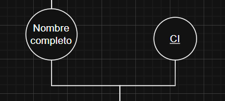
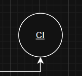
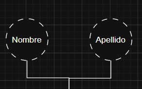
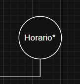
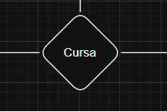
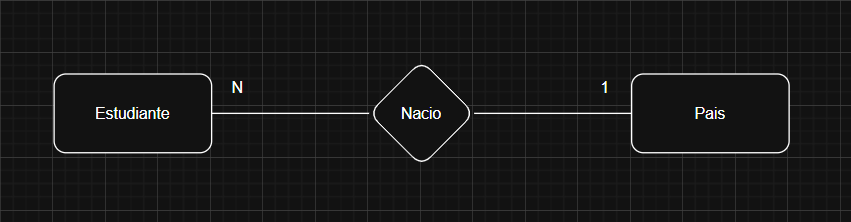
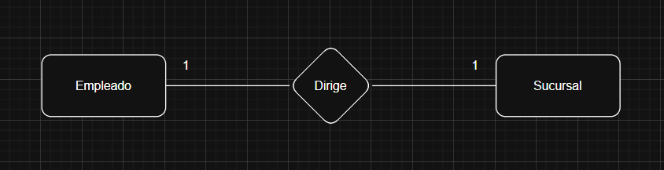
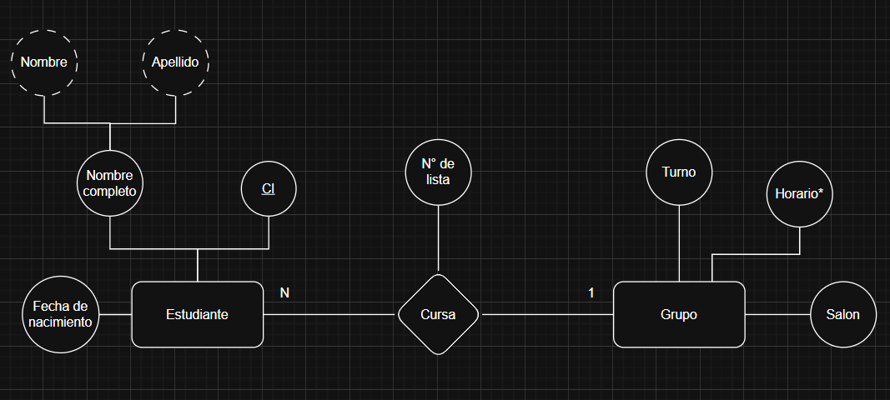

# Modelo Entidad-Relación

> Modelo conceptual Entidad relación -> Diagrama entidad relación

Concepto que permite describir la realidad mediante un conjunto de representaciones gráficas y lingüísticas.

- Modelo conceptual mas usado
- Propuesto por Peter Chan en 1976
- Existe una gran variedad de _"dialectos"_ y variedades del Modelo Entidad Relación
- Se utiliza fundamentalmente para definición de datos
- Se basa en representar objetos (entidades) y relaciones entre ellos

## Entidad

- Cualquier tipo de objeto o concepto sobre el que se recaba información
- Cosa, persona, concepto abstracto o suceso
- Las entidades se representan gráficamente mediante rectángulos y su nombre aparece en el interior

  

- Un nombre de entidades solo puede aparecer una vez en el esquema conceptual
- Colección o conjunto de elementos del mismo tipo

## Atributo

- Es una característica de interés o un hecho sobre una relación
- Los atributos representan las propiedades básicas de las cantidades y de las relaciones
- Gráficamente, se representan mediante bolitas que salen de las entidades o relaciones a las que pertenecen

  

## Atributo clave o atributo determinante

- Atributo que su valor es distinto para cada elemento de la entidad
- Se utiliza para identificar de forma única a cada elemento de la entidad
- Se subraya en el diagrama

  

## Atributos compuestos o derivado

- Se pueden dividir en componentes mas pequeños que representen atributos básicos con su propio significado

  

## Atributos multivaluados o multivalor

- Atributos que tienen un conjunto de valores para una entidad particular
- Por ejemplo color auto, teléfono
- Los representamos con un asterisco

  

## Relación (interrelación)

- Es una correspondencia o asociación entre dos o mas entidades
  - Cada relación tiene un nombre que describe su función
  - las relaciones se representan gráficamente mediante rombos y su nombre aparece en el interior
  - EL nombre de las relaciones no se puede repetir en el esquema conceptual

  

### Relaciones - Restricciones - Cardinalidad

- Especifica el numero de ejemplares de vínculos en los que puede participar cada entidad presente en una relación
- En otras palabras, representa la cantidad de elementos, de cada cantidad que pueden vincularse en una relación

#### Cardinalidades

- N : N (muchos a muchos)
- 1 : N (1 a muchos)
- 1 : 1 (1 a 1)

#### Cardinalidad 1 : N

- Cada país puede estar relacionado con muchos estudiantes
- Un estudiante puede estar relacionado con un único país (natalidad)

  

#### Cardinalidad 1:1

- Un empleado solo puede dirigir una sucursal
- Una sucursal solo puede ser dirigida por un empleado

  

# Diagrama completo

  

