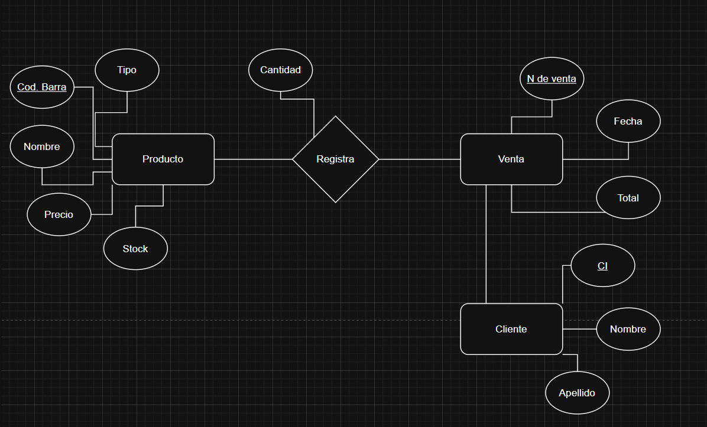
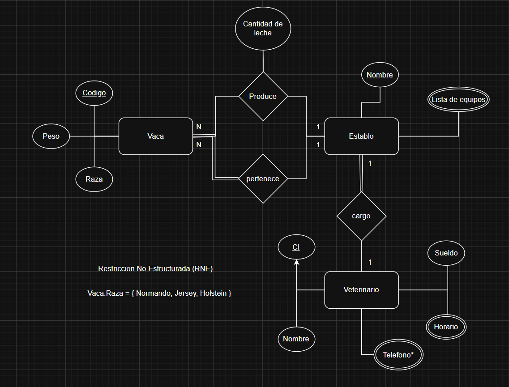
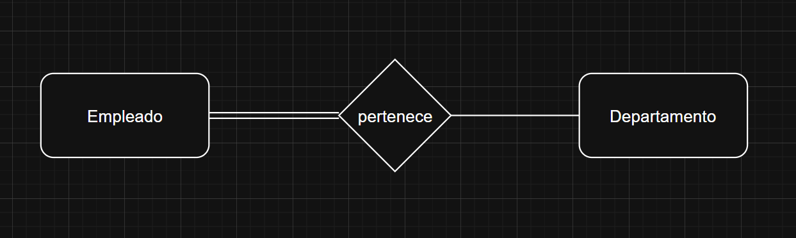

<!--
filename: 03232026.md
date: 23, March of 2026
tag: notes
last-update: 23, April of 2026
-->

# Solución deberes

  

# Ejercicio 2

Diseñar una base de datos, utilizando un D. E-R, que permita registrar y
consultar la información de un tambo. El tambo tiene _vacas_, las cuales están
identificadas por un _código_, tiene un _peso_ y una _raza (que puede ser
Normando, Jersey o Holstein)_.

Cada vaca _produce_ una _cantidad de leche estimada al dia_. Cada una de las
_vacas esta asignada a un establo_, donde duerme, come y se la ordeña, los
cuales están identificados por un _nombre_ y tienen una _lista de equipos
disponibles_ en el mismo.

Existen varios establos y en cada una hay varias vacas. Todas las vacas que
están en _un establo_ dado están a _cargo_ de un _veterinario_, de quien se
conoce el _nombre_, el _teléfono de contacto_, _horario_ y _sueldo_.

  

# Restricciones

# Totalidad

- Representa la obligación por parte de una entidad a relacionarse con otra
  entidad
- "TODOS los empleados pertenecen a un departamento"

  

