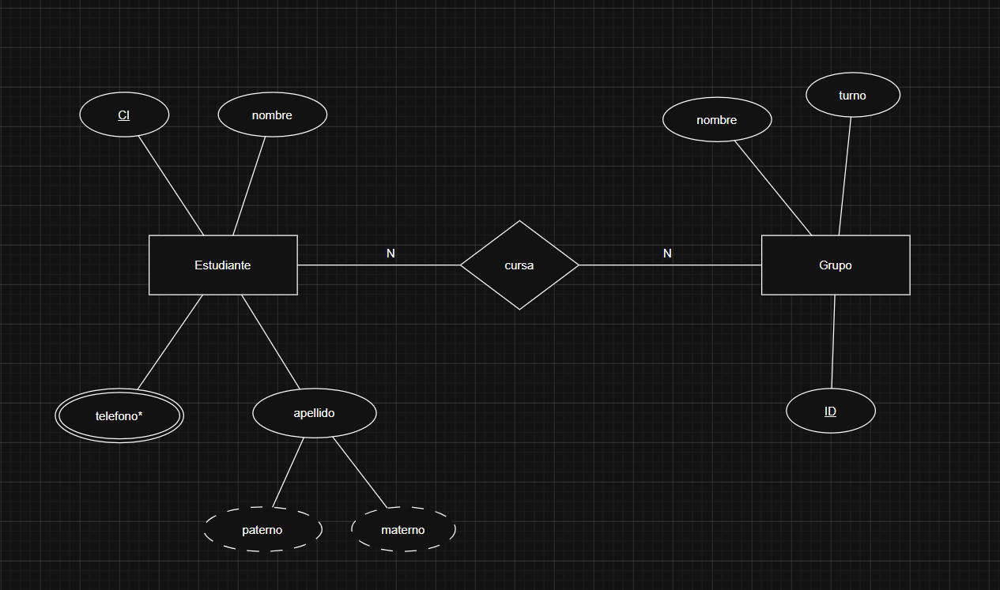
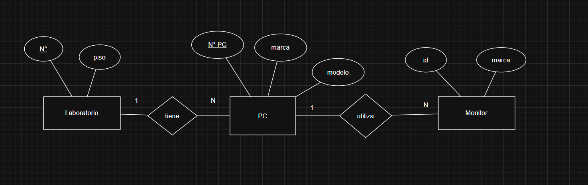

# Pasaje a tablas

En grandes rasgos es convertir un diagrama entidad relación en un listado de
Entidades con sus respectivos atributos

  

- Estudiante (<u>ci</u>, nombre, apellido {maternal, paternal}, teléfono\*)
- Grupo (<u>idG</u>, nombre, turno)
- cursa (<u>ci</u>, <u>idG</u>, N° Lista)

> [!NOTE]
>
> _cursa_ tiene una clave compuesta, una clave valor que esta compuesta por dos
> elementos, en este caso Estudiante.ci y Grupo.idG

| Ci  | idG |
| --- | --- |
| 123 | 2MN |
| 321 | 2MN |
| 201 | 2MN |
| 303 | 2MN |
| 123 | 1MA |
| 323 | 1MA |
| 404 | 1MA |

## Segundo esquema

  

- Laboratorio (<u>N°</u>, piso)
- Monitor (<u>id</u>, marca, pulgadas)
- PC (<u>N°PC</u>, marca, modelo)
- tiene (<u>N°PC</u>, N°)
- utiliza (<u>N°PC</u>, id)

> [!NOTE]
>
> Cuando tenemos una relación 1 a N, la clave valor compuesta siempre va a ser
> la que tenga N de cardinalidad para así garantizar no tener valores repetidos.
>
> En el caso de relación 1 a 1, no importa cual es el que se convierta en clave
> valor de la relación porque en ambos casos debería existir uno solo.

## Solución ejercicio 8 (reference: 05112026_Ejercicio8.png)

Importante <u> significa underline

- Libro (<u>ISBN</u>, titulo, año, N°Edición)
- Autor (<u>idAutor</u>, Nombre, Nacionalidad)
- Socio (<u>CI</u>, nombre, apellido, teléfono\*)
- escribe (<u>ISBN</u>, idAutor)
- retira (<u>ISBN</u>, <u>CI</u>, fecha)
- reserva (<u>CI</u>, ISBN)

## Claves Foránea (externa)

- Atributos que previenen de otra tabla para representar una relación o vínculo
- Son claves en su tabla
- El SGBD controla la integridad referencial a través de ellas

## Relaciones con totalidad

En el caso de las entidades con totalidad N a 1, como es obligatorio que la
tabla de la relación espeje la cantidad de entradas que la entidad que tiene
totalidad y es N pero esto se puede simplificar utilizando la tabla que tiene
totalidad y N.

- Funcionario (<u>CI</u>, nombre, apellido, **id**) id -> Departamento
- Departamento (<u>id</u>, nombre, **ci**) ci -> Funcionario
- Proyecto (<u>codigo</u>, fecha { inicio, fin })
- realiza (<u>ci</u>, <u>codigo</u>)

## Ejercicio 9 (reference: 05112026_Ejercicio9.png)

- Terminal
- Recorrido
- Empleado
- Viaje
- Pasaje
- Omnibus
- Pasajero
