<!--
filename: 07262026_resumen-examen.md
date: 26, July of 2026
tag: notes
last-update: 03, August of 2026
-->

# Introducción a Bases de Datos — Resumen para el escrito

> Resumen completo de teoría (basado en los PowerPoint del curso) combinado con
> las notas de clase. Material de consulta permitido para la evaluación.
>
> **Docente:** A/S Leonardo Carámbula · correo: <leonardocarambula@gmail.com>
>
> 🖼️ Las figuras son recortes de las diapositivas del curso (notación de Chen).
> Se encuentran en `../_assets/base-de-datos/` (junto al resto de imágenes del
> curso).

## Índice

1. [Convenciones gráficas (símbolos del D. E-R)](#1-convenciones-gráficas-del-d-e-r)
2. [Introducción y conceptos generales](#2-introducción-y-conceptos-generales)
3. [Modelo Conceptual — Modelo Entidad-Relación (MER)](#3-modelo-conceptual--modelo-entidad-relación-mer)
4. [Modelo Lógico — Esquema Relacional (Pasaje a Tablas)](#4-modelo-lógico--esquema-relacional-pasaje-a-tablas)
5. [Normalización](#5-normalización)
6. [Teoría de Conjuntos (prueba diagnóstica)](#6-teoría-de-conjuntos-prueba-diagnóstica)
7. [Tablas resumen rápido](#7-tablas-resumen-rápido)

---

## 1. Convenciones gráficas del D. E-R

| Elemento                            | Cómo se dibuja                                     | Cómo se escribe en el esquema relacional |
| ----------------------------------- | -------------------------------------------------- | ---------------------------------------- |
| **Entidad**                         | Rectángulo (nombre adentro)                        | `Entidad(...)`                           |
| **Atributo**                        | Elipse / bolita que sale de la entidad o relación  | se lista dentro del `( )`                |
| **Atributo determinante (clave)**   | Se **subraya**                                     | subrayado, es la clave primaria          |
| **Atributo compuesto / derivado**   | Elipse punteada que se divide en sub-atributos     | `dirección{calle, número, esquina}`      |
| **Atributo multivaluado**           | Se marca con un **asterisco** `*` (doble elipse)   | `teléfono*`                              |
| **Relación (interrelación)**        | Rombo (nombre adentro)                             | tabla `nombre(...)` o clave foránea      |
| **Cardinalidad**                    | Números `1`, `N`, `M` sobre las líneas             | define cómo se pasa a tablas             |
| **Totalidad**                       | **Doble línea** (roja) del lado obligatorio        | evita crear tabla de la relación         |
| **Entidad débil**                   | Rectángulo doble; determinante subrayado punteado  | determinante compuesto                   |
| **Categorización / Generalización** | Triángulo con la palabra `es`                      | atributo tipo o tablas hijas             |
| **Agregación**                      | Recuadro que **enmarca** 2 entidades + su relación | se usa como si fuera entidad             |

> **Regla de oro de nombres:** en el esquema conceptual **el nombre de una
> entidad y el nombre de una relación no se pueden repetir**. Y en una tabla
> **no pueden existir dos atributos con el mismo nombre** (importante en
> auto-relaciones).

---

## 2. Introducción y conceptos generales

### 2.1. Base de Datos

**Definición:** un conjunto de datos relacionados entre sí y almacenados por un
prolongado período de tiempo. Una base de datos:

- representa algún aspecto del **mundo real**,
- almacena un conjunto de datos **coherentes**,
- está **diseñada y construida** con datos específicos.

### 2.2. Elementos que la componen

| Elemento      | Qué es                                                | Cómo cambia                                           |
| ------------- | ----------------------------------------------------- | ----------------------------------------------------- |
| **Esquema**   | Descripción de los datos y las relaciones entre ellos | Cambia **muy poco** con el tiempo                     |
| **Instancia** | El conjunto de datos de la base en un instante dado   | Cambia con cada **inserción, borrado o modificación** |

### 2.3. SGBD / DBMS

- **SGBD** = Sistema Gestor de Base de Datos.
- **DBMS** = _Data Base Management System_.
- Es el **software especializado** en la administración de bases de datos.
- Ejemplos: **MariaDB, MySQL, Oracle, SQL Server**.

**Herramientas / ventajas que brinda un SGBD:**

- **Aislamiento de los datos:** simplifica el cruzamiento de datos a través de
  un lenguaje de consulta.
- **Independencia de datos:** independencia de las implementaciones (lógica y
  física).
- **Acceso concurrente:** varios usuarios pueden acceder simultáneamente a los
  mismos datos.
- **Control de integridad:** simplifica los controles de integridad.
- **Recuperación ante fallos:** respaldos, copias de seguridad y transacciones.
- **Control de seguridad:** permisos, niveles de acceso y usuarios.

### 2.4. Arquitectura de una B. D. (3 niveles)

```
        USUARIOS FINALES
             |
NIVEL EXTERNO      →  VISTA EXTERNA ... VISTA EXTERNA
             |
NIVEL CONCEPTUAL   →  ESQUEMA CONCEPTUAL
             |
NIVEL INTERNO      →  ESQUEMA INTERNO
             |
        BASE DE DATOS ALMACENADA
```

- **Nivel externo:** las distintas vistas que ven los usuarios.
- **Nivel conceptual:** el esquema conceptual (visión global de los datos).
- **Nivel interno:** el esquema interno (cómo se almacena físicamente).

<p align="center">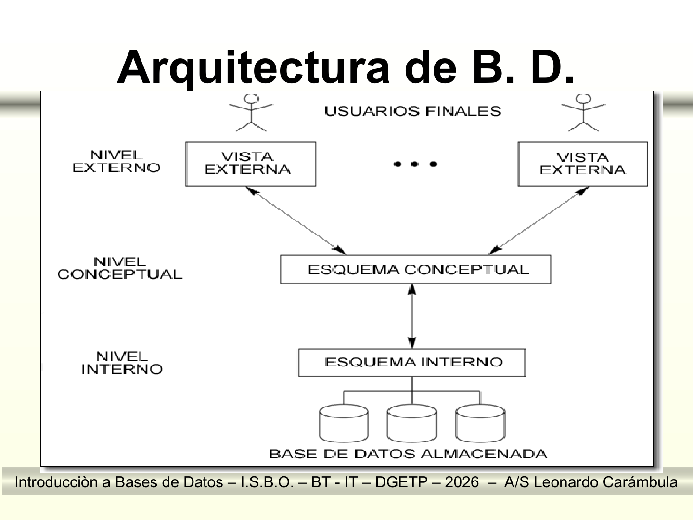</p>

### 2.5. Modelos de datos

| Modelo                  | Orientación                                                 | Uso                                                          |
| ----------------------- | ----------------------------------------------------------- | ------------------------------------------------------------ |
| **Conceptual (M. E-R)** | Definición de estructuras y restricciones                   | Diseño conceptual; **independiente del SGBD**                |
| **Lógico (M. R.)**      | Implementación y operaciones                                | Implementación de la B. D.                                   |
| **Físico**              | Estructuras de datos sobre las que se implementan los otros | Dentro de los gestores (SGBD), con poco control desde afuera |

### 2.6. Lenguajes de especificación

- **DDL** (_Data Definition Language_): describe el **esquema** de la B. D.
  (estructuras y restricciones de integridad). Permite crear, modificar y
  eliminar **tablas, claves (primarias/externas/únicas), índices y vistas**.
- **DML** (_Data Manipulation Language_): manipula las **instancias** →
  inserción, borrado y modificación de datos.
- **SQL** (_Structured Query Language_): orientado a **extraer o consultar**
  información de la B. D.

### 2.7. Conceptos de tabla (elemento fundamental)

- **Tabla:** estructura donde se almacenan los datos.
- **Fila (tupla):** un registro completo de la tabla.
- **Columna (atributo):** una característica/propiedad.
- Para **evitar redundancia** conviene dividir una tabla grande en tablas más
  pequeñas relacionadas.

---

## 3. Modelo Conceptual — Modelo Entidad-Relación (MER)

### 3.1. Diseño y modelo conceptual

- **Diseño conceptual:** primera etapa del diseño de una base de datos.
  - Etapas: (1) análisis y estudio del problema/realidad a representar, (2)
    especificación usando un lenguaje de muy alto nivel.
  - Resultado: **Esquema Conceptual → D. E-R. (Diagrama Entidad-Relación)**.
- **Un modelo conceptual:**
  - Es un modelo de datos de muy alto nivel.
  - Se focaliza en las **estructuras**.
  - Tiene representación **gráfica**.
  - Permite representar el "mundo real" de forma abstracta.
  - **Debe representar todos los aspectos del problema** y **no** debe incluir
    ningún elemento de implementación ni de performance de la futura B. D.

**Flujo del diseño:**
`situación del mundo real → (modelado conceptual) → D. E-R → (diseño del sistema) → esquema físico (CREATE TABLE ...)`

<p align="center">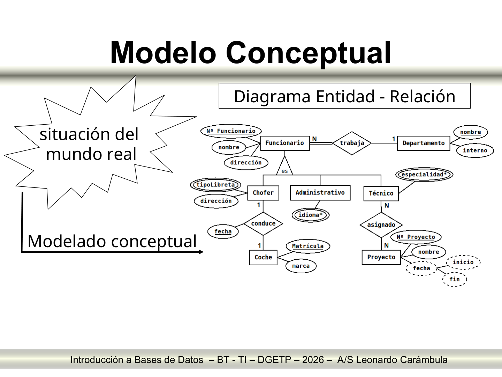</p>
<p align="center"><em>Ejemplo de un D. E-R completo (Funcionario, Chofer, Técnico, Proyecto…).</em></p>

### 3.2. Modelo Entidad-Relación

- Permite describir la realidad mediante representaciones **gráficas y
  lingüísticas**.
- Es el **modelo conceptual más usado**.
- Propuesto por **Peter Chen en 1976**.
- Existen muchos "dialectos" / variantes del MER.
- Se usa fundamentalmente para la **definición de datos**.
- Se basa en representar **objetos (entidades)** y **relaciones** entre ellos.
- Permite declarar gran cantidad de **restricciones**.
- Tiene **DDL gráfico, NO tiene DML**.
- Conceptos básicos: **Entidad** (objeto de la realidad: Estudiantes, Cursos,
  Docentes) y **Relación** (asociación entre objetos: Cursa, Dicta).

### 3.3. Entidad

- Cualquier tipo de objeto o concepto sobre el que se recaba información (cosa,
  persona, concepto abstracto o suceso).
- Se representa con un **rectángulo** con el nombre adentro.
- Un nombre de entidad **solo puede aparecer una vez** en el esquema conceptual.
- Es una colección o conjunto de elementos del mismo tipo.

### 3.4. Atributos

Característica de interés o hecho sobre una entidad o una relación. Se
representan con **bolitas/elipses** que salen de la entidad o relación.

| Tipo de atributo              | Definición                                                                                                                                           | Notación               |
| ----------------------------- | ---------------------------------------------------------------------------------------------------------------------------------------------------- | ---------------------- |
| **Determinante o clave**      | Su valor es distinto para cada elemento; identifica de forma única                                                                                   | se **subraya**         |
| **Compuesto o derivado**      | Se puede dividir en componentes más pequeños con significado propio (ej. `nombreCompleto` → nombre + apellido; `dirección` → calle, número, esquina) | sub-atributos colgando |
| **Multivaluado o multivalor** | Tiene un **conjunto de valores** para una entidad (ej. teléfono, color de auto)                                                                      | **asterisco** `*`      |

<p align="center">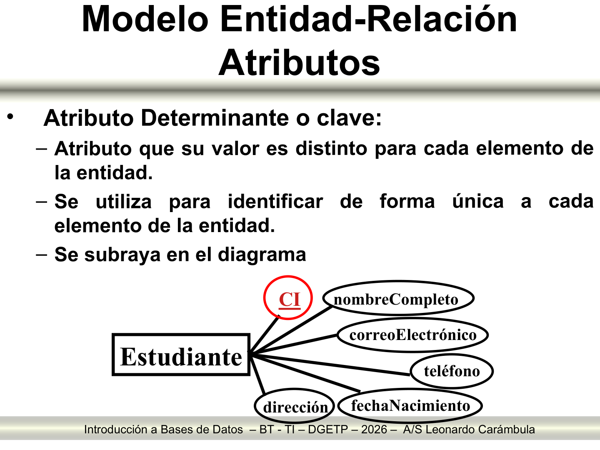</p>
<p align="center"><em>Atributo determinante o clave: se <strong>subraya</strong> (CI).</em></p>

<p align="center">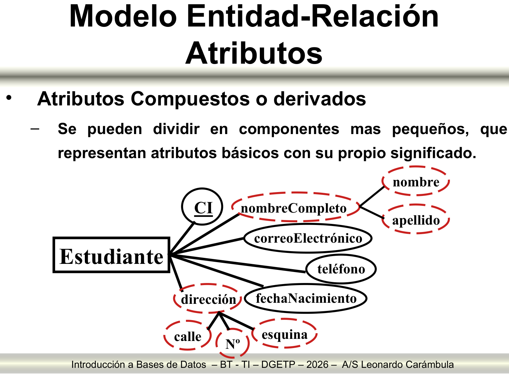</p>
<p align="center"><em>Atributos compuestos / derivados (nombreCompleto → nombre + apellido).</em></p>

<p align="center">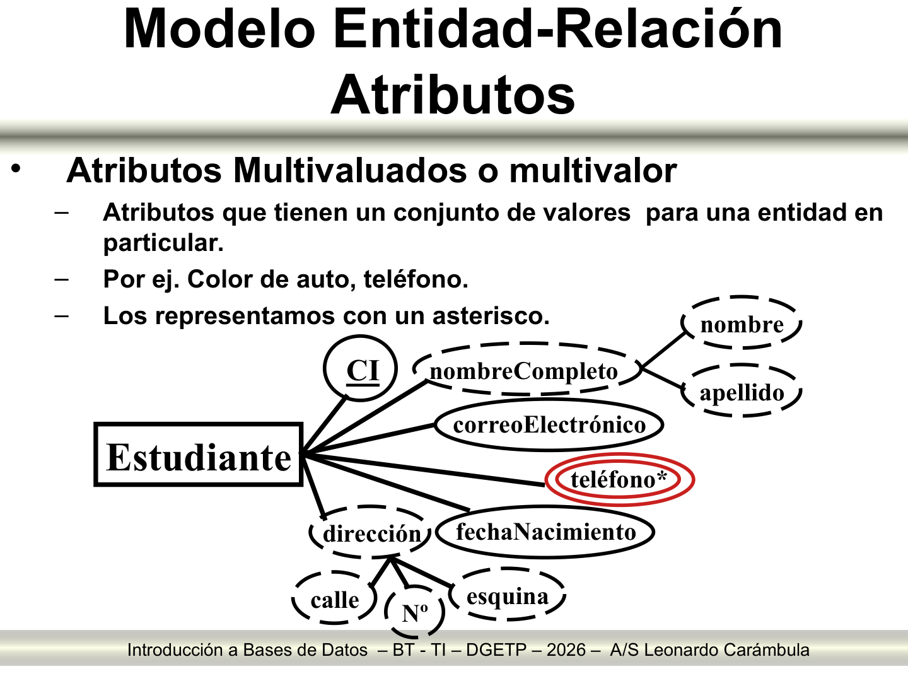</p>
<p align="center"><em>Atributo multivaluado: se marca con <strong>*</strong> (teléfono*).</em></p>

### 3.5. Relación (interrelación)

- Correspondencia o asociación entre **dos o más** entidades.
- Cada relación tiene un **nombre** que describe su función.
- Se representa con un **rombo**; el nombre no se puede repetir.

**Grado de la relación:** cantidad de entidades que participan.

- Grado 2 → **relación binaria**.
- Grado 3 → **relación ternaria**. (El curso se centra principalmente en
  relaciones binarias.)

<p align="center">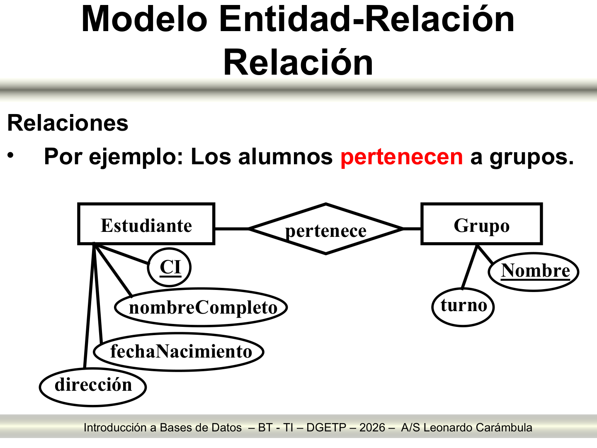</p>
<p align="center"><em>La relación se dibuja con un <strong>rombo</strong> (pertenece).</em></p>

### 3.6. Restricciones sobre las relaciones

#### Cardinalidad

Especifica el número de vínculos en los que puede participar cada entidad de una
relación (cuántos elementos de cada entidad pueden vincularse).

| Cardinalidad                | Ejemplo                                                                      |
| --------------------------- | ---------------------------------------------------------------------------- |
| **1 : 1**                   | Un empleado dirige una sucursal y una sucursal es dirigida por un empleado   |
| **1 : N**                   | Un país tiene muchos estudiantes; un estudiante nació en un solo país        |
| **N : M** (muchos a muchos) | Un empleado trabaja en muchos proyectos y un proyecto tiene muchos empleados |

<p align="center">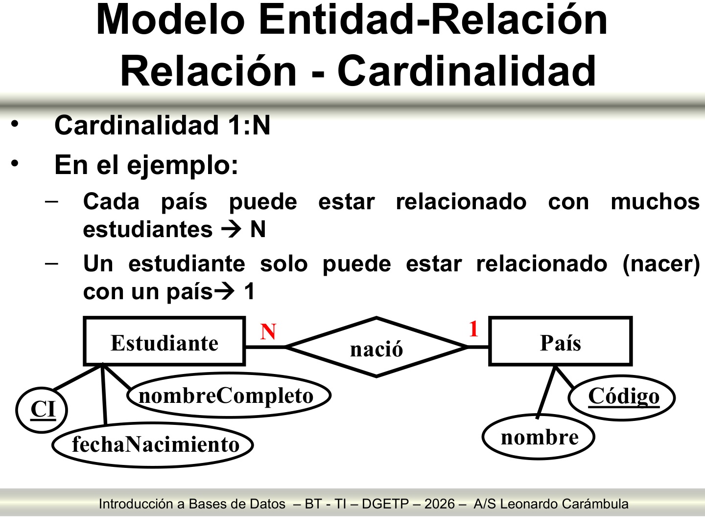
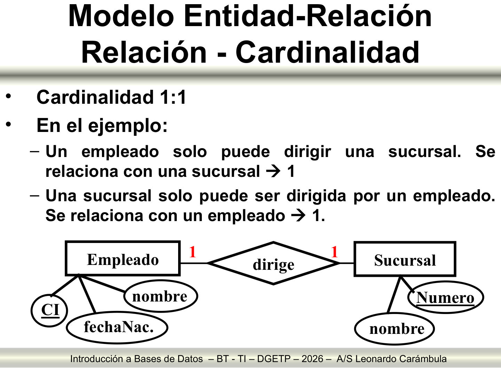</p>
<p align="center">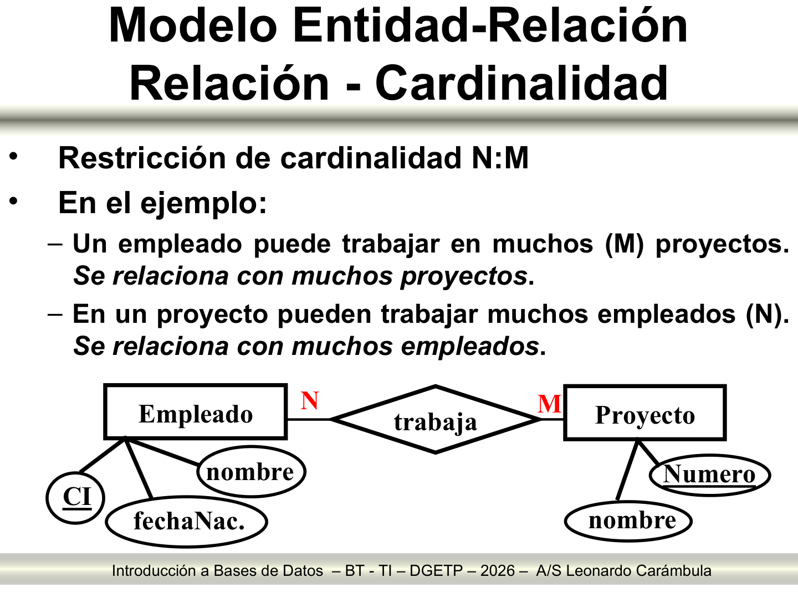</p>
<p align="center"><em>Cardinalidades: 1:N (nació), 1:1 (dirige) y N:M (trabaja).</em></p>

#### Totalidad

- Representa la **obligación** de una entidad a relacionarse con otra.
- Ejemplo: _"TODOS los empleados pertenecen a un departamento"_.
- Se dibuja con **doble línea** del lado de la entidad obligada.

<p align="center">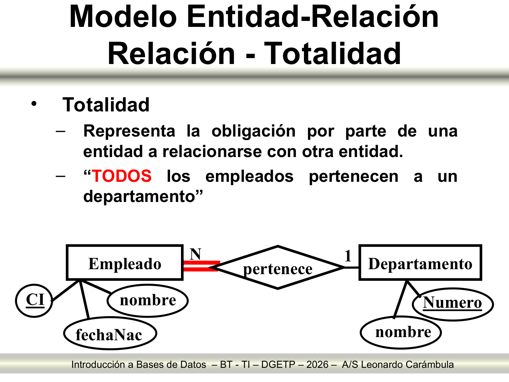</p>
<p align="center"><em>Totalidad: <strong>doble línea</strong> del lado obligado (todos los empleados pertenecen a un departamento).</em></p>

### 3.7. Atributos en una relación

- Una relación puede tener **atributos propios** (ej. las **horas** que un
  empleado trabaja en un proyecto). No es atributo del empleado ni del proyecto,
  sino **de la relación** `trabaja`.

### 3.8. Agregación

- **Objetivo:** representar asociaciones entre elementos de una relación y otras
  entidades, manteniendo relaciones binarias (evita relaciones de grado alto).
- **Constructor:** se "reinterpreta" una **relación como si fuera una entidad**;
  esa nueva entidad se usa como cualquier otra. Gráficamente se **enmarcan** las
  2 entidades y su relación.
- **Importante (de las notas):** una agregación solo puede contener **una**
  relación.

<p align="center">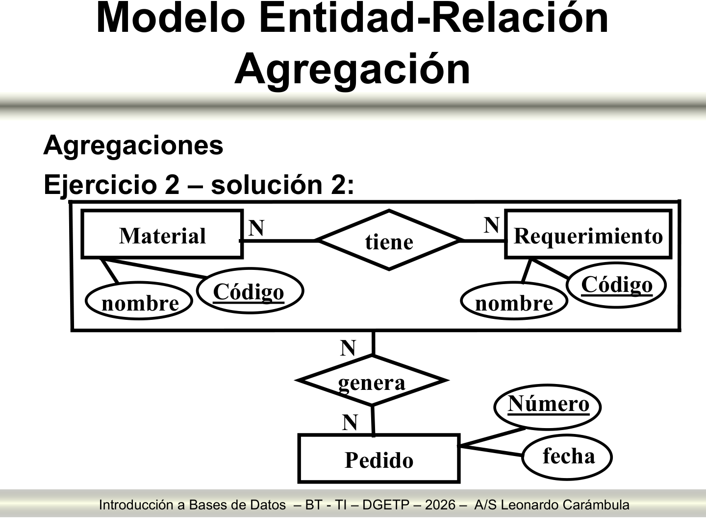</p>
<p align="center"><em>Agregación: se <strong>enmarca</strong> la relación <code>tiene</code> y se la usa como una entidad para relacionarla con <code>Pedido</code>.</em></p>

### 3.9. Categorización / Generalización

- Permite representar **subagrupaciones** (subclases) de una entidad.
- Se usa cuando esas subagrupaciones son significativas y **tienen atributos y/o
  relaciones particulares**.
- Se dibuja con un triángulo con la palabra **`es`** entre la entidad padre y
  sus categorías.
- Ejemplo: `Persona` **es** `Director` / `Alumno` / `Docente` / `Adscripto`
  (cada categoría con sus atributos propios: Alumno→grupo, NºLista;
  Docente→materia\*).

<p align="center">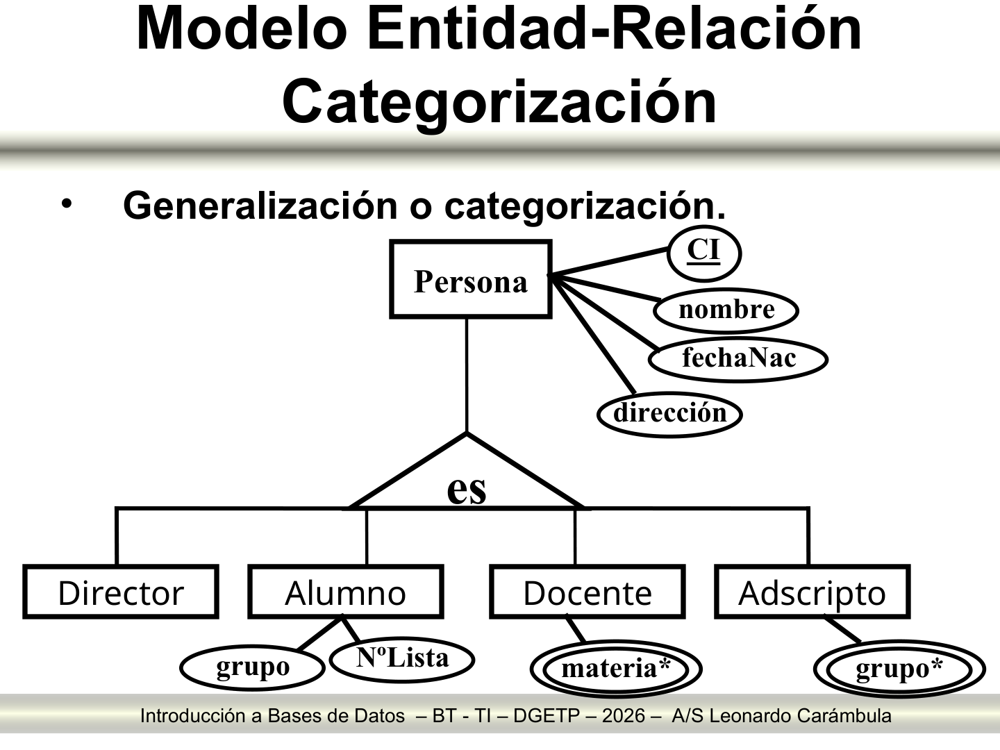</p>
<p align="center"><em>Categorización / generalización: triángulo <strong>es</strong> (Persona → Director, Alumno, Docente, Adscripto).</em></p>

### 3.10. Entidad débil

- Caso particular de entidad.
- **Por sí sola no se puede identificar de forma única.**
- Depende de otra entidad (**entidad fuerte**) para identificarse.
- Si no existe la entidad fuerte, **no existe** la entidad débil.
- Se dibuja con **rectángulo doble**.
- Ejemplos: `Estudiante` (el NºLista solo no identifica; se necesita el grupo);
  `Jugador` (el Nº de camiseta solo no identifica; se necesita el equipo).

<p align="center">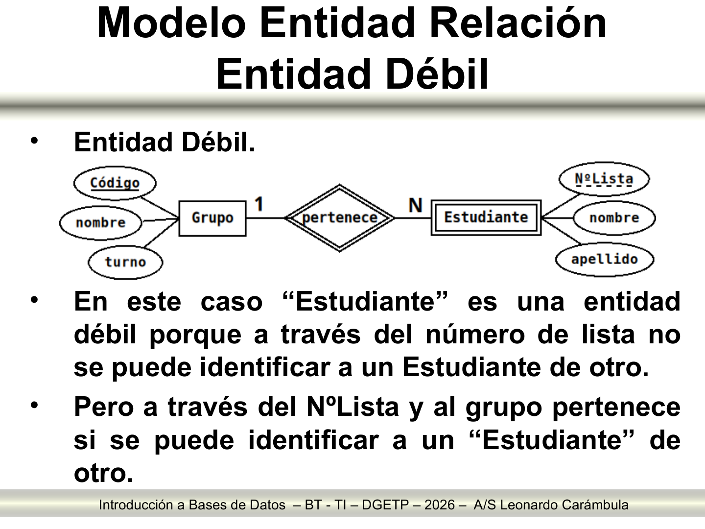</p>
<p align="center"><em>Entidad débil: <strong>rectángulo doble</strong>; el NºLista (subrayado punteado) solo identifica junto al Grupo.</em></p>

### 3.11. Auto-relación (relación recursiva) y Roles

- **Auto-relación:** relación entre un elemento de una entidad con otro(s)
  elemento(s) **de la misma entidad**.
- **Roles / Papeles:** cuando una entidad participa más de una vez en una
  relación desempeñando papeles distintos, se debe **diferenciar los roles** y
  se colocan sobre los conectores (líneas).
- Ejemplos:
  - `Funcionario` **supervisa** Funcionario → roles `jefe` (1) y `empleado` (N).
  - `Materia` **previa** Materia → una materia _tiene_ previas y _es_ previa de
    otras (N:N).

<p align="center">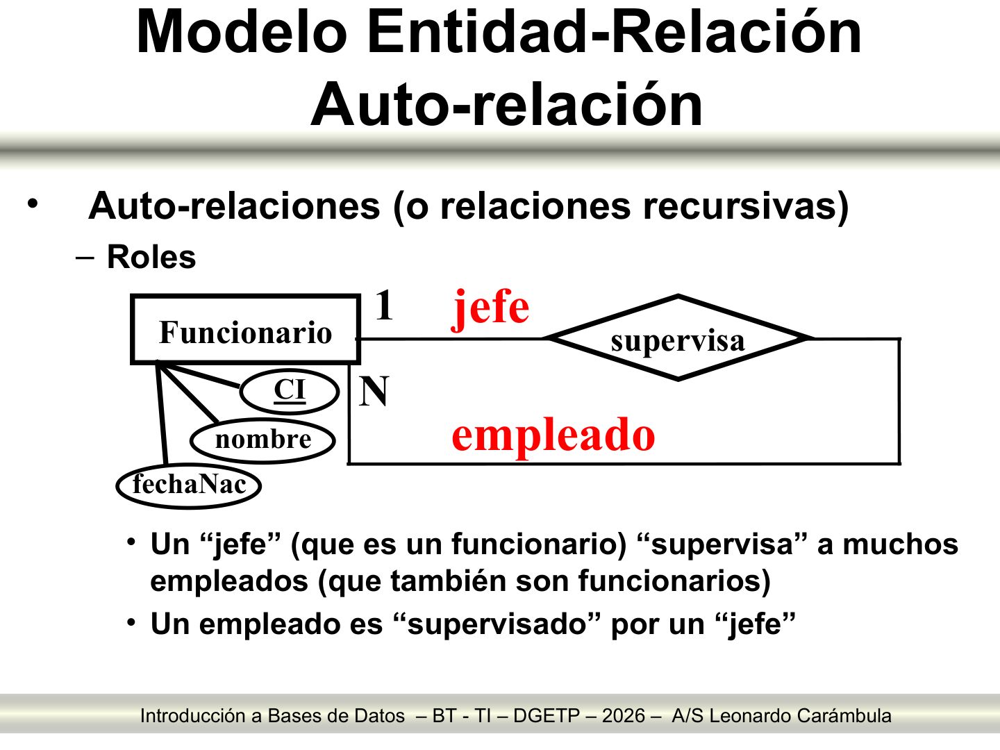</p>
<p align="center"><em>Auto-relación con <strong>roles</strong>: un funcionario (jefe, 1) supervisa a muchos funcionarios (empleado, N).</em></p>

---

## 4. Modelo Lógico — Esquema Relacional (Pasaje a Tablas)

- El **Esquema Relacional** es la representación mediante **tablas** de un D.
  E-R.
- Está conformado por: **(1) el Pasaje a Tablas** del D. E-R. y **(2) el proceso
  de Normalización**.
- Antes de pasar a tablas, el D. E-R debe tener: **Entidades, Relaciones,
  Atributos y Atributos Determinantes (claves), y Restricciones (cardinalidad y
  totalidad)**.

**Notación:** `Tabla(clave_subrayada, atributo, atributo, clave_foránea)`. Para
las claves foráneas se indica **de dónde vienen**: `atributo -> Tabla`.

### 4.1. Entidad → Tabla

Cada entidad se representa con una tabla del mismo nombre. Los atributos son sus
columnas; el determinante es la **clave primaria** (subrayada).

```
Estudiante(CId, nombre, fechaNac, dirección)
```

- **Atributo compuesto/derivado:** se lista con sus componentes (se descomponen
  en la misma tabla):
  `Estudiante(CId, nombre, dirección{calle, número, esquina})`
- **Atributo multivaluado:** se marca con asterisco:
  `Estudiante(CId, nombre, fechaNac, teléfono*)` _(luego, al normalizar en 1FN,
  genera una tabla aparte)._

<p align="center">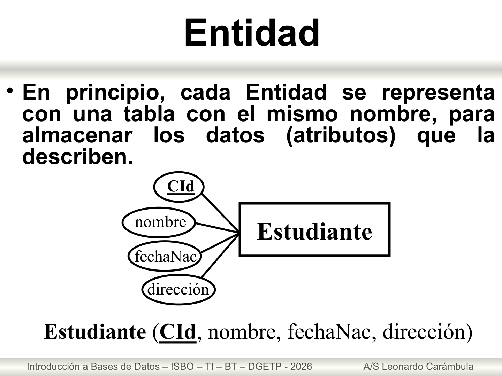</p>
<p align="center"><em>Cada entidad → una tabla con el mismo nombre; el determinante es la clave primaria.</em></p>

### 4.2. Relación → Tabla (regla general)

- En general, la relación se representa con una **tabla** formada por los
  **determinantes de las entidades** que participan.
- **El determinante de la tabla de la relación depende de la cardinalidad.**
- Si la relación tiene **atributos propios**, éstos también van en la tabla que
  la representa. `pertenece(ci, idG, nºLista)` — `nºLista` es atributo propio de
  la relación.

### 4.3. Reglas según cardinalidad

#### N : N — **siempre genera tabla**

La tabla de la relación tiene un **determinante compuesto** por el determinante
de A **y** el de B.

```
A(a1, a2, a3)          Estudiante(ci, nombre, apellido)
B(b1, b2)              Grupo(idG, nombre)
A-B(a1, a2, b1)   →    pertenece(ci, idG, nºLista)
       ↑ (a1,a2,b1 subrayados = clave compuesta)
```

> De las notas: _las relaciones N a N siempre van a generar tabla._

<p align="center">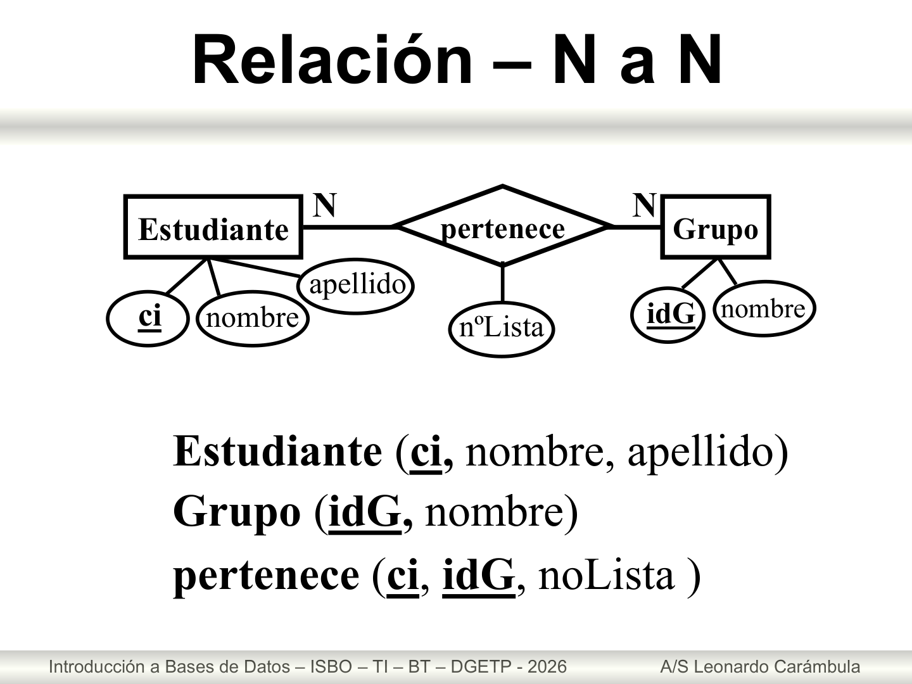</p>
<p align="center"><em>N:N → la tabla <code>pertenece</code> tiene clave compuesta (ci + idG).</em></p>

#### N : 1 (o 1 : N) **sin totalidad** — genera tabla

Se representa con tabla porque **no todos** los elementos del lado N se
relacionan. El determinante de la tabla de la relación es el del **lado N**.

```
N a 1:  A-B(a1, a2, b1)      → clave = det. del lado N (A)
1 a N:  A-B(b1, a1, a2)      → clave = det. del lado N (B)
Ej: PC(código, marca, año) / Laboratorio(número, sillas) / esta(código, número)
```

<p align="center">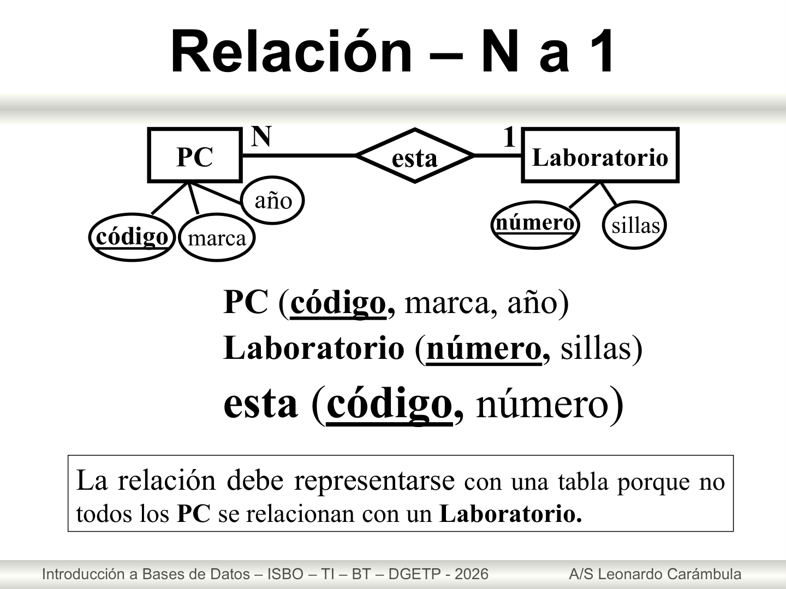</p>
<p align="center"><em>N:1 sin totalidad → genera tabla <code>esta(código, número)</code>; la clave es la del lado N.</em></p>

#### N : 1 (o 1 : N) **con totalidad** — **NO genera tabla** (se hereda la clave)

La relación **no** genera tabla: se agrega la **clave foránea en la entidad del
lado N** (la que tiene la totalidad y la N). Esa entidad **hereda** la clave de
la entidad del lado 1.

```
Totalidad 1 a N:  A(a1, a2, a3)        B hereda la clave de A
                  B(b1, b2, a1, a2)

Totalidad N a 1:  A(a1, a2, a3, b1)    A hereda la clave de B
                  B(b1, b2)

Ejemplo (N a 1): Grupo(idG, nombre, idT) / Turno(idT, nombre)   idT -> Turno
```

> De las notas: cuando la relación es **1 a N**, la clave foránea siempre va del
> lado que tiene **N** (para no repetir valores). Con **totalidad N a 1** la
> relación se simplifica poniendo la clave foránea en la tabla que tiene la
> totalidad y la N.

<p align="center">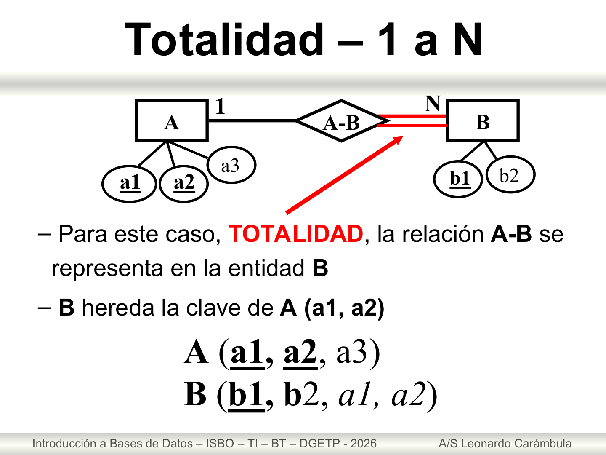
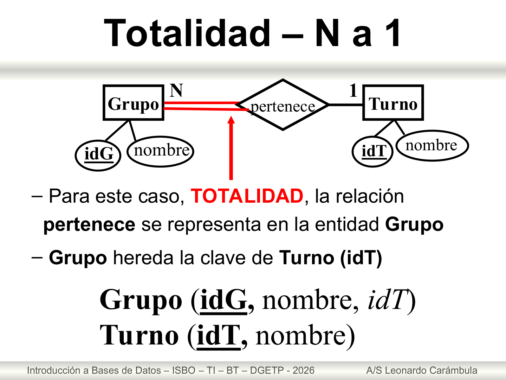</p>
<p align="center"><em>Con totalidad, la entidad del lado N <strong>hereda la clave</strong> (no se crea tabla de la relación).</em></p>

#### 1 : 1 — se elige una de las dos

- **Sin totalidad:** puede representarse como tabla eligiendo **cualquiera** de
  los dos determinantes como clave: `controla(ci, idS)` **o**
  `controla(idS, ci)`.
- **Con totalidad:** la relación se representa **en la entidad que tiene la
  totalidad**, que **hereda** la clave de la otra.
  `Director(ci, nombre, apellido)` / `UTU(id, nombre, ci)` → `ci -> Director`.

<p align="center">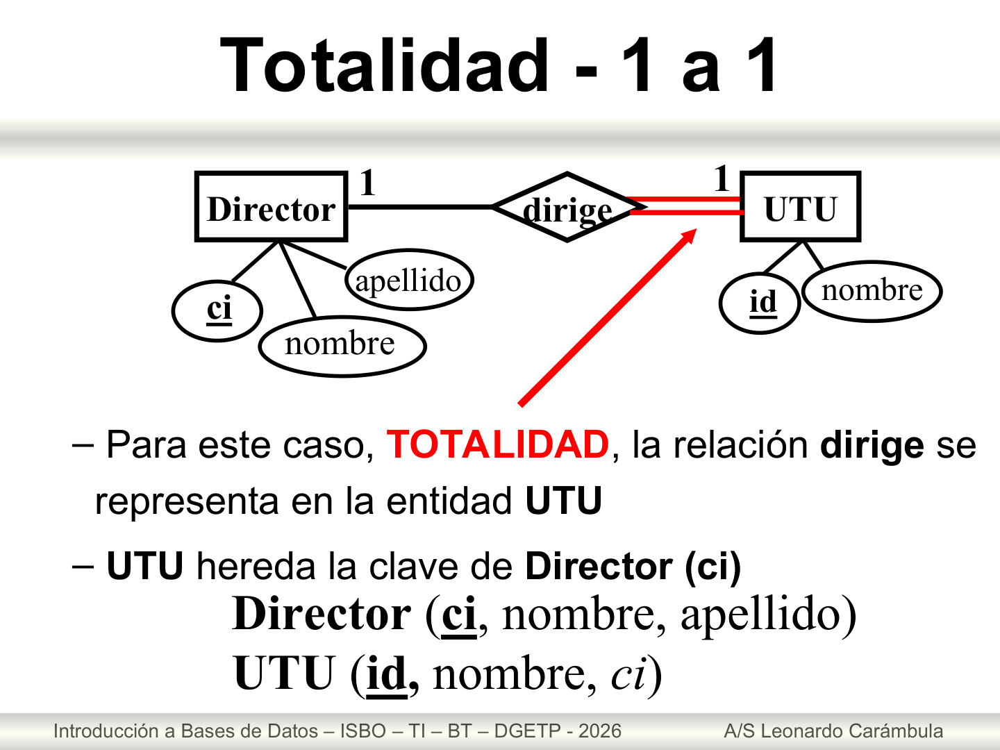</p>
<p align="center"><em>1:1 con totalidad → la entidad con totalidad (UTU) hereda la clave de la otra (Director).</em></p>

#### Relación **ternaria**

Genera una tabla con los determinantes de las **tres** entidades (clave
compuesta).

```
A-B-C(a1, a2, b1, c1, c2)   ← todos subrayados
```

<p align="center">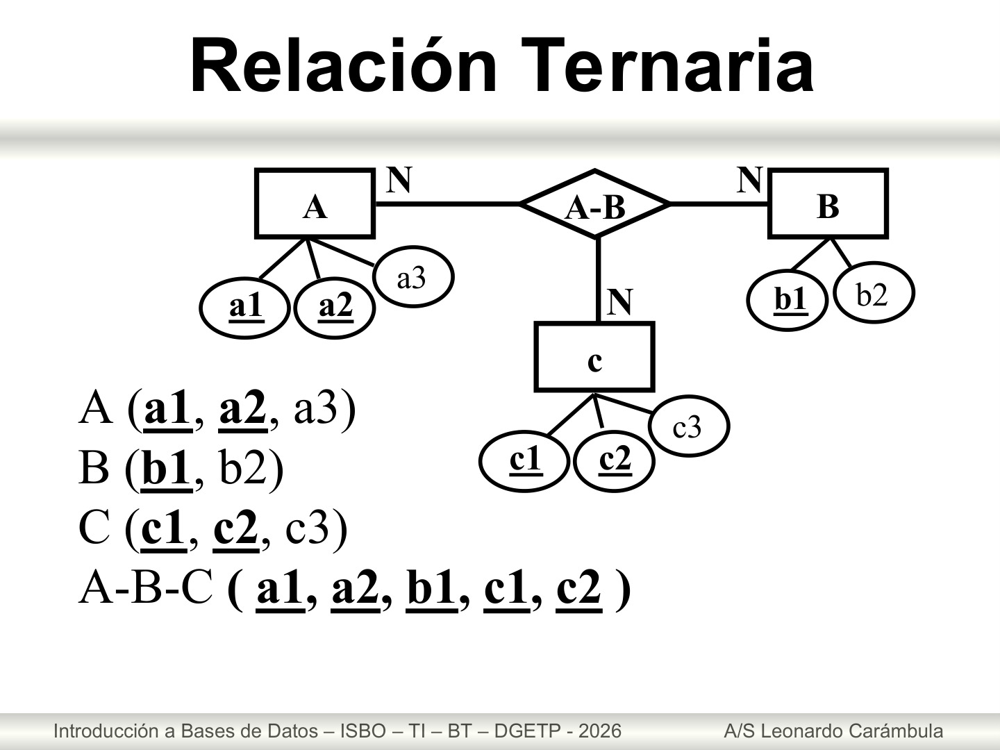</p>
<p align="center"><em>Relación ternaria → tabla con los determinantes de las 3 entidades.</em></p>

### 4.4. Categorización → Tablas

- **Categorías SIN atributos ni relaciones:** se agrega un atributo a la entidad
  padre que indica la categoría/tipo (`es`). **No** se crean tablas por
  subcategoría. `A(a1, a2, es)` · `Materia(idMat, nombre, tipo)` /
  `Grupo(idG, nombre, turno)`
- **Categorías CON atributos y/o relaciones:** cada categoría (subclase) genera
  su **propia tabla**, que hereda el determinante de la entidad padre. Las
  relaciones de las subclases se tratan normalmente.

  ```
  A(a1, a2)   C(a1, c1)   D(a1, d1)
  Usuario(login, pass, nombre)
  Básico(login, visitas)         login -> Usuario
  Premium(login, pagó?)          login -> Usuario
  Contenido(id, título, URL, login)   login -> Premium
  ```

<p align="center">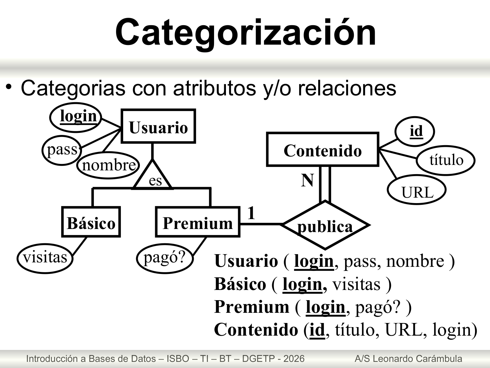</p>
<p align="center"><em>Categoría <strong>con</strong> atributos/relaciones → cada subclase es una tabla que hereda la clave del padre.</em></p>

### 4.5. Agregación → Tablas

- La relación agregada se trata como una entidad. Cuando otra entidad se
  relaciona con la agregación, la tabla de esa nueva relación **incluye el
  determinante de la relación agregada**.

  ```
  A-B(a1, a2, b1)
  AB-C(c1, c2, a1, a2, b1)
  ```

- Ejemplo: `tiene(idMat, idG)` (relación agregada) y `dicta(idMat, idG, ci)` —
  `dicta` usa la clave de `tiene`.
- **De las notas:** cuando hay una agregación y hay que definir una clave
  foránea, la misma se define **por la relación** que haya dentro de esa
  agregación.

<p align="center">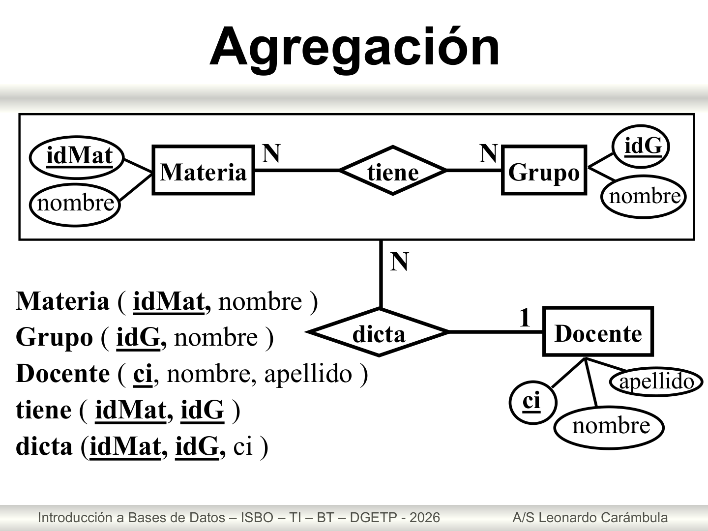</p>
<p align="center"><em>La relación <code>dicta</code> incluye la clave de la relación agregada <code>tiene(idMat, idG)</code>.</em></p>

### 4.6. Auto-relación → Tabla

Genera una tabla con **dos columnas que referencian el determinante** de la
entidad, pero con **nombres distintos** (los roles), porque en una tabla no
puede haber dos atributos con el mismo nombre.

```
A(a1, a2, a3)
R(rol1, rol2)      ← NO se escribe R(a1, a1)
Ej: Materia(id, nombre, horas) / previa(tiene, es)
```

<p align="center">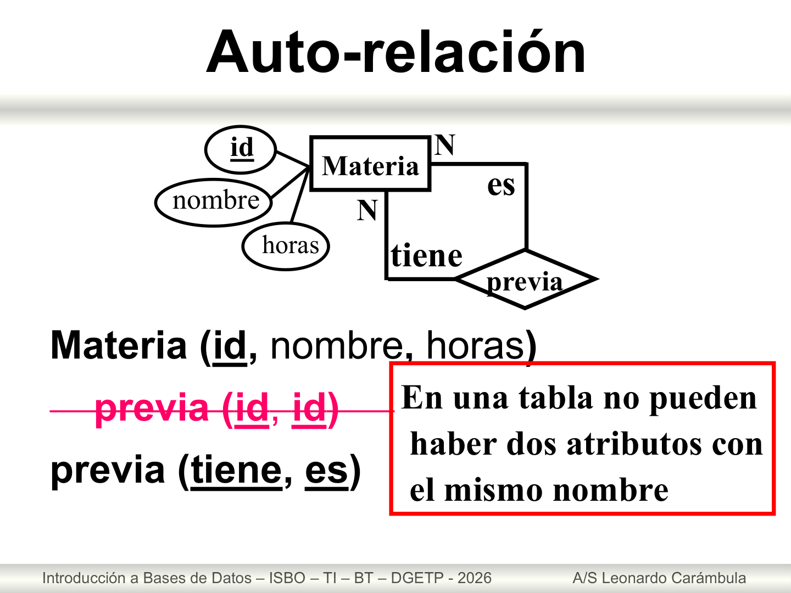</p>
<p align="center"><em>Auto-relación → tabla <code>previa(tiene, es)</code>; nunca dos columnas con el mismo nombre.</em></p>

### 4.7. Entidad débil → Tabla

- La relación de la entidad débil con la entidad fuerte **NO genera tabla**.
- La entidad débil **hereda el determinante de la entidad fuerte**.
- La entidad débil **siempre tiene un determinante compuesto**.

```
A(a1, a2, a3)                 Grupo(id, nombre, turno)
B(a1, b1, b2)            →     Estudiante(id, noLista, nombre, apellido)
   ↑ (a1 y b1 subrayados = clave compuesta)
```

<p align="center">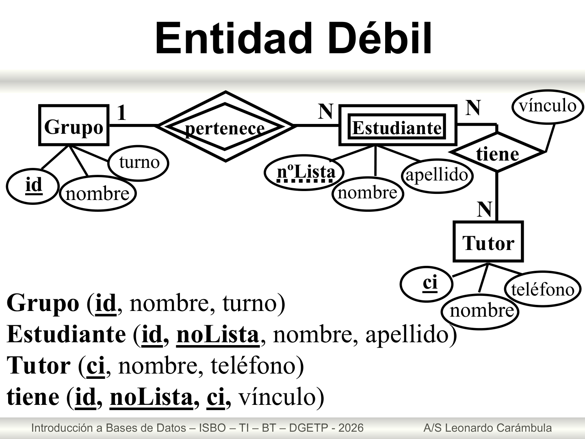</p>
<p align="center"><em>La entidad débil hereda la clave del fuerte → determinante compuesto (id + noLista).</em></p>

### 4.8. Clave foránea (externa)

- Atributo que **proviene de otra tabla** para representar una relación o
  vínculo.
- Es **clave en su tabla** de origen.
- El **SGBD controla la integridad referencial** a través de ellas.
- **Siempre** indicar de dónde viene: `atributo -> Tabla`.

---

## 5. Normalización

Luego del pasaje a tablas hay que verificar que **cada tabla** cumpla una serie
de normas básicas que buscan evitar:

- **Redundancia de datos:** repetir datos de forma innecesaria.
- **Inconsistencias:** el mismo dato repetido y con valores distintos.

A este proceso se lo denomina **normalización**.

### 5.1. Primera Forma Normal (1ª FN)

Una tabla está en 1ª FN **si y solo si**:

1. **No existen dos filas idénticas** → cada tabla/entidad debe tener un
   **atributo determinante**.
2. **Todos sus atributos son atómicos** → de **único valor** e **indivisibles**.
   - **No cumplen los multivaluados** (`*`) → único valor.
   - **No cumplen los compuestos** (`{ }`) → indivisibles.

**Cómo normalizar a 1ª FN:**

- **Atributo multivaluado:** se crea una **tabla nueva** para ese atributo. Se
  repite solo el determinante, por lo que la nueva tabla tiene un **determinante
  compuesto** (determinante original + el atributo).
- **Atributo compuesto:** se **descompone** en la misma tabla.

```
Pasaje a tablas:
   Persona(CId, Nombre, Apellidos{Paterno, Materno}, Teléfono*)
Normalizando (1ª FN):
   Persona(CId, Nombre, Paterno, Materno)      ← compuesto descompuesto
   PersonaTelefono(Cid, Teléfono)              ← multivaluado en tabla aparte
```

<p align="center">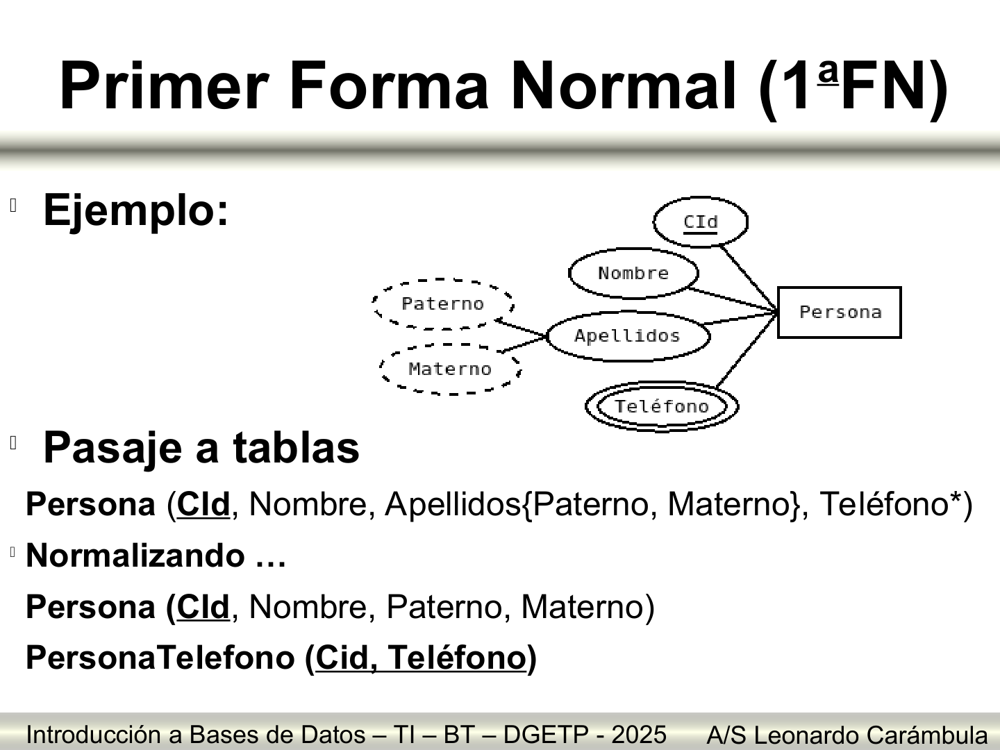</p>
<p align="center"><em>1ª FN: el compuesto se descompone; el multivaluado (teléfono*) va a una tabla aparte.</em></p>

### 5.2. Conceptos previos para 2ª y 3ª FN

- **Atributo primo:** atributo (o conjunto de atributos) que, igual que la clave
  primaria, **determina la unicidad** en la tabla; identifica una fila. Es o
  conforma una **clave candidata**. _(Ej.: en Estudiante, CId, CC y NºEstudiante
  podrían identificar; uno es el determinante y los otros son primos.)_
- **Dependencia funcional (X —» Y):** Y **depende funcionalmente** de X si X lo
  **determina** (conociendo X obtengo Y).
  - Ej.: `Matrícula —» modelo`, `CI —» nombre`.

| Tipo de dependencia funcional | Definición                                                    | Rompe...              |
| ----------------------------- | ------------------------------------------------------------- | --------------------- |
| **Total**                     | El atributo depende de **toda** la clave primaria (compuesta) | (correcta para 2ª FN) |
| **Parcial**                   | El atributo depende solo de **parte** de la clave             | la **2ª FN**          |
| **Transitiva**                | Un atributo **no primo** depende de **otro no primo**         | la **3ª FN**          |

### 5.3. Segunda Forma Normal (2ª FN)

Una tabla está en 2ª FN **si y solo si**:

1. Está en **1ª FN**.
2. **Todos sus atributos NO primos dependen funcionalmente de forma TOTAL de la
   clave primaria** (no hay dependencias funcionales **parciales**).

**Cómo normalizar:** por **cada dependencia funcional parcial** se genera una
tabla.

```
Pedidos(IdLibro, IdCliente, Fecha, Título, IdAutor, NomAutor, Precio,
        NomCliente, Cantidad)

Dependencias funcionales:
   IdLibro, IdCliente, Fecha —» Cantidad        (TOTAL → ok)
   IdLibro —» Título, IdAutor, NomAutor, Precio (PARCIAL → falla)
   IdCliente —» NomCliente                       (PARCIAL → falla)

Normalizando (2ª FN):
   Pedidos(IdLibro, IdCliente, Fecha, Cantidad)
   Libros(IdLibro, Título, IdAutor, NomAutor, Precio)
   Clientes(IdCliente, NomCliente)
```

<p align="center">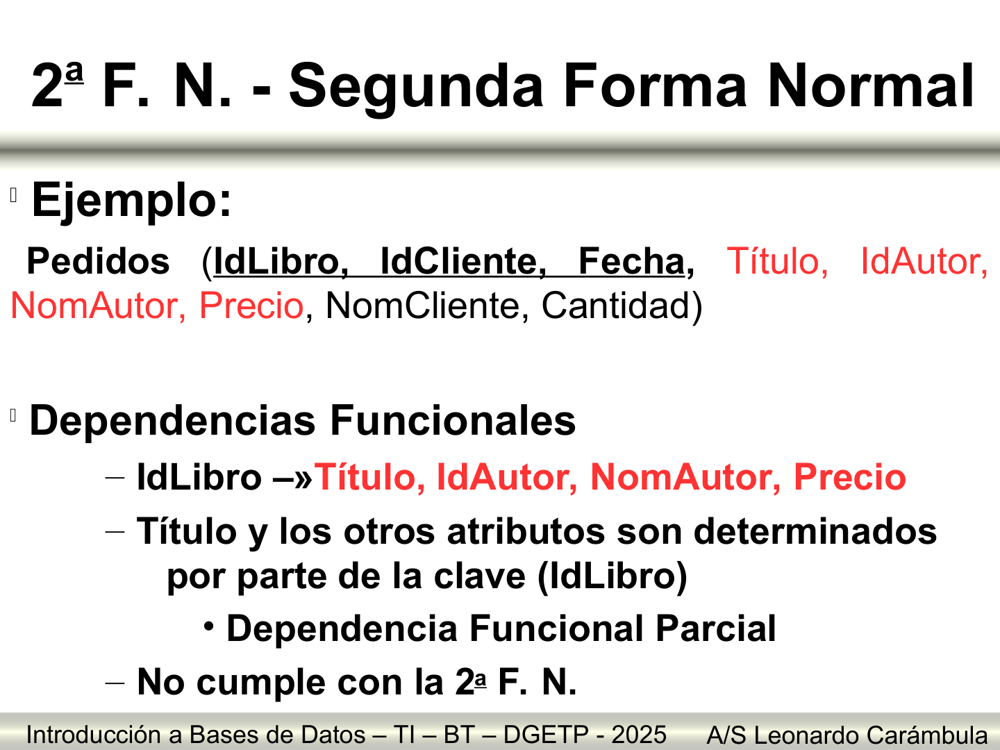</p>
<p align="center"><em>2ª FN: <code>IdLibro —» Título…</code> es dependencia <strong>parcial</strong> → no cumple; se separa en otra tabla.</em></p>

### 5.4. Tercera Forma Normal (3ª FN)

Una tabla está en 3ª FN **si y solo si**:

1. Está en **2ª FN**.
2. **Ningún atributo NO primo depende de otro atributo NO primo** → no existen
   dependencias funcionales **transitivas** entre atributos no primos.

**Cómo normalizar:** se saca la dependencia transitiva a una **tabla nueva**.

```
Libros(IdLibro, NomLibro, IdAutor, NomAutor, Precio)
   Dependencia transitiva:  IdAutor —» NomAutor
   (IdAutor no es determinante ni primo → falla la 3ª FN)

Normalizando (3ª FN):
   Libros(IdLibro, NomLibro, IdAutor, Precio)
   Autores(IdAutor, NomAutor)
```

**Resultado final del ejemplo (2ª + 3ª FN):** más tablas, pero **menos
redundancia**. `Pedidos(IdLibro, IdCliente, Fecha, Cantidad)` ·
`Clientes(IdCliente, NomCliente)` · `Libros(IdLibro, Título, IdAutor, Precio)` ·
`Autores(IdAutor, NomAutor)`.

<p align="center">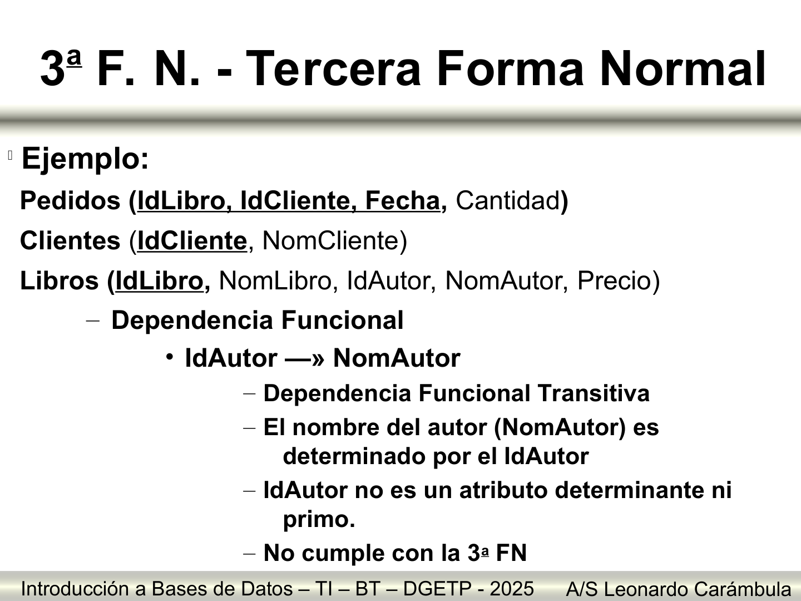</p>
<p align="center"><em>3ª FN: <code>IdAutor —» NomAutor</code> es dependencia <strong>transitiva</strong> → se saca a la tabla <code>Autores</code>.</em></p>

<p align="center">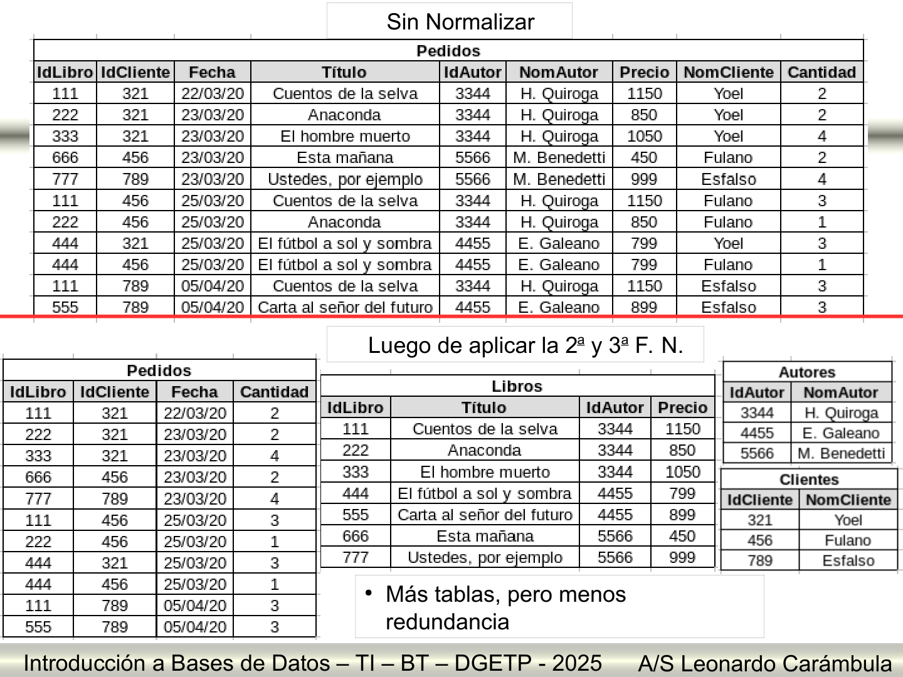</p>
<p align="center"><em>Antes (una tabla redundante) vs. después de 2ª + 3ª FN (más tablas, menos redundancia).</em></p>

---

## 6. Teoría de Conjuntos (prueba diagnóstica)

- **Conjunto:** agrupación, colección o clase de objetos del mismo tipo,
  denominados **elementos** del conjunto.
- **Por extensión:** se **enumeran** los elementos.
  `A = {0, 1, 2, 3, 4, 5, 6, 7}` (números naturales menores que 8). _(Si en el
  curso 0 no se considera natural, sería `{1, 2, 3, 4, 5, 6, 7}`.)_
- **Por comprensión:** se describen por una **propiedad**. `B = {x ∈ ℕ | x < 8}`

| Operación               | Símbolo | Definición                                        |
| ----------------------- | ------- | ------------------------------------------------- |
| **Unión**               | `A ∪ B` | elementos que están en A **o** en B               |
| **Intersección**        | `A ∩ B` | elementos que están en A **y** en B               |
| **Diferencia / resta**  | `A − B` | elementos que están en A y **no** en B            |
| **Producto cartesiano** | `A × B` | todos los **pares ordenados** (a, b) con a∈A, b∈B |

**Ejercicio resuelto** — `A = {1, 3, 5, 7}` · `B = {1, 2, 3}`:

- `A ∪ B = {1, 2, 3, 5, 7}`
- `A ∩ B = {1, 3}`
- `A − B = {5, 7}`
- `A × B = {(1,1),(1,2),(1,3), (3,1),(3,2),(3,3), (5,1),(5,2),(5,3), (7,1),(7,2),(7,3)}`
  _(4 × 3 = 12 pares ordenados)_

---

## 7. Tablas resumen rápido

### 7.1. Pasaje a tablas — ¿cuándo se crea tabla para la relación?

| Caso                                   | ¿Genera tabla?                         | Clave / dónde va                                                           |
| -------------------------------------- | -------------------------------------- | -------------------------------------------------------------------------- |
| **N : N**                              | **Sí, siempre**                        | clave compuesta (det. de A + det. de B)                                    |
| **N : 1 / 1 : N sin totalidad**        | Sí                                     | clave = determinante del **lado N**                                        |
| **N : 1 / 1 : N con totalidad**        | **No**                                 | clave foránea en la entidad del **lado N**, que hereda la clave del lado 1 |
| **1 : 1 sin totalidad**                | Sí (o clave foránea)                   | se elige cualquiera de los dos determinantes                               |
| **1 : 1 con totalidad**                | No                                     | la entidad con totalidad hereda la clave de la otra                        |
| **Ternaria**                           | Sí                                     | clave compuesta con las 3 entidades                                        |
| **Entidad débil**                      | No (la relación débil no genera tabla) | la débil hereda la clave del fuerte → clave compuesta                      |
| **Auto-relación**                      | Sí                                     | 2 columnas con nombres de rol distintos                                    |
| **Categoría con atributos/relaciones** | Sí (una por subclase)                  | hereda el determinante del padre                                           |
| **Categoría sin atributos/relaciones** | No                                     | atributo "tipo" en la entidad padre                                        |

### 7.2. Formas normales — de un vistazo

| Forma     | Requisito clave                                                                                      |
| --------- | ---------------------------------------------------------------------------------------------------- |
| **1ª FN** | Sin filas idénticas (hay determinante) + atributos atómicos (sin `*` ni `{ }`)                       |
| **2ª FN** | 1ª FN + atributos no primos dependen de forma **total** de la clave (sin dependencias **parciales**) |
| **3ª FN** | 2ª FN + sin dependencias **transitivas** entre atributos no primos                                   |

### 7.3. Símbolos rápidos

- `subrayado` = atributo determinante / clave primaria
- `*` = atributo multivaluado
- `{ }` = atributo compuesto / derivado
- doble línea = totalidad
- rectángulo doble = entidad débil
- rombo = relación · rectángulo = entidad · triángulo `es` = categorización
- `atributo -> Tabla` = clave foránea (indica su origen)
