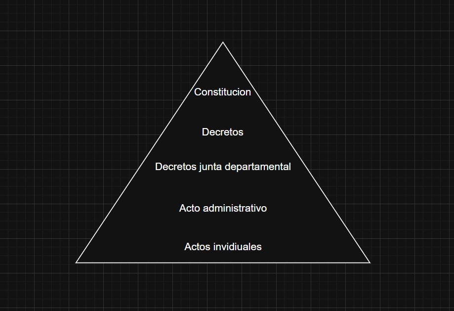

- Derecho objetivo: Es el conjunto de normas jurídicas, en sentido abstracto, general.

Por ej: El derecho uruguayo

- Derecho subjetivo: Posicionándose en el sujeto.

Por ej: el derecho de propietario a usar la cosa es la posibilidad que le otorga la norma jurídica

> [!NOTE]
>
> El derecho: conjunto abstracto de normas jurídicas

- Orden jurídico
  - Es un conjunto de normas jurídicas, es un sistema organizado jerárquicamente y con coherencia
    Se debe asegurar certeza jurídica

> [!NOTE]
>
> El orden jurídico se representa como una pirámide y se le dice pirámide de Hals Kelsen.

  

- Constitution: Son las leyes de máxima jurisdicción
- Ley: Es una norma creada por el Poder Legislativo
- Decreto: Es una norma jurídica creada por una autoridad superior - generalmente Poder Ejecutivo (Gobierno, Presidente)
- Decreto junta departamental: tienen poder dentro del departamento
- Acto administrativo: es una regla o ley que afecta a un grupo en especifico por ejemplo el reglamento de la UTU, afecta a los estudiantes y es administrativo porque es creado por ANEP y no por el órgano jurídico.
- Actos individuales: es una norma jurídica que surge del acuerdo de voluntades entre dos o más partes para crear, modificar o extinguir una obligación. Por ejemploÑ la compra-venta. (Relación de derecho entre dos personas, que genera derechos y obligaciones)
