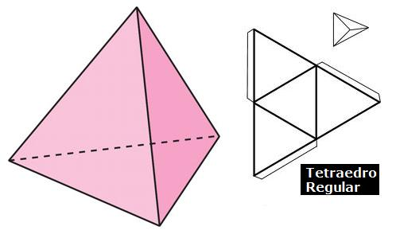

# Palillos chinos

Con 6 palillos debes formar 4 triángulos equiláteros. No vale doblarlos ni romperlos.

## Solución: un triangulo 3D (Tetraedro)

  

# El cubo mas primo

Siempre han habido dos tipos de juego de ingenio especialmente rebuscados, los tridimensionales y los que involucran números primos, porque estos son impredecibles.

Aquí presento un juego qeu combina los dos: debes poner los ocho vertices de un cubo los números del 0 al 7 de manera que los dos números de cualquier arista sumen un numero primo.
