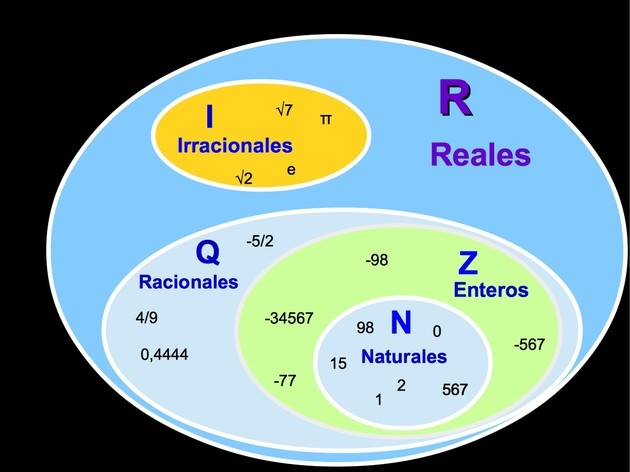

<!--
filename: 03162026.md
date: 16, March of 2026
tag: notes
last-update: 23, April of 2026
-->

| Símbolo             | Descripción          |
| ------------------- | -------------------- |
| $$\mathbb{N}$$      | Números Naturales    |
| $$\mathbb{Z}$$      | Números Enteros      |
| $$\mathbb{Q}$$      | Números Racionales   |
| $$\mathbb{I}$$      | Números Irracionales |
| $$\mathbb{R}$$      | Números Reales       |
| $$\in$$             | Pertenece            |
| $$\notin$$          | No pertenece         |
| $$ \| $$            | Tal que              |
| 
\*
 | Excluir el cero      |

# Naturales

- Tienen que estar el cero después de la coma pero no puede haber otro número
  que no sea el cero
- es para contar enteros o sea, que no podemos faccionar

$$
\mathbb{N} = \{ \ 0,1,2,3,4,... \ \}
$$

# Enteros

- Son los naturales y los opuestos de los naturales excepto el cero porque no
  tiene signo

$$
\mathbb{Z} = \mathbb{N} \cup \{\ -n \ | \ n \in \mathbb{N} \ \} \cup \{\ 0 \ \}
$$

## Valor absoluto

- Distancia del numero al cero

$$| -2 | = | +2 | = 2$$

## Números opuestos

- Si tienen mismo valor absoluto
- Si la suma de los dos es cero

$$
-a + a = 0 \\
| -a | = | +a | = 0
$$

# Racionales

- Pueden expresarse como el cociente (fracción) de dos números enteros, donde el
  denominador es distinto de cero

$$
\mathbb{Q} = \{ \ \frac{a}{b} \ | \ a \in \mathbb{Z}, \ b \in \mathbb{N^*}\  \}
$$

# Irracionales

- No se puede representar en forma de fracción
- No son predecibles, no siguen un patron

$$
\mathbb{I} = \{ \ x \in \mathbb{R} \ | \ x \notin \mathbb{Q} \ \}
$$

# Reales

$$
\mathbb{R} = \mathbb{Q} \ \cup \ \mathbb{I}
$$

<!-- $$
\mathbb{Z} \cup \mathbb{Z^-}
$$ -->

  

