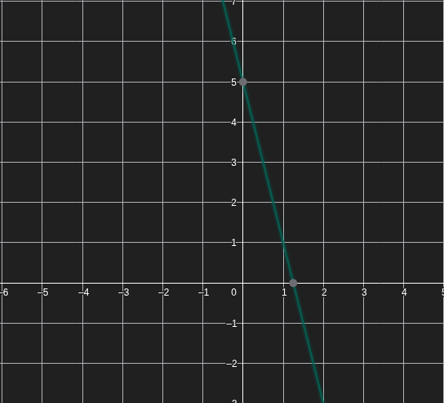
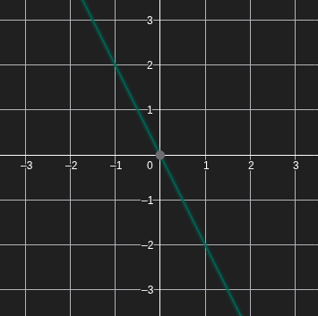
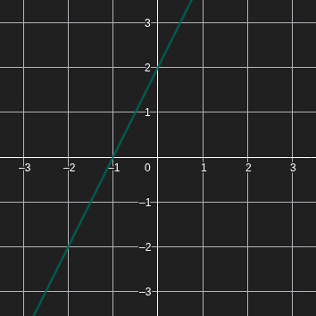
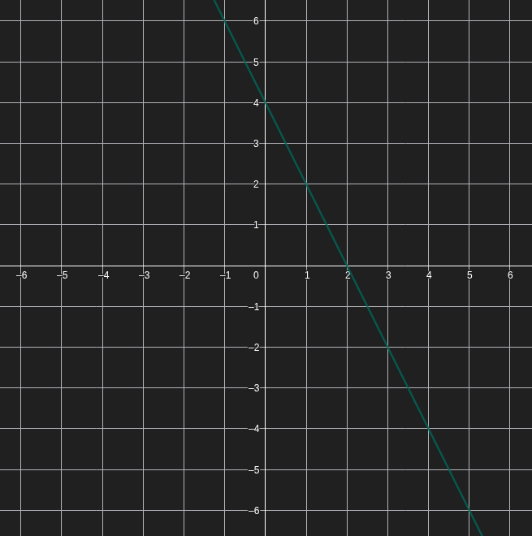
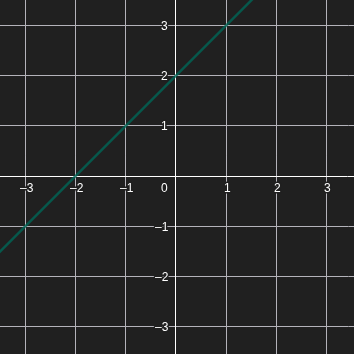

<!--
filename: 03242026.md
date: 24, March of 2026
tag: notes
last-update: 23, April of 2026
-->

# Matemáticas

$$
f:\mathbb{R}\to\mathbb{R}, \quad f(n)=2n-6
$$

Función de conjunto de dominio y codominio, ambos reales.

## Ejemplos

$$
A=\{22,\,-1,\,x\sqrt{2},\,0\}
\qquad
B=\{38,\,-20,\,-6,\,0\}
$$

> [!NOTE]
>
> La imagen de 22 es 38.
>
> Una preimagen de 38 es 22.
>
> $f(22)=38$
>
> $(22,38)\in gr(f)$
>
> $(0,-6)$ -> ordenada en el origen

## Raíz

Se consigue igualando a cero:

$$
\begin{array}{rcl}
2n-6 & = & 0 \\
2n & = & 6 \\
n & = & \frac{6}{2} \\
n & = & 3
\end{array}
$$

## Signo

> [!NOTE]
>
> El signo de la derecha nos da el signo del polinomio eg 2x - 6

$$
\Large\operatorname{Sg}(f(n)) \quad \xrightarrow[\quad 3 \qquad x]{-\quad 0 \quad +}
$$

## Ejercicios

### 3 -

$$
f:\mathbb{R}\to\mathbb{R}, \quad f(x)=-4x+5
$$

#### a -

$$
\begin{array}{rcl}
f(-3) & = & -4(-3)+5 \\
& & 12+5 \\
& & 17
\end{array}
$$

#### b -

$$
\begin{array}{rcl}
f(x) & = & -4x+5=-3 \\
& & -4x=-3-5 \\
& & -4x=-8 \\
& & x=\frac{-8}{-4}
\end{array}
$$

$$
f(2)=-3
$$

#### c -

Ordenada en el origen

$$
\begin{array}{rcl}
f(0) & = & -4\cdot 0+5 \\
f(0) & = & 5
\end{array}
$$

$$
(0,5)
$$

$$
\begin{array}{rcl}
f(x) & = & -4x+5=0 \\
& & -4x=-5 \\
& & x=\frac{5}{4}
\end{array}
$$

$$
f\left(\frac{5}{4}\right)=0
$$

#### d -

$$
\Large\operatorname{Sg}(f(x)) \quad \xrightarrow[\quad \frac{5}{4} \qquad x]{+\quad 0 \quad -}
$$

#### e -

Gráfica de la recta que pasa por $(0,5)$ y $\left(\frac{5}{4},0\right)$.

  

### 4 -

#### a -

$$
\begin{array}{rcl}
a(x) & = & -2x = 0 \\
& & x = \frac{0}{2} \\
\end{array}
$$

  

#### b -

$$
\begin{array}{rcl}
b(x) & = & 2x+2=0 \\
& & 2x=-2 \\
& & x=\frac{-2}{2}
\end{array}
$$

$$
b(-1)=0
$$

  

#### c -

$$
\begin{array}{rcl}
c(x) & = & -2x+4=0 \\
& & -2x=-4 \\
& & x=\frac{-4}{-2}
\end{array}
$$

$$
c(2)=0
$$

  

#### d -

$$
\begin{array}{rcl}
d(x) & = & x+2=0 \\
& & x=-2
\end{array}
$$

$$
d(-2)=0
$$

  

> [!NOTE]
>
> Forma de hacerlo más fácil
>
> 1- primero hallar la ordenada en el origen
>
> 2- ver signo
>
> 3- hallar raíz

#### e -

$$
\begin{array}{rcl}
& & -x+4 \\
e(4) & = & 0
\end{array}
$$

### 5 -

$$
g:\mathbb{R}\to\mathbb{R}, \quad g(n)=an-2
$$

#### a -

$$
\begin{array}{rcl}
a(-4)-2 & = & 18 \\
-4a & = & 20 \\
a & = & \frac{20}{-4} \\
a & = & -5
\end{array}
$$

$$
g(x)=-5x-2
$$

#### b -

$$
\begin{array}{rcl}
-5x-2 & = & 0 \\
-5x & = & 2 \\
x & = & -\frac{2}{5} \\
x & = & 0,4
\end{array}
$$

$$
g\left(-\frac{2}{5}\right)=0
$$

$$
\begin{array}{rcl}
g(0) & = & -2
\end{array}
$$
