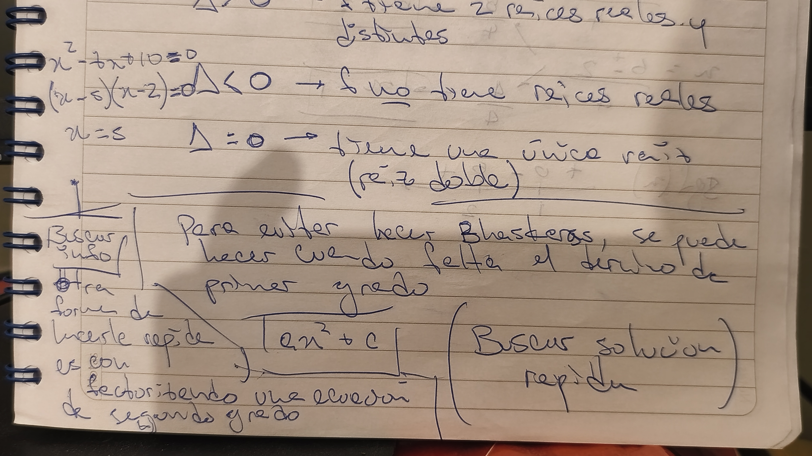
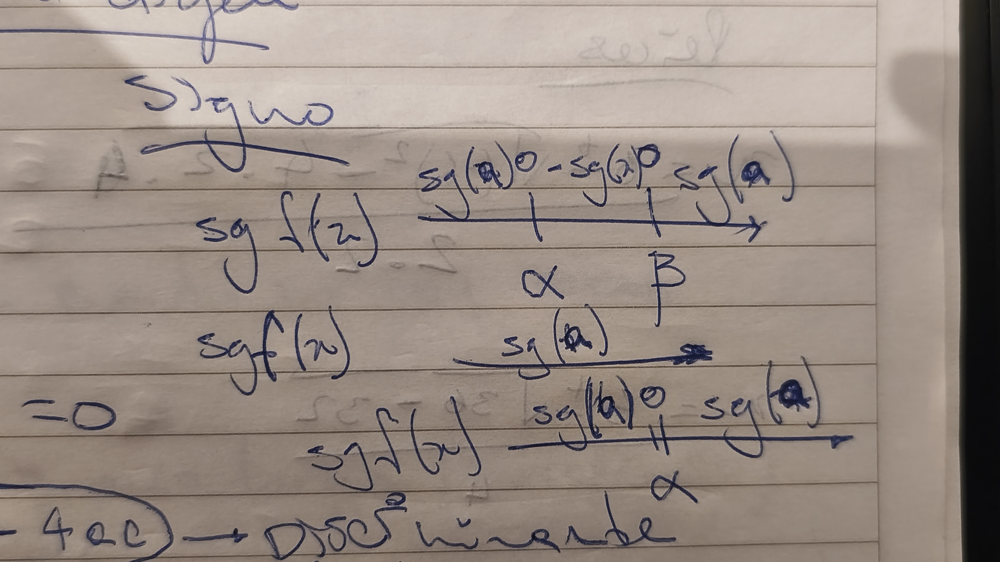

<!--
filename: 03262026.md
date: 26, March of 2026
tag: notes
last-update: 23, April of 2026
-->

## Funciones de segundo grado

$$
f:\mathbb{R}\to\mathbb{R}, \quad f(x)=ax^2+bx+c, \quad a\neq 0
$$

## Ordenada en el origen

$$
f(0)=c
$$

## Raíces

$$
ax^2+bx+c=0
$$

$$
x=\frac{-b\pm\sqrt{b^2-4ac}}{2a}
$$

$$
\Delta=b^2-4ac
$$

- Si $\Delta>f$, tiene $2$ raíces reales y distintas.
- Si $\Delta<f$, no tiene raíces reales.
- Si $\Delta=f$, tiene una única raíz (raíz doble).

> [!NOTE]
>
> [TODO]: Type it manually
>
> Uncertain transcription: the sentence near the bottom seems to explain a
> shortcut to avoid using Bhaskara in some cases, but the handwriting is not
> clear enough to recover exactly.

  

## Signo

Si $\alpha$ y $\beta$ son raíces de $f(x)$:

$$
\operatorname{sg}(f(x))=\frac{\operatorname{sg}(x-\alpha)\cdot \operatorname{sg}(x-\beta)\cdot \operatorname{sg}(a)}{1}
$$

> [!NOTE]
>
> [TODO]: Type it manually
>
> Uncertain transcription: the handwritten sign scheme at the right margin is
> partially legible, but it appears to derive the sign of the quadratic from the
> signs of $(x-\alpha)$, $(x-\beta)$, and $a$.

  

## Ejemplo

$$
f:\mathbb{R}\to\mathbb{R}, \quad f(x)=2x^2-6x+4
$$

### O.O

$$
f(0)=4
$$

### Raíces

$$
x=\frac{6\pm\sqrt{(-6)^2-4\cdot 2\cdot 4}}{2\cdot 2}
$$

$$
x=\frac{6\pm\sqrt{36-32}}{4}
$$

$$
x=\frac{6\pm\sqrt{4}}{4}
$$

$$
x=\frac{6+2}{4}=\frac{8}{4}=2
$$

$$
x=\frac{6-2}{4}=\frac{4}{4}=1
$$

### Esquema del signo

$$
\begin{array}{c}
\Large\operatorname{Sg}(f(x)) \quad
\xrightarrow
[\quad 1 \qquad\quad 2 \ \ \qquad x]
{+\quad 0\quad -\quad 0\quad +\quad -}
\end{array}
$$

## Concavidad y vértice

### Concavidad

- Si $a>0$: concavidad para arriba. $\large\cup$
- Si $a<0$: concavidad al revés. $\large\cap$

### Vértice

$$
V(x_v,y_v)
$$

$$
x_v=\frac{\alpha+\beta}{2}
$$

$$
y_v=f(x_v)
$$

Para hallar el vértice cuando no hay raíces:

$$
x_v=\frac{-b}{2a}
$$

## Repartido

$$
h:\mathbb{R}\to\mathbb{R}, \quad h(x)=2x^2+x-6
$$

### a)

$$
h(4)=2(4)^2+4-6=30
$$

$$
h(-2)=0
$$

$$
h(-1)=-5
$$

$$
h(0)=-6
$$

$$
h(1)=-3
$$

$$
h(2)=30
$$

$$
h\left(\frac{5}{2}\right)=
\frac{2}{1}\left(\frac{25}{4}\right)+\frac{5}{2}-\frac{6}{1}
$$

$$
\frac{50}{4}+\frac{5}{2}-\frac{6}{1}
$$

$$
\frac{25}{2}+\frac{5}{2}-\frac{6}{1}
$$

$$
\frac{30}{2}-\frac{6}{1}
$$

$$
15-6=9
$$

### b)

$$
h(0)=-6
$$

### Raíces

$$
h(-2)=0
$$

> [TODO]: Pendiente signo del ejercicio
