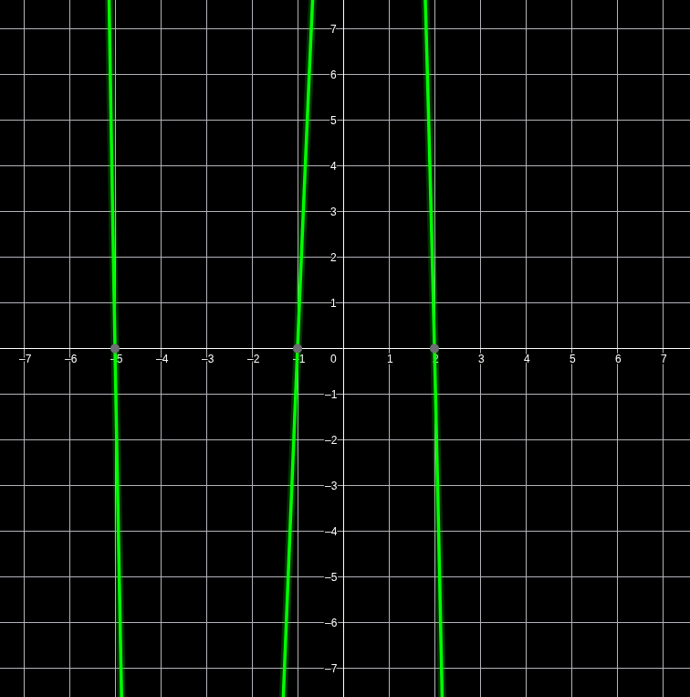
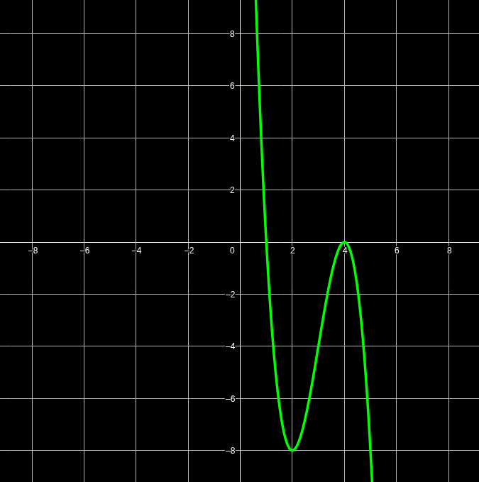
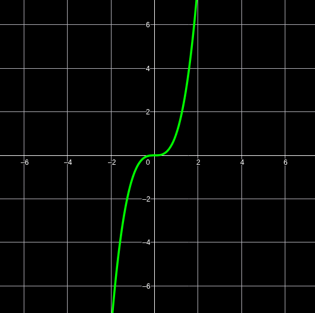
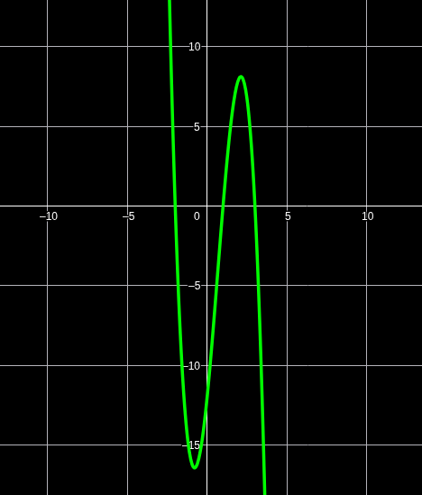
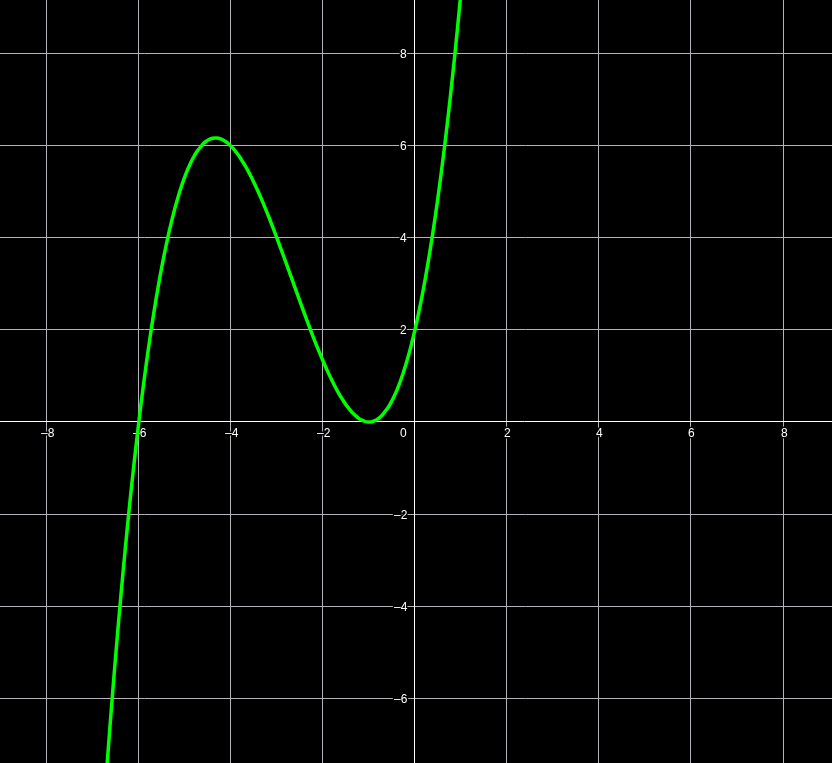

# Funciones Polinómicas de 3er grado

$$
f:\mathbb{R}\to\mathbb{R}, \quad f(x)=-2(x+5)(x+1)(x-2)
$$

## Raíces

$$
-2(x+5)(x+1)(x-2)
$$

$$
x=-5
$$

$$
x=-1
$$

$$
x=+2
$$

### Signo

$$
\Large\operatorname{Sg}\ f(x) \quad \xrightarrow[\quad -5 \qquad -1 \qquad 2 \qquad x]{+\quad 0 \quad - \quad 0 \quad + \quad 0 \quad -}
$$

### O.O

$$
f(0)=-2(0+5)(0+1)(0-2)
$$

$$
-2\cdot 5\cdot 1\cdot (-2)=20
$$

### Gráfico

  

---

$$
g:\mathbb{R}\to\mathbb{R}, \quad g(x)=-2(x-4)^2(x-1)
$$

$$
-2(x-4)(x-4)(x-1)
$$

## Raíces

$$
x=4 \text{ raíz doble}
$$

$$
x=1
$$

### Signo

$$
\Large\operatorname{Sg}\ g(x) \quad \xrightarrow[\quad \quad 1 \quad\qquad  4 \qquad x]{+\quad 0 \quad - \quad 0 \quad -}
$$

### Gráfico

  

---

$$
h:\mathbb{R}\to\mathbb{R}, \quad h(x)=(x + 1)^3
$$

## Raíces

$$
x=-1 \quad \text{Raíz triple}
$$

### O.O

$$
h(0)=1
$$

### Signo

$$
\Large\operatorname{Sg}\ h(x) \quad \xrightarrow[\quad -2 \qquad x]{-\quad 0 \quad +}
$$

### Gráfico

  

---

# Descomposición factorial de funciones polinómicas de 3er grado

$$
f:\mathbb{R}\to\mathbb{R}, \quad f(x)=a(x-\alpha)(x-\beta)(x-\delta)
$$

$$
\alpha,\beta,\delta=\text{raíces}
$$

$$
f(x)=a(x-\alpha)(x^2+mx+n)
$$

El conjunto no tiene raíces reales.

$$
(x^2+mx+n)
$$

f de $3^\circ$ grado que tenga raíces $7$, $3$ (doble), y el termino independiente es $\frac{1}{3}$

$$
f(x)=\frac{1}{3}(x-7)(x-5)^2
$$

---

$$
j:\mathbb{R}\to\mathbb{R}, \quad j(x)=-\frac{1}{2}(x-4)(x^2+1)
$$

## Raíces

$$
x=4
$$

$$
x^2+1=0
$$

$$
x^2=-1
$$

$$
x = \pm \sqrt{1} \quad \text{No} \ \exists \ \text{en} \ \mathbb{R}
$$

### Signo

$$
\Large\operatorname{Sg}\ j(x) \quad \xrightarrow[\quad 4 \quad x]{+\quad 0 \quad -}
$$

---

# Ejercicios Funciones Polinómicas de 3er grado

## 1

$$
f:\mathbb{R}\to\mathbb{R}, \quad f(x)=-2(x-3)(x+2)(x-1)
$$

## Raíces

$$
x=3
$$

$$
x=-2
$$

$$
x=1
$$

### O.O

$$
f(0)=-2(0-3)(0+2)(0-1)
$$

$$
-6\cdot 2\cdot (-1)
$$

$$
f(0)=-12
$$

### Signo

$$
\Large\operatorname{Sg}\ f(x) \quad \xrightarrow[\quad -2 \qquad 1 \qquad 3 \qquad x]{+\quad 0 \quad - \quad 0 \quad + \quad 0 \quad -}
$$

### Gráfico

  

---

$$
g:\mathbb{R}\to\mathbb{R}, \quad g(x)=\frac{1}{3}(x+6)(x+1)^2
$$

## Raíces

$$
x=-6
$$

$$
x=-1 \quad \text{Doble}
$$

### O.O

$$
\frac{1}{3}(0+6)(0+1)^2
$$

$$
\frac{1}{3}\cdot\frac{6}{1}\cdot\frac{1}{1}
$$

$$
\frac{6}{3}=2
$$

$$
f(0)=2
$$

### Signo

$$
\Large\operatorname{Sg}\ g(x) \quad \xrightarrow[\qquad -6 \qquad -1 \qquad x]{-\quad 0 \quad + \quad 0 \quad +}
$$

### Gráfico

  

