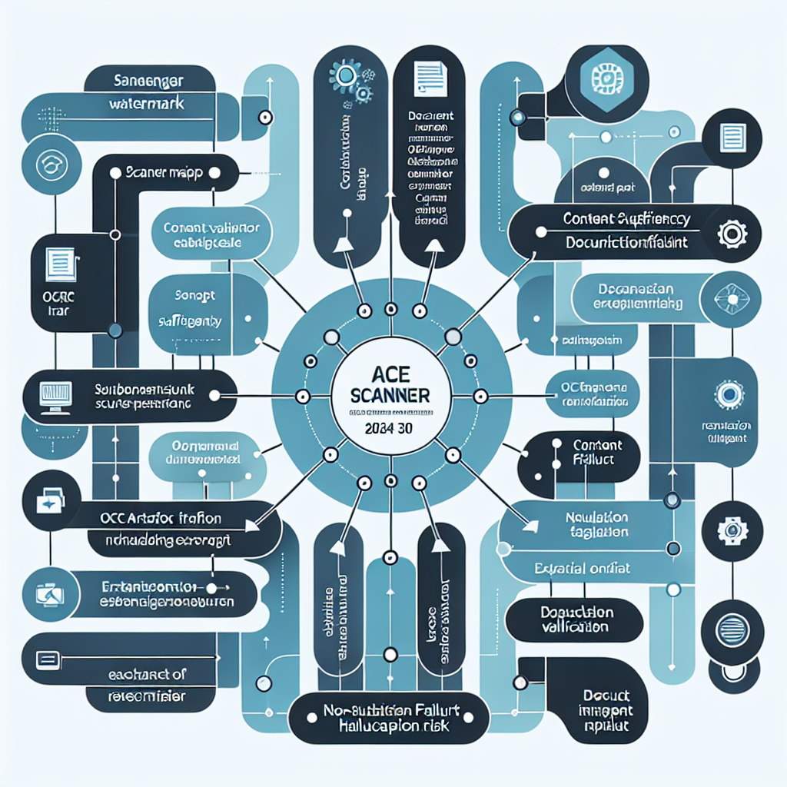

# Ace Scanner 2024 05 30

> PDF: `crea_assets/osi_tcp_ip/ACE_Scanner_2024_05_30.pdf`

---

## Table of Contents

1. [Overview](#overview)
2. [Concept Map](#concept-map)
3. [Detailed Notes](#detailed-notes)
4. [Key Concepts](#key-concepts)
5. [Glossary](#glossary)
6. [Cheat Sheet](#cheat-sheet)
7. [Takeaways](#takeaways)
8. [Quiz (4q)](#quiz)
9. [Flashcards (5)](#flashcards)
10. [Exercises (1)](#exercises)
11. [Learning Path](#learning-path)

---

## Overview

The provided content contains only the phrase “Scanned with ACE Scanner,” which appears to be a scanning or OCR watermark rather than substantive instructional material. Because there is no actual source text, argument, data, methodology, or domain-specific discussion, there is no central thesis to extract and no factual body of knowledge to summarize from the source itself. The only reliable conclusion is that the document ingestion process produced an incomplete or non-content-bearing artifact.

From a knowledge-architecture perspective, this content is best understood as a quality-control signal: it indicates that a document was scanned, but the meaningful text either was not included, was not recognized by OCR, or was omitted during extraction. The logical chain is therefore procedural rather than conceptual: a source was processed by a scanner; the output retained only scanner metadata; this output is insufficient for learning-material generation; remediation requires locating the original document, rescanning it, running OCR, validating extraction quality, and supplying the complete text.

The main lesson is not about the content of the missing document, but about source validation. Before summarization, note-taking, glossary creation, or curriculum design can occur, the input must be checked for completeness, readability, and semantic density. A single scanner watermark cannot support claims, concepts, definitions, or instructional conclusions. Any attempt to infer the document’s topic would be speculative. The appropriate next action is to recover or reprocess the source material and verify that the resulting text contains actual headings, paragraphs, tables, figures, or other meaningful evidence.

---

## Concept Map



---

## Detailed Notes

## Source Analysis

### Provided Content

The entire supplied content is:

> Scanned with ACE Scanner

This phrase is most likely a **scanner watermark**, **OCR artifact**, or **document-processing note** rather than the substantive content of a document.

## What Can Be Concluded Reliably

### 1. The Source Is Not Substantive

The text does not contain:

- A thesis or argument
- Explanatory paragraphs
- Data, tables, or figures
- Definitions or technical terms beyond the scanner reference
- Methodology
- Results or conclusions
- Examples, cases, or evidence

Because of this, it cannot support a normal learning package about a subject-matter topic.

### 2. The Phrase Indicates Document Capture

The phrase “Scanned with ACE Scanner” suggests that a physical or digital document may have been processed using a scanning application called **ACE Scanner**.

Possible interpretations include:

- The document was scanned from paper.
- The scanner app inserted a watermark.
- OCR was not performed or failed.
- Only a footer, watermark, or metadata layer was extracted.
- The actual document body was lost during upload, conversion, or copy-paste.

### 3. The Input Fails Content Sufficiency Requirements

A source is typically sufficient for instructional design when it includes enough information to identify:

- **Topic**: What the document is about
- **Purpose**: Why it was written
- **Audience**: Who it is for
- **Claims**: What it argues or explains
- **Evidence**: What supports those claims
- **Structure**: How the ideas are organized
- **Terminology**: What specialized vocabulary is used
- **Applications**: How the information should be used

This input does not meet those criteria.

## Why Hallucination Must Be Avoided

### No Topic Can Be Safely Inferred

Although the phrase references a scanner, it does not mean the original document was about scanning technology. It could have been any type of document, such as:

- A textbook page
- A legal form
- A medical report
- A business contract
- A worksheet
- A research article
- A receipt
- A handwritten note

Inferring any of these would be speculative.

### No Domain-Specific Claims Are Justified

The content does not justify claims about:

- ACE Scanner’s features
- OCR accuracy
- Document-management workflows
- Scanning hardware
- Image processing
- Any original document topic

The only defensible claim is that the provided extract is incomplete or non-substantive.

## Instructional Design Implication

### Learning Cannot Be Built from Missing Content

High-quality learning materials require a meaningful source. Without source content, an instructional designer should shift from synthesis to **intake quality control**.

Instead of producing a false summary, the correct workflow is:

1. Identify that the input is insufficient.
2. Report the limitation clearly.
3. Request or recover the complete source.
4. Reprocess the document if needed.
5. Validate extracted text before analysis.
6. Only then generate learning materials.

## Recommended Recovery Workflow

### Step 1: Locate the Original Document

Find the original file, scan, image, PDF, or physical document that was intended to be analyzed.

Check whether:

- Only one page was uploaded.
- The file was truncated.
- The wrong document was selected.
- The copied text omitted the body.
- The PDF contains image-only pages.

### Step 2: Inspect the Document Visually

Open the source file and verify whether readable content appears on the page.

Look for:

- Headings
- Paragraphs
- Tables
- Charts
- Captions
- Footnotes
- Page numbers
- Appendices

### Step 3: Run OCR If Needed

If the document is an image or scanned PDF, run **Optical Character Recognition (OCR)** to extract machine-readable text.

Recommended OCR tools include:

- Adobe Acrobat OCR
- Google Drive OCR
- Microsoft OneNote OCR
- ABBYY FineReader
- Tesseract OCR
- OCRmyPDF

### Step 4: Validate OCR Quality

After OCR, compare extracted text against the visible document.

Check for:

- Missing pages
- Garbled characters
- Broken tables
- Incorrect reading order
- Headers or footers mistaken for body text
- Watermarks inserted as content
- Misrecognized technical terms

### Step 5: Provide the Complete Text

For a strong learning package, supply:

- Full extracted text
- Page images if OCR quality is uncertain
- Document title and author, if known
- Context or assignment goal
- Any specific audience or learning objective

## Quality Checklist for Future Inputs

Before requesting summarization or learning design, confirm:

- The source contains at least several meaningful paragraphs.
- The title and main topic are visible.
- The text is not only metadata, watermark, or footer content.
- The OCR has captured the body, not just margins.
- Tables and figures are either transcribed or described.
- Page order is correct.
- The intended document, not an accidental placeholder, was uploaded.

## Minimal Valid Conclusion

The source does not provide enough substantive information to create a topic-specific learning package. The correct action is to recover the complete document or rerun OCR and resubmit the actual content.

---

## Key Concepts

**1.** Scanner Watermark: A short phrase automatically added by a scanning application that identifies the tool used rather than conveying the document’s substantive content.

**2.** OCR Artifact: Text produced or preserved during optical character recognition that may reflect formatting, metadata, or watermarks instead of meaningful body text.

**3.** Content Sufficiency: The degree to which a source contains enough meaningful information to support accurate summary, analysis, or instruction.

**4.** Source Validation: The process of checking whether an input document is complete, readable, relevant, and suitable for analysis before using it as evidence.

**5.** Document Ingestion: The workflow of acquiring, scanning, converting, extracting, and preparing documents for digital processing.

**6.** Extraction Failure: A document-processing problem where the meaningful body text is missing, corrupted, or replaced by irrelevant metadata.

**7.** Non-Substantive Input: Text that does not contain claims, explanations, evidence, or concepts sufficient for learning or analysis.

**8.** Hallucination Risk: The danger of inventing unsupported details when a source lacks enough information to justify conclusions.

**9.** OCR Quality Control: The practice of comparing extracted text against the original document to identify missing, garbled, or misordered content.

**10.** Semantic Density: The amount of meaningful conceptual information contained in a text relative to its length.

**11.** Metadata vs. Content: The distinction between information about a document’s processing or origin and the actual material the document is meant to communicate.

**12.** Remediation Workflow: A sequence of corrective actions used to recover usable content from an incomplete or failed document extraction.

---

## Glossary

| Term | Definition | Related |
|:-----|:-----------|:--------|
| **ACE Scanner** | The scanning tool referenced by the phrase in the provided content; in this context, it appears only as a watermark or processing label, not as the topic of a substantive document. | Scanner Watermark, Document Ingestion, OCR Artifact |
| **Scanner Watermark** | A phrase or visual mark inserted by a scanning application to identify the software or service used to create the scan. | ACE Scanner, Metadata, OCR Artifact |
| **OCR** | Optical Character Recognition, the process of converting text visible in an image or scanned PDF into machine-readable text. | OCR Quality Control, Text Extraction, Scanned PDF |
| **OCR Artifact** | Unwanted or misleading text produced during OCR, such as watermarks, headers, footers, broken characters, or misplaced fragments. | OCR, Scanner Watermark, Extraction Failure |
| **Document Ingestion** | The process of collecting, scanning, uploading, converting, and preparing a document for digital analysis or storage. | Source Validation, Text Extraction, OCR |
| **Text Extraction** | The process of pulling machine-readable text from a digital file, scanned image, or PDF. | OCR, Extraction Failure, Document Ingestion |
| **Extraction Failure** | A failure mode in which the extracted text does not include the meaningful body of the document or contains only irrelevant fragments. | OCR Artifact, Text Extraction, Content Sufficiency |
| **Content Sufficiency** | The condition of having enough substantive information in a source to support accurate summarization, analysis, teaching, or decision-making. | Source Validation, Semantic Density, Non-Substantive Input |
| **Source Validation** | The process of confirming that a source is authentic, complete, readable, relevant, and usable before analyzing it. | Content Sufficiency, OCR Quality Control, Document Ingestion |
| **Non-Substantive Input** | Text that lacks meaningful claims, explanations, definitions, evidence, or instructional value. | Scanner Watermark, Content Sufficiency, Hallucination Risk |
| **Metadata** | Information about a document or its processing, such as scanner name, date, filename, author, or software used, rather than the document’s main content. | Scanner Watermark, Document Ingestion, Content |
| **Semantic Density** | The concentration of meaningful concepts, claims, relationships, and evidence within a body of text. | Content Sufficiency, Learning Value, Non-Substantive Input |
| **Hallucination Risk** | The risk that an AI system or analyst will generate unsupported details when the source material is incomplete or ambiguous. | Source Validation, Non-Substantive Input, Evidence |
| **Scanned PDF** | A PDF composed of page images rather than embedded machine-readable text, often requiring OCR before analysis. | OCR, Text Extraction, Document Ingestion |
| **Image-Only Document** | A digital document that contains visual images of text but no selectable or searchable text layer. | Scanned PDF, OCR, Text Extraction |
| **OCR Quality Control** | The review process used to ensure OCR output accurately reflects the original document’s text, structure, and reading order. | OCR, Source Validation, Extraction Failure |
| **Reading Order** | The sequence in which extracted text should be read to preserve the logical structure of the original document. | OCR Quality Control, Text Extraction, Document Layout |
| **Document Layout** | The visual arrangement of headings, columns, paragraphs, tables, figures, headers, and footers in a document. | Reading Order, OCR Quality Control, Text Extraction |
| **Remediation Workflow** | A structured set of corrective steps used to recover usable text from an incomplete, corrupted, or poorly extracted document. | Extraction Failure, Source Validation, OCR Quality Control |
| **Learning Package** | A structured instructional output containing summaries, notes, concepts, glossaries, references, and action steps designed to help a learner master a topic. | Instructional Design, Content Sufficiency, Learning Value |

---

## Cheat Sheet

## Quick Reference: Handling an Empty or Scanner-Only Source

### Provided Text

```text
Scanned with ACE Scanner
```

### What It Means

| Observation | Interpretation |
|---|---|
| Only one short phrase is present | The source is incomplete or non-substantive |
| Phrase names a scanner app | Likely a watermark or metadata artifact |
| No paragraphs, headings, data, or claims | No topic-specific learning package can be justified |
| No thesis or evidence | Any detailed subject summary would be speculative |

### Do Not Infer

- The original document’s topic
- The author’s argument
- The intended audience
- The methodology or conclusions
- Technical details about ACE Scanner beyond its apparent role as a scanner label

### Required Recovery Steps

1. **Find** the original scan, PDF, image, or physical document.
2. **Open** it visually and confirm the real content is present.
3. **Run OCR** if the document is image-only.
4. **Check** extracted text against the original page images.
5. **Remove** irrelevant watermarks, headers, and footers if needed.
6. **Resubmit** the complete text for analysis.

### Minimum Source Quality Checklist

| Requirement | Yes/No |
|---|---|
| Has a title or identifiable topic |  |
| Contains meaningful paragraphs |  |
| Includes all pages in order |  |
| OCR text matches visible text |  |
| Tables/figures are captured or described |  |
| Not just watermark or metadata |  |

### Best Tools for OCR/Recovery

- Adobe Acrobat OCR
- ABBYY FineReader
- Google Drive OCR
- Microsoft OneNote OCR
- Tesseract OCR
- OCRmyPDF

### Core Rule

**If the source contains only metadata or a watermark, stop analysis and recover the real document before summarizing.**

---

## Takeaways

- Verify that the source contains substantive text before requesting or performing analysis.
- Locate the original document file or physical source if the extracted text shows only a scanner watermark.
- Run OCR on image-only PDFs or scanned pages to produce machine-readable text.
- Compare OCR output against the original scan to catch missing pages, broken reading order, and watermark-only extraction.
- Remove scanner watermarks, headers, footers, and metadata before treating text as instructional content.
- Resubmit the complete document text once headings, paragraphs, tables, or figures are visible.
- Avoid inferring the topic or claims of a missing document from a scanner label alone.
- Create a document-ingestion checklist to prevent incomplete sources from entering a learning-design workflow.

---

## Quiz

### Q1 [MCQ] (E)

**What is the most defensible conclusion you can draw from the phrase "Scanned with ACE Scanner"?**

- A. The document was digitized or processed using a tool called ACE Scanner.
- B. The document has been verified as accurate and complete.
- C. The document was created originally in ACE Scanner rather than scanned.
- D. The document contains no errors because it was scanned automatically.

<details><summary>Answer</summary>

**A. The document was digitized or processed using a tool called ACE Scanner.**

_The phrase directly indicates that ACE Scanner was involved in scanning or processing the document. It does not prove that the scan is accurate, complete, error-free, or that the original document was created in that tool. A careful interpretation avoids assuming more than the phrase actually states._

</details>

### Q2 [T/F] (M)

**True or False: The statement "Scanned with ACE Scanner" is sufficient evidence that the scanned document preserves the full original content without omissions or distortions.**

<details><summary>Answer</summary>

**False**

_The phrase identifies the scanning tool or process, but it does not provide quality assurance details. A scan could still be incomplete, blurry, cropped, distorted, or affected by recognition errors. Additional verification would be needed to confirm fidelity to the original._

</details>

### Q3 [Scenario] (M)

**A researcher receives a digital copy of a legal document that contains only the note "Scanned with ACE Scanner." They need to cite the document as evidence in a report. What is the best approach?**

- A. Treat the document as fully authenticated because scanner software is named.
- B. Use the document but note that it appears to be a scanned copy and seek corroboration or access to the original if authenticity matters.
- C. Reject the document automatically because anything scanned is unreliable.
- D. Assume ACE Scanner performed optical character recognition and that all text is accurate.

<details><summary>Answer</summary>

**B. Use the document but note that it appears to be a scanned copy and seek corroboration or access to the original if authenticity matters.**

_The note tells the researcher something about the document's processing history, but not enough to establish authenticity or accuracy. The responsible approach is to recognize it as a scanned copy and verify it through other means when the stakes are high. Automatically trusting or rejecting the document would both be overreactions._

</details>

### Q4 [Compare] (H)

**Compare what the phrase "Scanned with ACE Scanner" tells you with what it does not tell you about a document.**

<details><summary>Answer</summary>

**The phrase tells you that the document was scanned or processed using ACE Scanner. It does not tell you whether the scan is complete, authentic, legible, correctly recognized by OCR, or faithful to the original. Therefore, it is useful as processing metadata but not as proof of document reliability.**

_This comparison distinguishes between direct evidence and unsupported inference. The phrase provides limited metadata about the tool used, but quality, authenticity, and completeness require separate evidence. Understanding this boundary is important when evaluating scanned documents critically._

</details>

---

## Flashcards

**1. What tool is explicitly named in the text?** `source` `identification`
> The tool explicitly named is ACE Scanner.

**2. What does the phrase "Scanned with ACE Scanner" indicate?** `meaning` `document-processing`
> It indicates that the document or image was scanned using ACE Scanner.

**3. How was the document likely digitized according to the text?** `process` `scanning`
> It was digitized by scanning it with ACE Scanner.

**4. Why might the phrase "Scanned with ACE Scanner" appear on a document?** `purpose` `metadata`
> It may appear as a scanning note or watermark identifying the tool used to create the digital copy.

**5. Is "Scanned with ACE Scanner" substantive document content or a scanning attribution?** `classification` `document-processing`
> It is a scanning attribution, not substantive document content.

---

## Exercises

### Exercise 1: Analyze and Improve an ACE Scanner Accessibility Report (M)

You have received a digital publication or document package that was labeled only as 'Scanned with ACE Scanner.' Your task is to turn this vague scan status into an actionable accessibility review. Create a short accessibility analysis report that includes: 1) what ACE Scanner is likely checking for, 2) what information is missing from the phrase 'Scanned with ACE Scanner,' 3) a checklist of at least 8 accessibility items you would verify manually or from the ACE report, 4) a prioritized remediation plan with high, medium, and low priority fixes, and 5) a final recommendation stating whether the content should be accepted, revised, or rescanned before release.

**Hints:**
- Hint 1: A scan result is not the same as proof of accessibility; identify what evidence is needed.
- Hint 2: Consider common accessibility areas such as headings, alt text, reading order, language metadata, tables, links, and navigation.
- Hint 3: Prioritize issues that block access for screen reader, keyboard, or low-vision users.

<details><summary>Solution</summary>

A strong response should explain that 'Scanned with ACE Scanner' is insufficient by itself because it does not include pass/fail results, issue severity, file version, scan date, scanner configuration, or remediation evidence. Key checklist items should include: presence of document language, valid structure and headings, meaningful image alt text, accessible tables with headers, logical reading order, descriptive links, accessible navigation/table of contents, sufficient metadata, no duplicate or broken IDs, valid EPUB/HTML markup if applicable, keyboard/screen reader usability, and review of media alternatives such as captions or transcripts. The remediation plan should prioritize blockers first, such as missing navigation, broken structure, unreadable images without alt text, invalid markup, or incorrect reading order. Medium priorities may include improving link text, table structure, and metadata. Low priorities may include consistency improvements or minor warnings. The final recommendation should usually be 'rescan and manually review before release' unless a full ACE report and manual validation confirm accessibility.

</details>

---

## Learning Path

### Prerequisites
- Basic understanding of digital documents such as PDFs, images, and text files
- Ability to distinguish document content from metadata, headers, footers, and watermarks
- Basic familiarity with copying text from documents and checking whether text is selectable
- Awareness that scanned documents may require OCR before they can be analyzed

### Next Steps
- Study OCR workflows and common OCR failure modes.
- Learn document-quality assurance methods for scanned PDFs and archival materials.
- Practice validating extracted text against page images.
- Explore tools for batch OCR, PDF cleanup, and document preprocessing.
- Learn prompt and input-preparation practices for reliable AI-assisted summarization.

### Recommended Resources
- OCRmyPDF documentation: https://ocrmypdf.readthedocs.io/
- Tesseract OCR documentation: https://tesseract-ocr.github.io/
- Adobe Acrobat OCR guide: https://helpx.adobe.com/acrobat/using/scan-documents-pdf.html
- ABBYY FineReader PDF: https://pdf.abbyy.com/
- Google Drive OCR instructions: https://support.google.com/drive/answer/176692
- Library of Congress digital preservation resources: https://www.loc.gov/preservation/
- The NIST Guide to OCR and document image quality concepts: https://www.nist.gov/
- Book: Practical Tesseract OCR by Sandipan Dey
- Tool: Microsoft OneNote OCR for quick extraction from images
- Tool: Excalidraw or Markmap for mapping recovered document structure after OCR

---

*Generated by [Skill-Anything](https://github.com/SYuan03/Skill-Anything)*