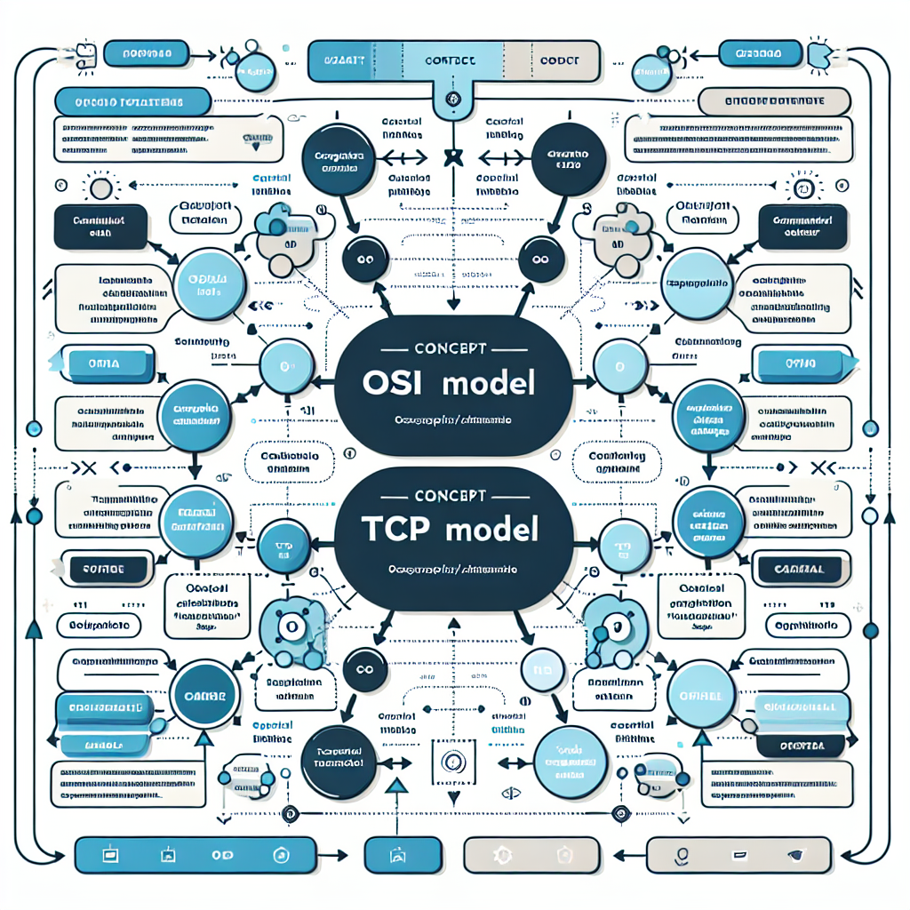

# Modelo Osi Vs Modelo Tcp (1)

> PDF: `output/osi_tcp_ip/converted_pptx_pdf/MODELO_OSI_VS_MODELO_TCP (1).pdf`

---

## Table of Contents

1. [Overview](#overview)
2. [Concept Map](#concept-map)
3. [Detailed Notes](#detailed-notes)
4. [Key Concepts](#key-concepts)
5. [Takeaways](#takeaways)
6. [Quiz (4q)](#quiz)
7. [Flashcards (5)](#flashcards)
8. [Exercises (1)](#exercises)

---

## Overview

MODELO OSI VS MODELO TCP/IP
Estudio comparativo
Comparativo con infraestructura de
redes
Descripción capa a capa
encapsulado
Estudio de cabeceras, protocolos y
sus puertos
Representación esquemática en
simulador de redes
Prácticos de captura

Estudio
comparativo
http
VLAN
MPLS WiFi
802. 1q
892,11ax

Protocolos
VLAN
802. 1q

Descripción capa a
capaL a Capa de Aplicación: En esta capa se encuentra el software necesario para
posibilitar las distintas sesiones, presentación de datos y comunicación de las
aplicaciones de usuario-Lo que en OSI se resolvia en 3 capas superiores a la de
transporte
La Capa de Transporte: es la que tiene aquellos procedimientos que
garantizan una transmisión segura a nivel lógico ,segmentado, empaquetado
identificación de puertos de transporte
La Capa de Internet: El objetivo de esta capa es el de comunicar computadoras
en redes distintas encargándose del direccionamiento y enrutamiento de los
datos
La Capa de Acceso a la Red: Es la responsable del intercambio de datos entre
capas superiores y la red a la cual se esta conectado,. Se encuentra relacionada
con el acceso y el encaminamiento de los datos
Algunas interpretaciones de este modelo la unen a la capa 1
La Capa Física: Define la interfaz física entre el dispositivo de transmisión
de datos (por ejemplo, la estación del trabajo del computador) y el medio de
transmisión o red. Esta capa se encarga de la especificación de las
características del medio de transmisión, la naturaleza de las señales, la
velocidad de los datos y cuestiones afines.

---

## Concept Map

---

## Detailed Notes

## Page 1

MODELO OSI VS MODELO TCP/IP
Estudio comparativo
Comparativo con infraestructura de
redes
Descripción capa a capa
encapsulado
Estudio de cabeceras, protocolos y
sus puertos
Representación esquemática en
simulador de redes
Prácticos de captura

Estudio
comparativo
http
VLAN
MPLS WiFi
802.1q
892,11ax

Protocolos
VLAN
802.1q

Descripción capa a
capaL a Capa de Aplicación: En esta capa se encuentra el software necesario para
posibilitar las distintas sesiones, presentación de datos y comunicación de 

---

## Key Concepts

**1.** Page 1: See corresponding section for details

---

## Takeaways

- Review the core content of Page 1

---

## Quiz

### Q1 [MCQ] (M)

**En el modelo TCP/IP descrito, ¿cuál es la relación más adecuada entre la Capa de Aplicación de TCP/IP y el modelo OSI?**

- A. Equivale únicamente a la capa de Aplicación de OSI, porque ambas gestionan solo protocolos como HTTP.
- B. Integra funciones que en OSI se distribuyen entre las capas de sesión, presentación y aplicación.
- C. Sustituye a la capa de transporte de OSI porque identifica puertos y segmenta datos.
- D. Agrupa las funciones físicas y de enlace de datos porque se ocupa del acceso al medio.

Answer

**B. Integra funciones que en OSI se distribuyen entre las capas de sesión, presentación y aplicación.**

_La descripción indica que la Capa de Aplicación de TCP/IP contiene el software necesario para sesiones, presentación de datos y comunicación de aplicaciones de usuario. En OSI, esas responsabilidades están separadas en tres capas superiores: sesión, presentación y aplicación. Por eso, TCP/IP simplifica esa parte del modelo agrupando varias funciones OSI en una sola capa._

### Q2 [Fill] (E)

**Completa el espacio en blanco: El estándar asociado al etiquetado de VLAN mencionado en el contenido es ________.**

Answer

**802.1q**

_El contenido relaciona explícitamente VLAN con el protocolo o estándar 802.1q. Este estándar se usa para insertar etiquetas en tramas Ethernet y así identificar a qué VLAN pertenece el tráfico, permitiendo separar lógicamente redes sobre una misma infraestructura física._

### Q3 [Scenario] (H)

**Un estudiante captura tráfico con Wireshark mientras abre una página web HTTP desde una PC conectada por WiFi a una red con VLAN. Observa que los datos pasan por varias capas antes de llegar al destino. ¿Cuál interpretación es la más correcta según el modelo TCP/IP descrito?**

- A. HTTP pertenece a la Capa Física porque finalmente viaja como señales por el medio inalámbrico.
- B. La Capa de Transporte identifica puertos y segmenta la comunicación; la Capa de Internet se ocupa del direccionamiento y enrutamiento; y el acceso WiFi/VLAN corresponde al acceso a la red o nivel físico/enlace según la interpretación.
- C. La VLAN reemplaza a la Capa de Internet porque permite comunicar computadoras en redes distintas mediante direccionamiento IP.
- D. Wireshark solo permite analizar la Capa de Aplicación, por lo que no sirve para estudiar cabeceras de transporte, Internet o acceso a la red.

Answer

**B. La Capa de Transporte identifica puertos y segmenta la comunicación; la Capa de Internet se ocupa del direccionamiento y enrutamiento; y el acceso WiFi/VLAN corresponde al acceso a la red o nivel físico/enlace según la interpretación.**

_La opción B integra correctamente las funciones capa por capa. HTTP se ubica en la Capa de Aplicación; la Capa de Transporte maneja segmentación lógica e identificación de puertos; la Capa de Internet direcciona y enruta entre redes; y tecnologías como WiFi o VLAN se relacionan con el acceso a la red y, según la interpretación del modelo, también con aspectos físicos o de enlace. Esta visión también es coherente con el análisis de cabeceras y encapsulado que se realiza en capturas con Wireshark._

### Q4 [Compare] (M)

**Compara la Capa de Transporte y la Capa de Internet del modelo TCP/IP. ¿Por qué no cumplen la misma función aunque ambas participan en la comunicación extremo a extremo?**

Answer

**La Capa de Transporte se encarga de la comunicación lógica entre procesos, incluyendo segmentación, empaquetado e identificación de puertos de transporte. La Capa de Internet, en cambio, se ocupa de comunicar computadoras ubicadas en redes distintas mediante direccionamiento y enrutamiento. Aunque ambas son necesarias para que los datos lleguen correctamente, una se centra en los servicios entre aplicaciones y la otra en el camino entre redes.**

_La diferencia clave está en el nivel de abstracción. Transporte identifica qué aplicación o proceso debe recibir los datos mediante puertos y organiza la comunicación en segmentos. Internet decide cómo llegar a otra máquina o red usando direccionamiento y rutas. Confundirlas llevaría a pensar que los puertos enrutan paquetes o que las direcciones IP identifican aplicaciones, cuando en realidad cumplen funciones complementarias._

---

## Flashcards

**1. ¿Cómo se compara la capa de Aplicación del modelo TCP/IP con las capas superiores del modelo OSI?** `TCP/IP` `OSI` `capas`
> La capa de Aplicación de TCP/IP agrupa funciones que en OSI se dividen en Aplicación, Presentación y Sesión.

**2. ¿Qué función cumple la capa de Transporte en el modelo TCP/IP?** `TCP/IP` `transporte` `puertos`
> La capa de Transporte gestiona la transmisión lógica entre aplicaciones mediante segmentación, empaquetado e identificación de puertos de transporte.

**3. ¿Por qué es necesaria la capa de Internet en el modelo TCP/IP?** `TCP/IP` `internet` `enrutamiento`
> Es necesaria para comunicar computadoras ubicadas en redes distintas mediante direccionamiento y enrutamiento de datos.

**4. ¿Cómo funciona la comunicación capa a capa mediante encapsulado?** `encapsulado` `cabeceras` `capas`
> Cada capa agrega o interpreta información de control, como cabeceras, para que su capa homónima en el destino pueda procesar los datos correctamente.

**5. En una captura con Wireshark, ¿qué dato de las cabeceras ayuda a identificar el servicio o aplicación usado?** `Wireshark` `cabeceras` `protocolos`
> Los números de puerto en las cabeceras de transporte ayudan a asociar el tráfico con protocolos o servicios de aplicación, como HTTP.

---

## Exercises

### Exercise 1: Análisis capa a capa de una comunicación HTTP con VLAN usando simulador y Wireshark (M)

Construye o utiliza un escenario simple de red en Cisco Packet Tracer u otro simulador equivalente con dos PCs, un switch y un router. Configura una VLAN usando 802.1Q para segmentar la red y permite que un cliente acceda a un servidor HTTP. Luego realiza una captura de tráfico con Wireshark o la herramienta de simulación disponible. Tu tarea es analizar la comunicación desde el punto de vista del modelo OSI y del modelo TCP/IP. Entregables: 1) un esquema de la red indicando dispositivos, interfaces, direcciones IP, VLAN y enlaces trunk/access; 2) una tabla comparativa OSI vs TCP/IP ubicando HTTP, TCP, IP, Ethernet, 802.1Q y la capa física; 3) una explicación del encapsulado de una petición HTTP desde la aplicación hasta el medio físico; 4) identificación de cabeceras relevantes en una captura: Ethernet, etiqueta VLAN 802.1Q si aparece, IP, TCP y HTTP; 5) identificación de protocolos y puertos usados, especialmente TCP puerto 80 para HTTP; 6) una conclusión breve sobre qué funciones cumple cada capa durante la comunicación.

**Hints:**
- Hint 1: Comienza configurando una topología mínima: PC cliente, switch, router-on-a-stick y servidor HTTP. El enlace entre switch y router debe estar en modo trunk para transportar VLAN mediante 802.1Q.
- Hint 2: En Wireshark, usa filtros como http, tcp.port == 80, ip.addr == X.X.X.X o eth.type == 0x8100 para localizar tráfico HTTP, TCP/IP y posibles etiquetas VLAN.
- Hint 3: Recuerda que el modelo TCP/IP agrupa las capas superiores de OSI en la capa de Aplicación, mientras que Transporte, Internet y Acceso a la Red se relacionan con TCP, IP y Ethernet/802.1Q respectivamente.

Solution

Puntos clave esperados: El esquema debe mostrar una red funcional con cliente y servidor comunicándose mediante HTTP. Si hay VLAN, los puertos hacia hosts deben estar en modo access y el enlace switch-router en modo trunk 802.1Q. La tabla comparativa debe ubicar HTTP en Aplicación TCP/IP y en las capas superiores de OSI, TCP en Transporte, IP en Red/Internet, Ethernet y 802.1Q en Enlace de datos/Acceso a la red, y el medio físico en Física. El encapsulado correcto debe describirse como: datos HTTP -> segmento TCP con puerto origen dinámico y destino 80 -> paquete IP con direcciones IP origen/destino -> trama Ethernet con MAC origen/destino y, si corresponde, etiqueta VLAN 802.1Q -> bits/señales en el medio físico. En la captura deben identificarse cabeceras Ethernet, posible VLAN tag con ID de VLAN, cabecera IP con direcciones origen/destino, cabecera TCP con puertos, flags y número de secuencia, y contenido HTTP como GET/POST o respuesta del servidor. La conclusión debe explicar que cada capa se comunica lógicamente con su homóloga y que cada una añade o interpreta su propia cabecera durante el proceso de encapsulado/desencapsulado.

---

*Generated by [Skill-Anything](https://github.com/SYuan03/Skill-Anything)*