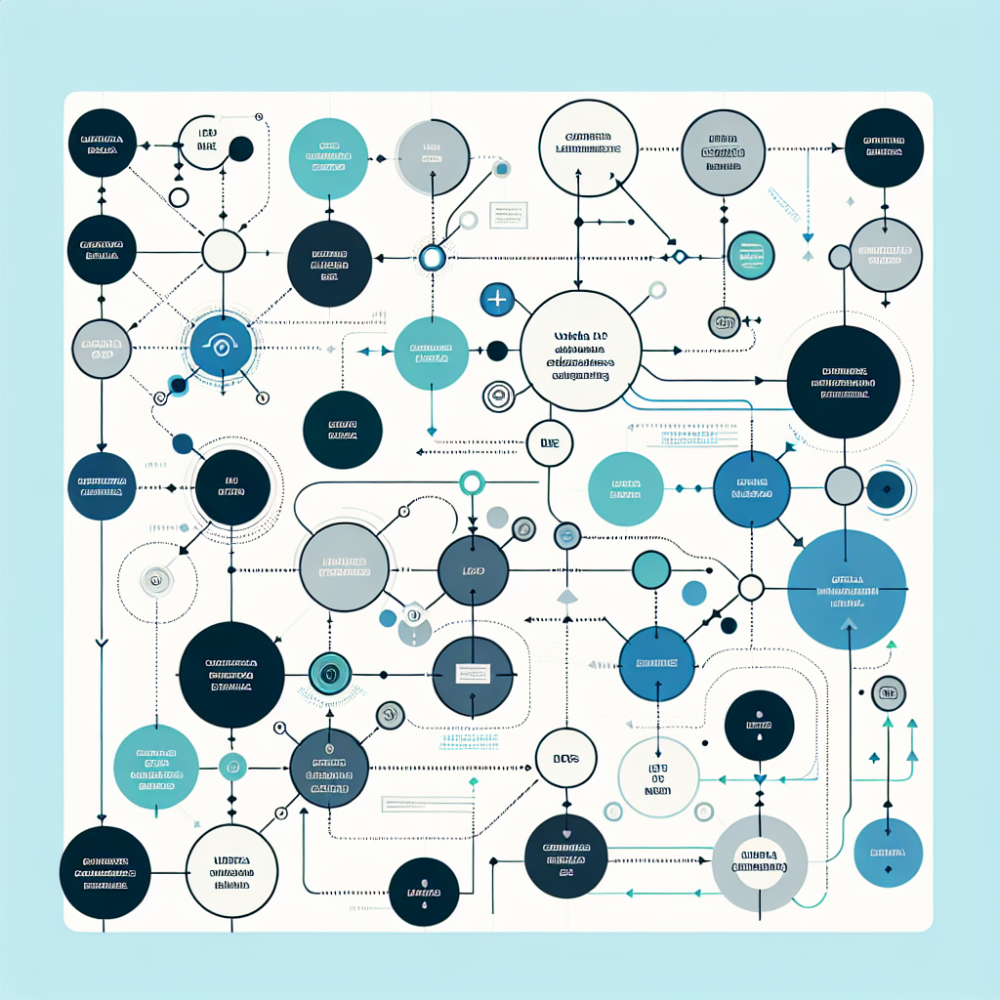

# Unidad 2 Altd R2 Sw

> PDF: `output/osi_tcp_ip/converted_pptx_pdf/Unidad_2_altd_r2_SW.pdf`

---

## Table of Contents

1. [Overview](#overview)
2. [Concept Map](#concept-map)
3. [Detailed Notes](#detailed-notes)
4. [Key Concepts](#key-concepts)
5. [Takeaways](#takeaways)
6. [Quiz (4q)](#quiz)
7. [Flashcards (5)](#flashcards)
8. [Exercises (1)](#exercises)

---

## Overview

Unidad 2
Redes y
Trasmisión de
datos II ALTD
• Función de dispositivos de capa 2,
• BRIDGE,SWITCH
• PLANTEAR TOPOLOGIAS Y CASCADAS EN PACKET
TRACER
• CONFIGURAR COMPONENTES

Dispositivos de capa 2 nic bridges
switch
Enlazar datos de capas superiores a la
red
• NIC: Conexión de dispositivo de red
802. 11 WiFi

BRIDGE: extiende el alcance LAN

SWITCH: Distribuir trafico por dirección MAC

PLANTEAR TOPOLOGIAS Y CASCADAS EN PACKET
TRACER (Por norma no mas de 4 cascadas)
• Deberemos descargar e instalar packet tracer 6. 22 y configurar la
mayor cantidad de topologías configurando las terminales

CONFIGURAR COMPONENTES
• Manual básico packet tracert
• Configuracion básica, para cada switch
• Tarea 1, identificar utilidad de comandos en configuración básica
• Tarea 2, implementar al menos 3 topológicas distintas con switch en
cascada como la figura
• Considerar 1 LAN
• Salvar cada configuración en
block de notas

conectand
2 Abrir terminal pc
o
1 conectar cable terminal rs232
3 cargar la configuración básica editando pass
hostname e ip de cada equipo
La tecla tab completa comandos
La tecla. despliega ayuda , verificar con comandos
show etc,
4 Verificar con comandos de red: ping, tracer
ipconfig arp –a en pantalla de comandos del PC

Se debe
practicar
mucho.

---

## Concept Map

---

## Detailed Notes

## Page 1

Unidad 2
Redes y
Trasmisión de
datos II ALTD
• Función de dispositivos de capa 2,
• BRIDGE,SWITCH
• PLANTEAR TOPOLOGIAS Y CASCADAS EN PACKET
TRACER
• CONFIGURAR COMPONENTES

Dispositivos de capa 2 nic bridges
switch
Enlazar datos de capas superiores a la
red
• NIC: Conexión de dispositivo de red
802.3 Ethernet 802.8 F.O. 802.11 WiFi

BRIDGE: extiende el alcance LAN

SWITCH: Distribuir trafico por dirección MAC

PLANTEAR TOPOLOGIAS Y CASCADAS EN PACKET
TRACER (Por norma no mas de 4 cascadas)
• De

---

## Key Concepts

**1.** Page 1: See corresponding section for details

---

## Takeaways

- Review the core content of Page 1

---

## Quiz

### Q1 [Fill] (E)

**Complete la frase: En una red Ethernet, la función principal de un switch de capa 2 es distribuir el tráfico usando la __________ de los dispositivos.**

Answer

**dirección MAC**

_El switch trabaja en la capa 2 del modelo OSI, por lo que toma decisiones de reenvío basándose en direcciones MAC, no en direcciones IP. Esto le permite enviar tramas solo hacia el puerto donde se encuentra el dispositivo destino, reduciendo tráfico innecesario dentro de la LAN._

### Q2 [MCQ] (M)

**¿Cuál opción describe mejor la diferencia funcional entre una NIC, un bridge y un switch en una red de capa 2?**

- A. La NIC conecta un dispositivo a la red, el bridge extiende el alcance de una LAN y el switch distribuye tráfico según direcciones MAC.
- B. La NIC enruta paquetes entre redes, el bridge asigna direcciones IP y el switch convierte señales de fibra óptica a WiFi.
- C. La NIC reemplaza al switch en redes grandes, el bridge se usa solo para conexión RS232 y el switch opera exclusivamente en capa 3.
- D. La NIC almacena configuraciones, el bridge verifica comandos show y el switch ejecuta ping y tracer desde las terminales.

Answer

**A. La NIC conecta un dispositivo a la red, el bridge extiende el alcance de una LAN y el switch distribuye tráfico según direcciones MAC.**

_La NIC es la interfaz que permite que un equipo se conecte físicamente o inalámbricamente a una red, como Ethernet 802.3, fibra óptica o WiFi 802.11. El bridge sirve para extender o unir segmentos de una LAN, mientras que el switch mejora la distribución del tráfico al reenviar tramas según direcciones MAC. Las demás opciones mezclan funciones de capa 3, comandos de verificación o tareas de configuración que no corresponden a estos dispositivos._

### Q3 [Scenario] (M)

**En Packet Tracer, un estudiante diseña una LAN con seis switches conectados en línea: PC1-SW1-SW2-SW3-SW4-SW5-SW6-PC2. Configura hostname, contraseña e IP de administración en cada switch usando la terminal del PC por cable RS232, pero luego observa que la práctica no cumple la norma indicada y además no ha documentado los comandos usados. ¿Cuál sería el enfoque más adecuado?**

- A. Mantener los seis switches en cascada porque todos pertenecen a la misma LAN y verificar únicamente con ipconfig.
- B. Rediseñar la topología para no superar cuatro cascadas, guardar la configuración de cada equipo en un bloc de notas y verificar conectividad con ping, tracer, ipconfig y arp -a.
- C. Eliminar las IP de administración de los switches porque en capa 2 no se puede usar ningún comando de red.
- D. Sustituir todos los switches por bridges, ya que los bridges distribuyen tráfico por dirección MAC con mayor precisión que un switch.

Answer

**B. Rediseñar la topología para no superar cuatro cascadas, guardar la configuración de cada equipo en un bloc de notas y verificar conectividad con ping, tracer, ipconfig y arp -a.**

_El contenido indica que, por norma, no se deben usar más de cuatro cascadas en Packet Tracer. También se pide configurar terminales, editar datos como password, hostname e IP, verificar con comandos de red y guardar cada configuración en bloc de notas. La opción B integra tanto el criterio de diseño físico/lógico de la topología como las buenas prácticas de configuración, documentación y verificación._

### Q4 [Compare] (H)

**Compare el uso de un bridge y un switch al diseñar una LAN en cascada en Packet Tracer. ¿Por qué el switch suele ser más adecuado para distribuir tráfico dentro de la LAN, aunque ambos sean dispositivos de capa 2?**

Answer

**Un bridge permite extender el alcance de una LAN conectando segmentos, por lo que su función principal es ampliar la red. Un switch también opera en capa 2, pero distribuye el tráfico con base en direcciones MAC, lo que permite segmentar mejor el envío de tramas hacia puertos específicos. En una topología en cascada, el switch resulta más adecuado porque facilita conectar varios equipos y controlar mejor el tráfico interno, aunque se debe respetar la recomendación de no superar cuatro cascadas.**

_La comparación requiere distinguir propósito y efecto operativo. Ambos dispositivos pertenecen a capa 2, pero el bridge se asocia principalmente con extender una LAN, mientras que el switch se usa para distribuir tráfico por dirección MAC. En prácticas de Packet Tracer, esta diferencia importa porque el diseño no solo debe conectar dispositivos, sino también organizar el tráfico y mantener una topología razonable, documentada y verificable._

---

## Flashcards

**1. ¿Cuál es la función principal de una NIC en una red de capa 2?** `capa2` `NIC` `definicion`
> La NIC proporciona la conexión del dispositivo a la red, permitiendo el acceso mediante tecnologías como Ethernet 802.3, fibra óptica o WiFi 802.11.

**2. ¿Por qué se utiliza un bridge en una LAN?** `capa2` `bridge` `LAN`
> Un bridge se utiliza para extender el alcance de una LAN conectando segmentos de red a nivel de capa 2.

**3. ¿En qué se diferencia un bridge de un switch en capa 2?** `capa2` `switch` `comparacion`
> Un bridge extiende una LAN conectando segmentos, mientras que un switch distribuye el tráfico hacia los dispositivos usando direcciones MAC.

**4. ¿Cuál es el límite recomendado de switches en cascada al plantear topologías en Packet Tracer?** `PacketTracer` `topologias` `switch`
> Por norma, no se recomienda usar más de 4 switches en cascada.

**5. ¿Cómo se verifica la conectividad y configuración básica de una topología desde una PC en Packet Tracer?** `PacketTracer` `verificacion` `comandos`
> Se puede verificar usando comandos como ping, tracer, ipconfig y arp -a desde la pantalla de comandos del PC.

---

## Exercises

### Exercise 1: Implementación y verificación de una LAN con switches en cascada en Packet Tracer (M)

Diseña e implementa en Cisco Packet Tracer una red LAN de capa 2 utilizando switches en cascada. La topología debe incluir al menos 3 switches conectados en cascada, sin superar el límite recomendado de 4 cascadas, y al menos 6 PCs distribuidas entre los switches. Todos los dispositivos deben pertenecer a una sola LAN y deben poder comunicarse entre sí mediante direcciones IP de la misma red. Configura cada switch desde una PC usando conexión por consola RS-232. En cada switch debes establecer hostname, contraseña de consola, contraseña de modo privilegiado, mensaje MOTD y una IP de administración en una VLAN. Luego verifica la conectividad con comandos de red y comandos de inspección. Entregables: 1) archivo .pkt de Packet Tracer con la topología funcionando, 2) captura o listado de la tabla de direccionamiento IP de PCs y switches, 3) archivo de texto con la configuración básica aplicada a cada switch, 4) evidencias de verificación usando ping, traceroute/tracert, ipconfig, arp -a y comandos show en switches, 5) breve explicación de cómo el switch distribuye el tráfico usando direcciones MAC.

**Hints:**
- Hint 1: Usa cable de consola RS-232 entre una PC y el puerto Console del switch para realizar la configuración inicial desde la terminal.
- Hint 2: Asigna todas las PCs a la misma red, por ejemplo 192.168.10.0/24, y configura una IP de administración diferente para cada switch en la VLAN 1.
- Hint 3: Utiliza comandos como show running-config, show ip interface brief y show mac address-table para verificar la configuración y el aprendizaje de direcciones MAC.

Solution

Una solución correcta debe incluir una LAN funcional con 3 switches en cascada, por ejemplo SW1 conectado a SW2 y SW2 conectado a SW3, con PCs conectadas a cada switch. Las PCs pueden usar direcciones como PC1 192.168.10.11/24, PC2 192.168.10.12/24, PC3 192.168.10.13/24, PC4 192.168.10.14/24, PC5 192.168.10.15/24 y PC6 192.168.10.16/24. Los switches pueden tener IP de administración en VLAN 1: SW1 192.168.10.2/24, SW2 192.168.10.3/24 y SW3 192.168.10.4/24. Una configuración básica esperada para cada switch incluye comandos similares a: enable, configure terminal, hostname SW1, enable secret class, line console 0, password cisco, login, exit, banner motd #Acceso autorizado solamente#, interface vlan 1, ip address 192.168.10.2 255.255.255.0, no shutdown, end, copy running-config startup-config. Para SW2 y SW3 se cambia el hostname y la IP correspondiente. La verificación debe mostrar ping exitoso entre PCs conectadas a diferentes switches, por ejemplo de PC1 a PC6. El comando tracert puede mostrar conectividad directa dentro de la misma LAN. ipconfig debe confirmar la IP asignada a cada PC y arp -a debe mostrar asociaciones IP-MAC aprendidas. En los switches, show mac address-table debe mostrar direcciones MAC aprendidas en los puertos donde están conectadas las PCs y los enlaces entre switches. La explicación debe indicar que el switch opera en capa 2, aprende direcciones MAC origen, construye una tabla MAC y reenvía las tramas únicamente por el puerto asociado a la MAC destino, reduciendo tráfico innecesario en comparación con un hub.

---

*Generated by [Skill-Anything](https://github.com/SYuan03/Skill-Anything)*