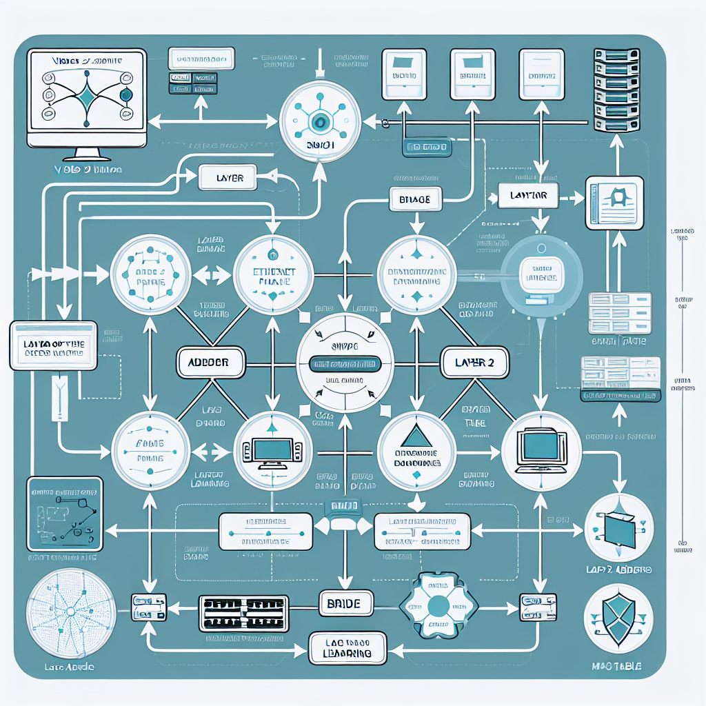

# Video zE07IFky

> Video: `https://www.youtube.com/watch?v=zE07IFkywnA`

---

## Table of Contents

1. [Overview](#overview)
2. [Concept Map](#concept-map)
3. [Detailed Notes](#detailed-notes)
4. [Key Concepts](#key-concepts)
5. [Glossary](#glossary)
6. [Cheat Sheet](#cheat-sheet)
7. [Takeaways](#takeaways)
8. [Quiz (4q)](#quiz)
9. [Flashcards (5)](#flashcards)
10. [Exercises (1)](#exercises)
11. [Learning Path](#learning-path)

---

## Overview

La unidad 2 introduce el trabajo práctico con dispositivos de capa 2 dentro de una red local, especialmente bridges y switches, y conecta la teoría del direccionamiento MAC con la implementación de topologías en Cisco Packet Tracer. La tesis central es que, para comprender cómo circulan los datos en una LAN, no basta con conocer los dispositivos: hay que observar cómo aprenden, reenvían o replican tráfico según las direcciones MAC y luego verificar ese comportamiento mediante simulación y comandos de diagnóstico.

La metodología propuesta es progresiva y práctica. Primero se revisa la función de los dispositivos de capa 2: preparar datos para circular por la red, recibirlos desde el medio físico y entregarlos a capas superiores. Luego se comparan dos dispositivos clave. El bridge extiende el alcance de una red y replica tráfico entre segmentos que pertenecen a la misma red. El switch, en cambio, aprende qué dirección MAC está asociada a cada puerto, construye una tabla interna y reenvía las tramas solo por el puerto correspondiente; si desconoce el destino, inunda el tráfico por varios puertos hasta aprender la ubicación.

Después, el curso propone descargar Packet Tracer —preferentemente una versión común como 6.2.2 para evitar incompatibilidades—, leer un manual básico y practicar con al menos tres topologías diferentes usando switches en cascada dentro de una sola red. También se enfatiza la configuración básica de switches mediante consola, el uso de contraseñas para consola y Telnet, la asignación de dirección IP de administración y la verificación desde PCs mediante comandos de red.

La conclusión pedagógica es que el dominio de redes se logra practicando: conectar equipos, configurar switches, guardar comandos en archivos de texto, usar ayudas de la CLI como ? y Tab, diagnosticar conectividad y observar cómo las tablas MAC explican el flujo real del tráfico.

---

## Concept Map



---

## Detailed Notes

## 1. Propósito de la unidad

La unidad 2 del curso introduce el estudio práctico de los **dispositivos de capa 2** y su comportamiento dentro de redes locales. El objetivo no es solo reconocer los dispositivos, sino comprender cómo procesan tramas, cómo usan direcciones MAC y cómo se configuran y prueban en **Cisco Packet Tracer**.

La unidad se centra en:

- La función de los dispositivos de **capa 2 del modelo OSI**.
- La diferencia entre **bridge** y **switch**.
- El uso de la **dirección MAC** para reenviar tráfico.
- La creación de topologías con **switches en cascada**.
- La configuración básica de switches desde consola.
- La verificación de conectividad con comandos de red.

## 2. Capa 2: función general

La **capa 2**, también llamada **capa de enlace de datos**, se encarga de preparar los datos para que puedan circular por la red local y de recibir datos desde el medio físico para entregarlos a capas superiores.

En términos prácticos, los dispositivos de capa 2 trabajan con **tramas** y no principalmente con direcciones IP. Su criterio fundamental de decisión es la **dirección MAC**.

### Funciones principales de la capa 2

- Encapsular datos de capas superiores en **tramas**.
- Usar direcciones físicas o **MAC** para identificar dispositivos dentro de una red local.
- Controlar el acceso al medio de transmisión.
- Permitir la comunicación sobre medios como:
  - Ethernet por cable de cobre.
  - Fibra óptica.
  - Wi-Fi.
- Entregar datos recibidos desde la red hacia capas superiores del dispositivo.

## 3. Dirección MAC

La **dirección MAC** es la dirección física asociada a una interfaz de red. En la clase se recalca que es **única e irrepetible en el mundo**.

### Características importantes

- Identifica una interfaz de red, no necesariamente a una persona o equipo completo.
- Es usada por bridges y switches para tomar decisiones de reenvío.
- Opera dentro del ámbito de una red local o dominio de capa 2.
- Normalmente se representa en formato hexadecimal, por ejemplo:
  - `00:1A:2B:3C:4D:5E`
  - `001A.2B3C.4D5E`

### Relación con el switch

El switch aprende qué dirección MAC está conectada a cada puerto. Con esa información arma una **tabla MAC** o **tabla CAM**, que luego usa para reenviar tramas de manera selectiva.

## 4. Bridge

El **bridge** es un dispositivo de capa 2 cuya función principal es extender el alcance de una red conectando segmentos.

### Función del bridge

- Extiende el alcance físico o lógico de una misma red.
- Permite conectar dos segmentos que pertenecen al mismo dominio de red.
- Replica tráfico entre los lados conectados.

En el contenido se menciona que, si existe una limitación de alcance físico —por ejemplo, un máximo aproximado de 500 metros según el contexto indicado—, el bridge permite ampliar ese alcance conectando segmentos.

### Idea clave

El bridge no crea necesariamente una red nueva; une segmentos de la **misma red**. Por eso hay que tener presente que los equipos conectados a ambos lados siguen perteneciendo al mismo entorno de capa 2.

## 5. Switch

El **switch** es un dispositivo de capa 2 más inteligente que un bridge simple, porque discrimina tráfico según la dirección MAC de destino.

### Comportamiento básico del switch

El switch:

1. Recibe una trama por un puerto.
2. Observa la **dirección MAC de origen**.
3. Aprende que esa MAC está asociada al puerto por el cual entró la trama.
4. Consulta su tabla MAC para buscar la **MAC de destino**.
5. Si conoce el puerto destino, reenvía la trama solo por ese puerto.
6. Si no conoce la MAC destino, envía la trama por varios puertos para descubrir dónde está el dispositivo.

### Aprendizaje de direcciones MAC

El switch aprende con el tráfico entrante. Por ejemplo:

- Si la PC A responde desde el puerto FastEthernet 0/1, el switch registra que la MAC de PC A está en ese puerto.
- Si luego otro equipo quiere comunicarse con PC A, el switch enviará el tráfico directamente a FastEthernet 0/1.

### Reenvío selectivo

A diferencia de un dispositivo que replica todo, el switch evita enviar tráfico innecesario a puertos que no corresponden. Esto mejora:

- Rendimiento.
- Seguridad relativa dentro de la LAN.
- Eficiencia del ancho de banda.
- Organización del tráfico.

### Cuando el switch no conoce una MAC

Si la dirección MAC de destino no está en su tabla, el switch realiza una acción similar a una consulta general:

- Inunda la trama por todos los puertos excepto el puerto de entrada.
- Espera que el equipo destino responda.
- Al recibir la respuesta, aprende por qué puerto se encuentra ese equipo.
- Actualiza su tabla MAC.

Este comportamiento permite que el switch construya su tabla progresivamente durante el uso normal de la red.

## 6. Tabla MAC del switch

La **tabla MAC** es una estructura interna del switch donde se asocian direcciones MAC con puertos físicos.

### Ejemplo conceptual

| Dirección MAC | Puerto del switch |
|---|---|
| `00:AA:BB:CC:DD:01` | Fa0/1 |
| `00:AA:BB:CC:DD:02` | Fa0/2 |
| `00:AA:BB:CC:DD:03` | Fa0/3 |

Si llega una trama destinada a `00:AA:BB:CC:DD:02`, el switch la enviará solo por `Fa0/2`.

### Diagnóstico en Packet Tracer

En Packet Tracer se puede verificar el comportamiento del switch observando:

- Qué equipos están conectados a cada puerto.
- Qué MAC aprendió el switch.
- Si el tráfico se reenvía correctamente.
- Si existe conectividad entre PCs.

Un comando típico en switches Cisco para ver la tabla MAC es:

```text
show mac address-table
```

## 7. Topologías con switches en cascada

La práctica principal consiste en implementar al menos **tres topologías diferentes** con switches en cascada usando Packet Tracer.

### Qué significa switches en cascada

Una topología en cascada conecta switches entre sí, de modo que un switch puede dar conectividad a otros switches y a los equipos finales conectados a ellos.

Ejemplo simple:

```text
PC1 --- SW1 --- SW2 --- PC2
        |
       PC3
```

Ejemplo con tres switches:

```text
PC1 --- SW1 --- SW2 --- SW3 --- PC4
        |       |       |
       PC2     PC3     PC5
```

### Condición importante de la tarea

Las topologías deben considerar **una sola red**. Esto implica que los equipos deben pertenecer al mismo rango de red IP, salvo que se indique lo contrario.

Ejemplo de una sola red:

| Equipo | IP | Máscara |
|---|---|---|
| PC1 | `192.168.1.10` | `255.255.255.0` |
| PC2 | `192.168.1.11` | `255.255.255.0` |
| PC3 | `192.168.1.12` | `255.255.255.0` |
| Switch 1 administración | `192.168.1.2` | `255.255.255.0` |
| Switch 2 administración | `192.168.1.3` | `255.255.255.0` |

Todos pertenecen a la red `192.168.1.0/24`.

## 8. Cisco Packet Tracer

**Packet Tracer** es el simulador recomendado para practicar las topologías y configuraciones. La clase sugiere usar una versión común, como **Packet Tracer 6.2.2**, para evitar problemas de compatibilidad y porque no exige necesariamente pertenecer a Cisco Networking Academy en ese contexto.

### Razones para usar la misma versión

- Evitar incompatibilidades al abrir archivos de otros estudiantes.
- Asegurar que los dispositivos y comandos disponibles sean los mismos.
- Facilitar la corrección y comparación de prácticas.

### Primer paso recomendado

Antes de configurar, se debe descargar y leer un **manual básico** del simulador. El material mencionado tiene aproximadamente 8 páginas y sirve para entender:

- Cómo insertar dispositivos.
- Cómo conectar cables.
- Cómo abrir terminales.
- Cómo configurar PCs y switches.
- Cómo probar conectividad.

## 9. Configuración básica de switches

La clase indica que existe una configuración básica que se replica en todos los switches, haciendo las modificaciones necesarias para cada sitio o dispositivo.

### Elementos habituales de una configuración básica

Una configuración básica de switch suele incluir:

- Nombre del dispositivo o hostname.
- Contraseña de consola.
- Contraseña para acceso remoto por Telnet.
- Contraseña de modo privilegiado.
- Dirección IP de administración.
- Activación de la interfaz VLAN de administración.
- Mensaje de advertencia o banner.
- Guardado de la configuración.

### Ejemplo representativo de configuración básica Cisco IOS

Este ejemplo no sustituye la configuración específica del curso, pero muestra el tipo de comandos que normalmente aparecen:

```text
enable
configure terminal
hostname SW1

enable secret class

line console 0
password cisco
login
exit

line vty 0 4
password cisco
login
exit

interface vlan 1
ip address 192.168.1.2 255.255.255.0
no shutdown
exit

banner motd #Acceso solo autorizado#

end
copy running-config startup-config
```

### Precaución sobre contraseñas

La clase advierte que puede haber diferencias entre:

- Contraseña de **consola**.
- Contraseña de **Telnet** o líneas VTY.
- Contraseña de modo privilegiado.

Por eso se recomienda registrar cuidadosamente las contraseñas en un bloc de notas y, si se cambian, mantener la documentación actualizada.

## 10. Conexión por consola

Para configurar un switch inicialmente, se utiliza normalmente un **cable de consola**, identificado en Packet Tracer como el cable celeste.

### Procedimiento general

1. Colocar una PC y un switch en el escenario.
2. Conectar la PC al switch usando el cable de consola.
3. Abrir la PC.
4. Entrar en la herramienta **Terminal**.
5. Usar la configuración por defecto de la terminal.
6. Acceder a la CLI del switch.
7. Cargar o escribir la configuración básica.

### Configuración de terminal típica

Packet Tracer suele mostrar valores por defecto como:

- Bits por segundo: `9600`
- Bits de datos: `8`
- Paridad: `None`
- Bits de parada: `1`
- Control de flujo: `None`

Estos valores permiten acceder a la consola del switch.

## 11. Guardar configuraciones en archivos de texto

La clase recomienda guardar la configuración en un **bloc de notas** o en varios archivos, según la cantidad de dispositivos.

### Por qué guardar la configuración

- Evita perder trabajo.
- Permite corregir errores fácilmente.
- Facilita replicar la configuración en otros switches.
- Ayuda a documentar contraseñas, direcciones IP y nombres de dispositivos.
- Permite comparar configuraciones entre equipos.

### Organización sugerida

Usar un archivo por dispositivo:

```text
SW1_config.txt
SW2_config.txt
SW3_config.txt
PCs_direcciones_IP.txt
```

O un único archivo organizado por secciones:

```text
=== SW1 ===
...

=== SW2 ===
...

=== SW3 ===
...
```

## 12. Verificación desde PCs

Una vez configurados los switches y asignadas las direcciones IP, se deben probar comandos de red desde las PCs.

### Comandos útiles en PCs de Packet Tracer

| Comando | Uso |
|---|---|
| `ipconfig` | Verifica la dirección IP, máscara y gateway configurados en una PC. |
| `ping <IP>` | Comprueba conectividad con otro equipo. |
| `arp -a` | Muestra asociaciones IP-MAC conocidas por la PC. |
| `tracert <IP>` | Muestra la ruta hacia un destino, útil especialmente cuando hay routers. |

### Ejemplo de prueba

Si PC1 tiene `192.168.1.10` y PC2 tiene `192.168.1.11`, desde PC1 se puede ejecutar:

```text
ping 192.168.1.11
```

Si hay respuesta, ambas PCs están comunicadas dentro de la red.

## 13. Ayudas de la línea de comandos Cisco

La clase destaca que Cisco IOS ofrece ayudas muy útiles para aprender y configurar.

### Tecla `?`

Muestra ayuda contextual.

Ejemplos:

```text
Switch> ?
Switch# show ?
Switch(config)# line ?
```

Sirve para descubrir qué comandos están disponibles en el modo actual.

### Tecla Tab

Completa comandos automáticamente.

Ejemplo:

```text
conf<Tab>
```

Puede completarse como:

```text
configure
```

### Flecha hacia arriba

Recupera comandos anteriores. Es útil para repetir o corregir comandos sin volver a escribirlos desde cero.

## 14. Tareas de la unidad

### Tarea 1: identificar la utilidad de los comandos

El primer trabajo consiste en leer la configuración básica propuesta e identificar para qué sirve cada comando.

Debe responderse, por ejemplo:

- ¿Qué hace `hostname`?
- ¿Para qué sirve `enable secret`?
- ¿Qué configura `line console 0`?
- ¿Cuál es la función de `line vty 0 4`?
- ¿Por qué se asigna IP a `interface vlan 1`?
- ¿Por qué se debe guardar la configuración?

### Tarea 2: implementar topologías en Packet Tracer

El segundo trabajo consiste en usar Packet Tracer para implementar al menos **tres topologías diferentes** con switches en cascada.

Condiciones:

- Usar una sola red.
- Configurar los switches según la configuración básica.
- Ajustar direcciones IP y nombres de dispositivos según corresponda.
- Conectar PCs y switches con los cables adecuados.
- Verificar conectividad con comandos de red.
- Guardar el archivo `.pkt` y las configuraciones en texto.

## 15. Criterio de aprendizaje de la unidad

La unidad insiste en la práctica constante. La idea central es que el estudiante no solo copie comandos, sino que entienda qué ocurre:

- Cómo se conecta físicamente una red.
- Cómo se configura un switch.
- Cómo se aprende una dirección MAC.
- Cómo se reenvía una trama.
- Cómo se diagnostica si una red funciona.
- Cómo se documenta una práctica.

La recomendación final es practicar todo lo posible, porque Packet Tracer es intuitivo y permite ensayar sin riesgo antes de trabajar con equipos reales.

---

## Key Concepts

**1.** Capa 2 del modelo OSI: capa encargada de mover tramas dentro de una red local usando direcciones físicas MAC.

**2.** Trama Ethernet: unidad de datos de capa 2 que contiene direcciones MAC de origen y destino para permitir el reenvío local.

**3.** Dirección MAC: identificador físico único de una interfaz de red usado por switches y bridges para reconocer dispositivos.

**4.** Dominio de capa 2: conjunto de dispositivos que pueden comunicarse directamente mediante tramas sin necesidad de un router.

**5.** Bridge: dispositivo de capa 2 que conecta segmentos de una misma red y extiende su alcance replicando tráfico entre ellos.

**6.** Switch: dispositivo de capa 2 que aprende direcciones MAC por puerto y reenvía tramas de forma selectiva.

**7.** Tabla MAC: registro interno del switch que asocia direcciones MAC con puertos físicos de entrada.

**8.** Aprendizaje MAC: proceso mediante el cual un switch observa la MAC de origen de las tramas entrantes y la vincula al puerto correspondiente.

**9.** Reenvío selectivo: acción del switch de enviar una trama solo por el puerto donde se encuentra la MAC destino conocida.

**10.** Inundación de tráfico: envío de una trama por múltiples puertos cuando el switch desconoce la ubicación de la MAC destino.

**11.** Switches en cascada: topología donde varios switches se conectan entre sí para ampliar la cantidad de equipos dentro de una misma red.

**12.** Packet Tracer: simulador de redes de Cisco usado para diseñar topologías, configurar dispositivos y probar conectividad.

**13.** Conexión por consola: método de administración local inicial de un switch usando una PC, cable de consola y terminal.

**14.** CLI Cisco IOS: interfaz de línea de comandos usada para configurar y diagnosticar dispositivos Cisco.

**15.** Configuración básica de switch: conjunto mínimo de comandos para nombrar, proteger, direccionar y guardar la configuración de un switch.

---

## Glossary

| Term | Definition | Related |
|:-----|:-----------|:--------|
| **Capa 2** | Nivel del modelo OSI encargado del enlace de datos, donde se encapsulan datos en tramas y se usan direcciones MAC para comunicación local. | Modelo OSI, Trama, Dirección MAC, Switch |
| **Modelo OSI** | Modelo conceptual de siete capas que organiza las funciones de comunicación de red; la unidad se enfoca en la capa de enlace de datos. | Capa 2, Capa física, Capa de red |
| **Dirección MAC** | Identificador físico único asociado a una interfaz de red, utilizado por dispositivos de capa 2 para reenviar tramas. | Tabla MAC, Ethernet, NIC |
| **Trama** | Unidad de información de capa 2 que transporta datos e incluye direcciones MAC de origen y destino. | Ethernet, Capa 2, Encapsulación |
| **Ethernet** | Tecnología de red local que usa tramas y direcciones MAC para comunicar dispositivos en una LAN cableada. | Trama, LAN, Switch |
| **Fibra óptica** | Medio físico de transmisión que usa luz para transportar datos y puede formar parte de redes Ethernet. | Medio físico, Ethernet, Capa física |
| **Wi-Fi** | Tecnología inalámbrica de red local que también utiliza direccionamiento MAC para identificar interfaces. | Dirección MAC, LAN inalámbrica, Capa 2 |
| **Bridge** | Dispositivo de capa 2 que conecta segmentos de una misma red y extiende el alcance replicando tráfico entre lados. | Switch, Segmento de red, Dominio de capa 2 |
| **Switch** | Dispositivo de capa 2 que aprende direcciones MAC por puerto y reenvía tráfico solo hacia el puerto adecuado cuando conoce el destino. | Tabla MAC, Reenvío selectivo, Puerto |
| **Puerto de switch** | Interfaz física o lógica del switch por la que se conectan PCs, otros switches u otros dispositivos de red. | Switch, Tabla MAC, FastEthernet |
| **Tabla MAC** | Tabla interna del switch que relaciona cada dirección MAC aprendida con el puerto por donde fue vista. | Aprendizaje MAC, CAM, Switch |
| **Tabla CAM** | Nombre técnico frecuente para la memoria usada por switches para almacenar asociaciones MAC-puerto. | Tabla MAC, Switch, Reenvío |
| **Aprendizaje MAC** | Proceso automático mediante el cual un switch registra la MAC de origen de una trama en el puerto por el que ingresó. | Tabla MAC, Switch, Trama |
| **Inundación** | Mecanismo por el cual un switch envía una trama por múltiples puertos cuando desconoce la MAC de destino. | MAC desconocida, Broadcast, Switch |
| **Topología** | Distribución física o lógica de dispositivos y conexiones dentro de una red. | Packet Tracer, Switches en cascada, LAN |
| **Switches en cascada** | Diseño donde varios switches se conectan entre sí para ampliar la red local y conectar más dispositivos. | Topología, Switch, Dominio de capa 2 |
| **Packet Tracer** | Simulador de redes de Cisco que permite construir topologías, conectar dispositivos, configurar equipos y probar tráfico. | Cisco IOS, CLI, Simulación |
| **Cable de consola** | Cable usado para conectar una PC al puerto de consola de un switch y realizar configuración local inicial. | Consola, Terminal, CLI |
| **CLI** | Interfaz de línea de comandos usada para introducir instrucciones de configuración y diagnóstico en dispositivos de red. | Cisco IOS, Comando, Terminal |
| **Cisco IOS** | Sistema operativo de dispositivos Cisco que proporciona comandos para configurar switches, routers y otros equipos. | CLI, Switch, Configuración |
| **Telnet** | Protocolo de acceso remoto a la línea de comandos de un dispositivo de red, configurado mediante líneas VTY en Cisco IOS. | VTY, Acceso remoto, Contraseña |
| **Línea VTY** | Línea virtual de Cisco IOS usada para conexiones remotas como Telnet o SSH. | Telnet, SSH, CLI |
| **IP de administración** | Dirección IP asignada a una interfaz lógica del switch para permitir administración y pruebas de conectividad. | VLAN 1, Switch, Ping |
| **Ping** | Comando de diagnóstico que envía mensajes ICMP para comprobar si un destino IP responde en la red. | ICMP, Conectividad, IP |
| **Running-config** | Configuración activa en memoria del dispositivo Cisco, que se pierde al reiniciar si no se guarda. | Startup-config, copy running-config startup-config, Cisco IOS |

---

## Cheat Sheet

## Capa 2 y Packet Tracer — Referencia rápida

### Función de capa 2

| Elemento | Idea clave |
|---|---|
| Capa 2 | Mueve **tramas** dentro de una LAN. |
| Dirección MAC | Identifica interfaces de red; usada por switches. |
| Bridge | Extiende una misma red y replica tráfico. |
| Switch | Aprende MAC por puerto y reenvía selectivamente. |
| Tabla MAC | Asociación `MAC -> puerto`. |

### Comportamiento del switch

```text
1. Recibe trama.
2. Lee MAC de origen.
3. Aprende: MAC origen = puerto de entrada.
4. Busca MAC destino en tabla MAC.
5. Si la conoce: envía solo por ese puerto.
6. Si no la conoce: inunda por varios puertos.
```

### Bridge vs Switch

| Dispositivo | Qué hace | Limitación/ventaja |
|---|---|---|
| Bridge | Une segmentos de la misma red | Replica tráfico entre lados. |
| Switch | Separa tráfico por MAC | Reduce tráfico innecesario. |

### Práctica en Packet Tracer

- Instalar una versión común, preferentemente la indicada por el curso.
- Leer el manual básico antes de configurar.
- Crear **3 topologías distintas** con switches en cascada.
- Mantener **una sola red IP**.
- Configurar cada switch.
- Probar conectividad con comandos.
- Guardar `.pkt` y configuraciones en `.txt`.

### Conexión por consola

```text
PC --- cable consola celeste --- Switch
PC > Desktop > Terminal > aceptar valores por defecto
```

Valores típicos:

| Parámetro | Valor |
|---|---|
| Speed | 9600 |
| Data bits | 8 |
| Parity | None |
| Stop bits | 1 |
| Flow control | None |

### Configuración básica típica de switch

```text
enable
configure terminal
hostname SW1
enable secret class
line console 0
 password cisco
 login
exit
line vty 0 4
 password cisco
 login
exit
interface vlan 1
 ip address 192.168.1.2 255.255.255.0
 no shutdown
exit
end
copy running-config startup-config
```

### Comandos útiles

| Lugar | Comando | Uso |
|---|---|---|
| Switch | `show mac address-table` | Ver MAC aprendidas por puerto. |
| Switch | `show running-config` | Ver configuración activa. |
| Switch | `copy running-config startup-config` | Guardar configuración. |
| PC | `ipconfig` | Ver IP y máscara. |
| PC | `ping <IP>` | Probar conectividad. |
| PC | `arp -a` | Ver relaciones IP-MAC. |

### Ayudas CLI

| Tecla | Función |
|---|---|
| `?` | Muestra ayuda contextual. |
| `Tab` | Autocompleta comandos. |
| Flecha arriba | Recupera comandos anteriores. |

---

## Takeaways

- Construye tres topologías diferentes con switches en cascada y mantén todos los equipos dentro de una sola red IP.
- Configura cada switch desde consola usando un archivo de texto como plantilla y ajustando hostname, IP y contraseñas.
- Documenta todas las direcciones IP, contraseñas, nombres de dispositivos y puertos usados antes de probar la red.
- Verifica conectividad entre PCs con `ping` y confirma la configuración local con `ipconfig`.
- Observa la tabla MAC del switch antes y después de generar tráfico para comprobar cómo aprende direcciones.
- Practica el uso de `?`, `Tab` y la flecha hacia arriba en la CLI hasta poder navegar comandos sin depender de memoria exacta.
- Compara el comportamiento de un bridge y un switch explicando cuándo se replica tráfico y cuándo se reenvía selectivamente.
- Guarda la configuración activa en cada switch para evitar perder cambios al reiniciar el dispositivo.
- Corrige fallos de conectividad siguiendo una secuencia: cableado, IP, máscara, estado de interfaces, tabla MAC y prueba de ping.

---

## Quiz

### Q1 [Fill] (E)

**La dirección que los dispositivos de capa 2 utilizan para identificar de forma única a cada equipo en la red es la dirección _____.**

<details><summary>Answer</summary>

**MAC**

_La dirección MAC es el identificador de control de acceso al medio asociado a la interfaz de red de un dispositivo. En la unidad se destaca que los dispositivos de capa 2, como bridges y switches, trabajan con direcciones MAC, no con direcciones IP, y que estas son únicas e irrepetibles a nivel mundial._

</details>

### Q2 [MCQ] (M)

**Un switch recibe una trama destinada a una dirección MAC que todavía no aparece en su tabla. ¿Cuál es el comportamiento correcto del switch según lo explicado?**

- A. Descarta la trama porque no puede identificar el destino.
- B. La envía únicamente al puerto por el que llegó para confirmar el origen.
- C. La reenvía por todas sus bocas excepto la de entrada y aprende la MAC de origen.
- D. La convierte en una trama de capa 3 para buscar la dirección IP del destino.

<details><summary>Answer</summary>

**C. La reenvía por todas sus bocas excepto la de entrada y aprende la MAC de origen.**

_El switch aprende a partir de las tramas entrantes qué dirección MAC está asociada a cada puerto. Si todavía no conoce la MAC de destino, no puede reenviar la trama de forma selectiva, por lo que la difunde por sus otros puertos. Cuando recibe respuestas, va completando su tabla MAC y luego puede enviar el tráfico solo por la boca correspondiente._

</details>

### Q3 [Scenario] (H)

**En Packet Tracer tienes una topología en cascada: PC-A está conectado al puerto Fa0/1 del switch S1, PC-C al Fa0/2 de S1, y el puerto Fa0/24 de S1 conecta con S2. En S2, PC-B está conectado al Fa0/1. Las tablas MAC de ambos switches están vacías. PC-A envía una trama a PC-B. ¿Qué ocurrirá primero y qué pasará después de la respuesta de PC-B?**

- A. S1 enviará la trama solo hacia S2 porque reconoce automáticamente que PC-B está en otro switch; después no modificará su tabla MAC.
- B. S1 aprenderá la MAC de PC-A en Fa0/1 y difundirá la trama por Fa0/2 y Fa0/24; S2 aprenderá la MAC de PC-A por su enlace hacia S1 y difundirá hacia PC-B. La respuesta de PC-B permitirá que ambos switches aprendan dónde está PC-B.
- C. S1 descartará la trama porque las tablas MAC están vacías; recién podrá reenviar tráfico cuando se configure manualmente cada dirección MAC.
- D. S1 enviará la trama a PC-C porque está en el puerto más cercano; luego PC-C reenviará la trama a S2.

<details><summary>Answer</summary>

**B. S1 aprenderá la MAC de PC-A en Fa0/1 y difundirá la trama por Fa0/2 y Fa0/24; S2 aprenderá la MAC de PC-A por su enlace hacia S1 y difundirá hacia PC-B. La respuesta de PC-B permitirá que ambos switches aprendan dónde está PC-B.**

_Cuando un switch no conoce la MAC de destino, realiza flooding: reenvía la trama por todos los puertos excepto el puerto de entrada. Al mismo tiempo, aprende la MAC de origen y la asocia al puerto por el que recibió la trama. En una topología en cascada, este proceso ocurre en cada switch. Cuando PC-B responde, S2 aprende la ubicación de PC-B y S1 aprende que PC-B se alcanza a través del puerto que conecta con S2. A partir de ese momento, el tráfico entre PC-A y PC-B puede reenviarse de forma selectiva._

</details>

### Q4 [Compare] (M)

**Compara el comportamiento de un bridge y un switch en una red de capa 2. ¿En qué se parecen y cuál es la diferencia clave en la forma en que manejan el tráfico?**

<details><summary>Answer</summary>

**Ambos son dispositivos de capa 2 y trabajan con direcciones MAC, por lo que operan dentro de la misma red lógica. El bridge permite extender el alcance de la red y replica el tráfico de un lado al otro, mientras que el switch aprende qué MAC está conectada a cada puerto y luego envía las tramas solo por la boca correspondiente. La diferencia clave es que el switch discrimina el tráfico con base en su tabla MAC, reduciendo envíos innecesarios.**

_El bridge se presenta como un dispositivo que extiende la red manteniendo a los equipos dentro de la misma red y replicando el tráfico entre segmentos. El switch también pertenece a capa 2, pero tiene una función más selectiva: construye una tabla de direcciones MAC asociadas a puertos y usa esa información para reenviar tramas solo hacia el destino correcto. Por eso, aunque ambos usan MAC y no separan redes como lo haría un router, el switch administra el tráfico de manera más eficiente._

</details>

---

## Flashcards

**1. ¿Qué función cumplen los dispositivos de capa 2 en una red?** `capa-2` `redes` `funcion`
> Preparan los datos para ser transmitidos por la red y reciben datos de la red para entregarlos a capas superiores del dispositivo.

**2. ¿Qué dirección utilizan los dispositivos de capa 2 para identificar equipos en la red?** `capa-2` `mac` `direccionamiento`
> Utilizan la dirección MAC, que es única e irrepetible para cada dispositivo de red.

**3. ¿En qué se diferencia un bridge de un switch respecto al manejo del tráfico?** `bridge` `switch` `comparacion`
> Un bridge extiende el alcance de la misma red y replica el tráfico entre segmentos; un switch discrimina el tráfico por dirección MAC y lo envía solo al puerto correspondiente cuando conoce el destino.

**4. ¿Cómo aprende un switch qué dirección MAC está conectada a cada puerto?** `switch` `mac` `aprendizaje`
> El switch observa las tramas entrantes y registra en su tabla MAC la dirección de origen asociada al puerto por donde llegó.

**5. ¿Qué hace un switch cuando no conoce la dirección MAC de destino?** `switch` `mac` `broadcast`
> Envía la trama por todos sus puertos, excepto por el puerto de entrada, para descubrir dónde está el dispositivo destino.

---

## Exercises

### Exercise 1: Implementación y verificación de topologías en cascada con switches de capa 2 (M)

En Cisco Packet Tracer, construye y prueba tres topologías diferentes usando switches de capa 2 conectados en cascada dentro de una única red LAN. El objetivo es comprobar cómo los switches aprenden direcciones MAC, cómo reenvían tráfico y cómo se verifica la conectividad básica entre hosts.

Requisitos:
1. Diseña e implementa tres topologías distintas, por ejemplo: cascada lineal, estrella extendida y árbol jerárquico.
2. Cada topología debe tener al menos 3 switches y 4 PCs.
3. Todos los dispositivos finales deben pertenecer a la misma red IP, por ejemplo 192.168.10.0/24.
4. Configura cada switch con una configuración básica: hostname único, password de consola, password para acceso remoto, enable secret, mensaje banner, dirección IP de administración en VLAN 1 y guardado de configuración.
5. Asigna direcciones IP estáticas a todas las PCs.
6. Verifica conectividad con comandos como ping, ipconfig y show mac address-table.
7. Observa cómo cambia la tabla MAC de los switches antes y después de generar tráfico entre PCs.

Entregables:
- Archivo .pkt con las tres topologías o tres archivos separados.
- Un archivo .txt por switch con su configuración básica.
- Una tabla con las direcciones IP asignadas a PCs y switches.
- Capturas o transcripción de pruebas de ping exitosas.
- Capturas o transcripción del comando show mac address-table en al menos dos switches por topología.
- Breve conclusión explicando cómo aprendieron los switches las direcciones MAC y qué ocurre cuando un switch aún no conoce la MAC destino.

**Hints:**
- Hint 1: Usa cables directos entre PC y switch, y verifica si Packet Tracer selecciona correctamente el cable entre switches con la opción automática.
- Hint 2: Después de crear la topología, ejecuta primero show mac address-table antes de hacer ping y luego repítelo después de generar tráfico.
- Hint 3: Guarda la configuración con copy running-config startup-config para no perder los cambios al cerrar el archivo.

<details><summary>Solution</summary>

Una solución correcta debe incluir tres topologías funcionales de capa 2 en una sola red LAN. Ejemplo de direccionamiento: PCs entre 192.168.10.11 y 192.168.10.20/24; switches con IP de administración 192.168.10.2, 192.168.10.3, 192.168.10.4, etc., todas en VLAN 1. No es necesario configurar gateway si no hay salida a otra red.

Configuración básica esperada para un switch, adaptando hostname e IP:

Switch> enable
Switch# configure terminal
Switch(config)# hostname SW1
SW1(config)# no ip domain-lookup
SW1(config)# enable secret class
SW1(config)# banner motd #Acceso solo autorizado#
SW1(config)# line console 0
SW1(config-line)# password cisco
SW1(config-line)# login
SW1(config-line)# exit
SW1(config)# line vty 0 15
SW1(config-line)# password cisco
SW1(config-line)# login
SW1(config-line)# exit
SW1(config)# interface vlan 1
SW1(config-if)# ip address 192.168.10.2 255.255.255.0
SW1(config-if)# no shutdown
SW1(config-if)# exit
SW1(config)# end
SW1# copy running-config startup-config

Puntos clave que deben observarse:
- Todos los pings entre PCs de la misma topología deben ser exitosos.
- La primera vez que se intenta comunicar una PC con otra, el switch puede inundar la trama si aún no conoce la MAC destino.
- Los switches aprenden direcciones MAC a partir de la dirección MAC origen de las tramas que reciben.
- Luego de generar tráfico, show mac address-table debe mostrar qué direcciones MAC están asociadas a cada puerto.
- En una cascada, los switches pueden aprender varias MAC a través del puerto que conecta con otro switch.
- La conclusión debe diferenciar claramente que el switch no replica todo el tráfico por todos los puertos permanentemente, sino que reenvía según su tabla MAC una vez aprendidas las direcciones.

</details>

---

## Learning Path

### Prerequisites
- Comprender la idea general de una red local o LAN.
- Conocer el modelo OSI a nivel introductorio, especialmente capas física, enlace de datos y red.
- Distinguir entre dirección MAC y dirección IP.
- Saber usar una computadora básica: abrir programas, editar archivos de texto y trabajar con ventanas.
- Tener nociones mínimas de cableado de red y conexión entre PCs y switches.

### Next Steps
- Estudiar VLANs para comprender cómo dividir una red de capa 2 en dominios lógicos separados.
- Aprender Spanning Tree Protocol para evitar bucles en topologías con switches redundantes.
- Profundizar en direccionamiento IP, subredes y gateways para pasar de redes de capa 2 a redes enrutadas.
- Configurar acceso remoto seguro por SSH en lugar de Telnet.
- Practicar resolución sistemática de fallas con comandos como `show interfaces`, `show vlan brief`, `show running-config` y `show mac address-table`.
- Estudiar routers y capa 3 para conectar redes diferentes.
- Explorar seguridad básica de switch, como port security, contraseñas cifradas y desactivación de puertos no usados.

### Recommended Resources
- Cisco Packet Tracer: https://www.netacad.com/courses/packet-tracer
- Cisco Networking Academy — Introduction to Networks: https://www.netacad.com/courses/networking-basics
- Libro: Wendell Odom, CCNA 200-301 Official Cert Guide, Cisco Press.
- Libro: James Kurose y Keith Ross, Computer Networking: A Top-Down Approach.
- Documentación Cisco IOS LAN Switching Command Reference: https://www.cisco.com/c/en/us/support/ios-nx-os-software/ios-lan-switching/products-command-reference-list.html
- Wireshark para observar tramas Ethernet reales: https://www.wireshark.org/
- Práctica recomendada: crear laboratorios propios en Packet Tracer con 2, 3 y 4 switches, generando tráfico y revisando tablas MAC.
- Referencia de IEEE 802.3 Ethernet: https://standards.ieee.org/standard/802_3-2022.html

---

*Generated by [Skill-Anything](https://github.com/SYuan03/Skill-Anything)*