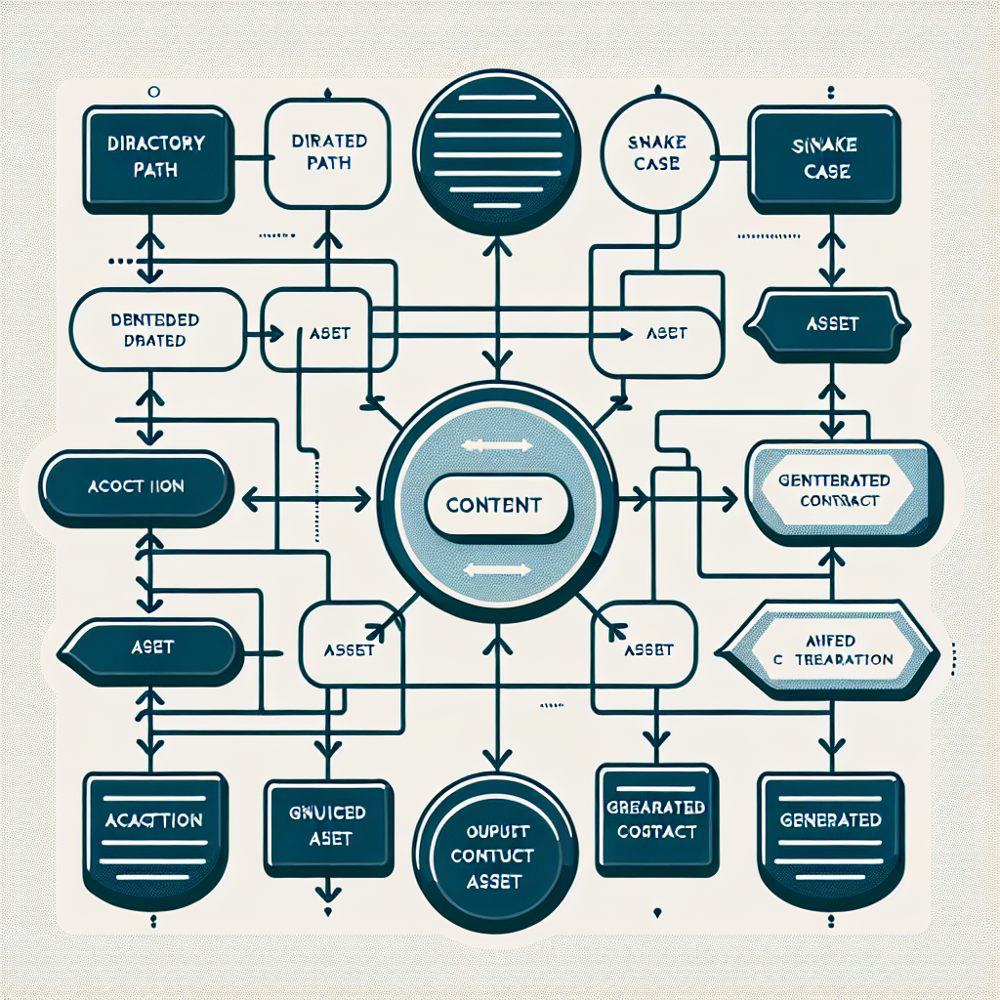

# Text Content

> Text: `create_assets/`

---

## Table of Contents

1. [Overview](#overview)
2. [Concept Map](#concept-map)
3. [Detailed Notes](#detailed-notes)
4. [Key Concepts](#key-concepts)
5. [Glossary](#glossary)
6. [Cheat Sheet](#cheat-sheet)
7. [Takeaways](#takeaways)
8. [Quiz (4q)](#quiz)
9. [Flashcards (5)](#flashcards)
10. [Exercises (1)](#exercises)
11. [Learning Path](#learning-path)

---

## Overview

The source content consists solely of the path-like string "create_assets/". The central conclusion is therefore not a substantive theory, workflow, or dataset, but an architectural signal: it appears to name a directory intended for asset creation or asset-generation work. The trailing slash conventionally indicates a folder rather than a file, while the snake_case naming suggests a programming or automation-oriented project structure. The phrase combines an action verb, "create," with the object "assets," implying a place where assets are produced, staged, generated, or organized.

Because the source provides no files, README, code, metadata, examples, or operating instructions, any interpretation beyond the literal directory name must be treated as inference rather than confirmed meaning. A reliable methodology for analyzing such sparse content is to separate observable facts from plausible assumptions: the observable fact is that a directory named "create_assets" is referenced; plausible assumptions include that it may contain scripts, source files, templates, generated media, build artifacts, or documentation related to asset creation.

The practical learning value is in understanding how to turn an under-specified project folder into a usable, maintainable asset pipeline component. A well-designed "create_assets/" directory should make clear what assets are created, what inputs are required, what tools or scripts perform creation, where outputs are written, whether outputs are version-controlled, and how reproducibility is ensured. The absence of such context highlights the importance of directory-level documentation, naming conventions, README files, input/output contracts, and automation standards. In short, the source teaches by omission: a directory name alone is not enough for maintainable knowledge transfer; effective project architecture requires explicit purpose, structure, and usage instructions.

---

## Concept Map



---

## Detailed Notes

## 1. What the Source Literally Contains

The entire source is:

```text
create_assets/
```

### Observable facts

- **`create_assets`** is a name written in **snake_case**.
- The trailing **`/`** conventionally indicates a **directory/folder**, not a file.
- The name combines:
  - **`create`**: an action verb suggesting generation or production.
  - **`assets`**: files or resources used by a project, product, model, website, game, application, course, or media workflow.

### What cannot be known from the source alone

The source does **not** specify:

- What kinds of assets are involved.
- Whether the directory contains source materials, generated outputs, scripts, or templates.
- Which tools are used.
- Whether assets are manually created or automatically generated.
- Where inputs come from or outputs go.
- Whether files inside should be version-controlled.
- Whether this is part of a software project, design project, machine learning pipeline, static site, game, courseware system, or content production workflow.

## 2. Core Interpretation

The path **`create_assets/`** most likely represents a project directory dedicated to creating or generating assets.

A strong interpretation is:

> `create_assets/` is a workspace or module responsible for producing project assets from some combination of source materials, scripts, templates, prompts, design files, or build processes.

This interpretation is plausible because directory names in software and production workflows often describe purpose. For example:

| Directory Name   | Typical Meaning                                             |
| ---------------- | ----------------------------------------------------------- |
| `src/`           | Source code                                                 |
| `assets/`        | Project resources such as images, fonts, audio, data, icons |
| `scripts/`       | Automation scripts                                          |
| `build/`         | Generated build output                                      |
| `create_assets/` | Tools or workspace for creating assets                      |

## 3. Why the Trailing Slash Matters

The slash in **`create_assets/`** is meaningful.

### Common convention

- `create_assets` may refer to a file, command, label, or directory depending on context.
- `create_assets/` strongly suggests a **directory path**.

### Practical implication

A directory should usually answer these questions:

1. **Purpose**: Why does this folder exist?
2. **Inputs**: What goes into it?
3. **Process**: What happens inside it?
4. **Outputs**: What comes out of it?
5. **Ownership**: Who maintains it?
6. **Reproducibility**: Can another person recreate the outputs?

The source provides only the directory name, so these questions remain unanswered.

## 4. Naming Analysis

### Snake_case

The name uses **snake_case**, where words are separated by underscores:

```text
create_assets
```

Snake_case is common in:

- Python projects
- Data pipelines
- Machine learning repositories
- Shell automation
- Internal tooling directories
- Content generation workflows

### Verb-object naming

The name follows a **verb-object** pattern:

```text
create + assets
```

This differs from a purely noun-based directory such as:

```text
assets/
images/
media/
resources/
```

A verb-object name suggests the folder may contain **processes**, not merely stored files.

### Possible naming implication

- `assets/` usually stores assets.
- `create_assets/` likely stores the means to create assets.

This distinction is important in project architecture.

## 5. Possible Roles of `create_assets/`

Because the source gives no details, several interpretations are possible.

### Role 1: Asset-generation scripts

The directory may contain scripts that generate assets.

Example structure:

```text
create_assets/
  README.md
  generate_icons.py
  generate_thumbnails.py
  templates/
  source/
  output/
```

Typical use:

```bash
python create_assets/generate_icons.py
```

### Role 2: Design production workspace

It may hold working files used to produce final assets.

Example structure:

```text
create_assets/
  source_figma_exports/
  raw_images/
  edited_images/
  export_presets/
```

### Role 3: AI or procedural generation workspace

It may contain prompts, model configuration, generation scripts, and outputs.

Example structure:

```text
create_assets/
  prompts/
  seeds/
  generate.py
  outputs/
  reviewed/
```

### Role 4: Build pipeline component

It may be part of an automated build process that converts source assets into deployable assets.

Example:

```text
create_assets/
  source_svg/
  optimize_svg.js
  sprite_config.json
```

Generated output might go to:

```text
public/assets/
```

### Role 5: Placeholder directory

It may also be an empty placeholder included to indicate a future location for asset creation work.

If so, it should ideally contain a `.gitkeep` file or a README explaining its intended purpose.

## 6. Asset Concepts

### What are assets?

In project contexts, **assets** are resources used by a system or product but not necessarily executable logic.

Examples include:

- Images
- Icons
- Logos
- Fonts
- Audio clips
- Video clips
- 3D models
- CSS resources
- Templates
- Data files
- Prompt files
- Localization files
- Documentation graphics
- Training examples

### Source assets vs generated assets

A mature workflow distinguishes between **source assets** and **generated assets**.

| Type               | Meaning                       | Example                                       | Usually Version-Controlled?    |
| ------------------ | ----------------------------- | --------------------------------------------- | ------------------------------ |
| Source asset       | Original editable input       | `.psd`, `.fig`, `.blend`, `.svg`, prompt file | Yes, often                     |
| Generated asset    | Output created from a process | minified image, sprite sheet, thumbnail       | Sometimes, depends on workflow |
| Intermediate asset | Temporary processing file     | cache, resized draft                          | Usually no                     |

The name `create_assets/` sounds more related to source and generation processes than final deployed assets.

## 7. What a Well-Documented `create_assets/` Directory Should Include

A useful asset-creation directory should not rely on its name alone. It should contain explicit documentation.

### Recommended minimum structure

```text
create_assets/
  README.md
  requirements.txt or package.json
  source/
  scripts/
  templates/
  output/
```

### Recommended README contents

A `README.md` should explain:

- Purpose of the directory.
- Asset types created.
- Required tools and dependencies.
- Input locations.
- Output locations.
- Commands to run.
- Naming conventions.
- Version-control policy.
- Quality checks.
- Troubleshooting steps.

Example README outline:

```markdown
# create_assets

## Purpose

Generates optimized image and icon assets for the application.

## Inputs

- source/svg/
- source/raw_images/

## Outputs

- ../public/assets/icons/
- ../public/assets/images/

## Usage

npm install
npm run create-assets

## Version Control

Source files are committed. Generated outputs are not committed unless required for deployment.
```

## 8. Input/Output Contract

A directory involved in asset creation should define a clear **input/output contract**.

### Input contract

The input contract answers:

- What files are expected?
- What formats are allowed?
- Where should they be placed?
- What naming scheme should they follow?
- Are dimensions, color profiles, or file sizes constrained?

Example:

```text
Input SVG files must be placed in create_assets/source/svg/.
File names must use lowercase kebab-case.
SVGs must not contain embedded raster images.
```

### Output contract

The output contract answers:

- What files are created?
- Where are they written?
- Are outputs deterministic?
- Are outputs safe to delete and regenerate?
- Should outputs be committed to version control?

Example:

```text
Generated PNG icons are written to public/assets/icons/ at 1x, 2x, and 3x resolutions.
Generated files can be deleted and recreated by running npm run create-assets.
```

## 9. Reproducibility

A strong asset pipeline should be reproducible.

### Reproducibility means

Another person or system can recreate the same assets using:

- The same source files.
- The same scripts.
- The same dependency versions.
- The same configuration.
- The same command sequence.

### Why reproducibility matters

Without reproducibility:

- Assets may differ across machines.
- Manual steps may be forgotten.
- Outputs become hard to audit.
- Build pipelines become fragile.
- New contributors waste time reverse-engineering the process.

### Practical reproducibility checklist

- Pin dependency versions.
- Store configuration files.
- Document commands.
- Separate source from generated output.
- Avoid undocumented manual edits to generated files.
- Add automated validation where possible.

## 10. Version-Control Considerations

A key question for `create_assets/` is what should be committed.

### Usually commit

- Source files needed to recreate assets.
- Scripts used for generation.
- Configuration files.
- Templates.
- Documentation.
- Small final assets required directly by the application.

### Usually ignore

- Temporary files.
- Cache directories.
- Large generated intermediates.
- Reproducible build outputs.
- Machine-specific files.

### Example `.gitignore`

```gitignore
create_assets/output/
create_assets/cache/
create_assets/tmp/
```

But this depends on whether outputs are needed at runtime or during deployment.

## 11. Quality Standards for Asset Creation

If `create_assets/` is part of a production workflow, it should include quality criteria.

### Common checks

- File naming consistency.
- Correct dimensions and aspect ratios.
- Compression or optimization.
- Accessibility requirements, such as alt-text mapping for images.
- Licensing and attribution compliance.
- File size limits.
- Color profile consistency.
- No broken references.
- No missing outputs.

### Example validation command

```bash
npm run validate-assets
```

or:

```bash
python create_assets/scripts/validate_assets.py
```

## 12. Risks of Under-Specified Directories

The source demonstrates a common project problem: a folder name without context.

### Risks

- Contributors do not know what belongs inside.
- Generated outputs may be confused with source materials.
- Manual processes become tribal knowledge.
- Duplicate or obsolete assets accumulate.
- Build systems become inconsistent.
- Onboarding becomes slower.

### Mitigation

Add:

- `README.md`
- Clear subdirectories
- Scripts with obvious entry points
- Dependency files
- Examples
- Tests or validation scripts
- Naming conventions

## 13. Recommended Mature Structure

A robust `create_assets/` folder could look like this:

```text
create_assets/
  README.md
  config/
    asset_pipeline.yml
  source/
    images/
    icons/
    audio/
  templates/
  prompts/
  scripts/
    create_assets.py
    validate_assets.py
  output/
  cache/
  tests/
    test_asset_generation.py
```

### Explanation

- **`README.md`**: explains purpose and usage.
- **`config/`**: contains settings such as sizes, formats, paths, compression levels.
- **`source/`**: contains original input files.
- **`templates/`**: contains reusable generation templates.
- **`prompts/`**: useful if AI-generated assets are involved.
- **`scripts/`**: contains executable generation logic.
- **`output/`**: contains generated assets, if stored locally.
- **`cache/`**: contains temporary reusable processing data.
- **`tests/`**: verifies the pipeline works.

## 14. Main Learning Conclusion

The single path `create_assets/` is not enough to convey a full workflow. However, it is enough to identify an architectural intent: a directory for creating assets. To make that intent operational, the directory should be documented, structured, and connected to reproducible scripts or procedures. A learner should treat sparse directory names as prompts to define purpose, inputs, outputs, ownership, and automation.

---

## Key Concepts

**1.** Directory Path: A textual reference to a folder location, commonly marked with a trailing slash to distinguish it from a file.

**2.** Snake Case: A naming convention that separates lowercase words with underscores, often used in programming and automation contexts.

**3.** Asset: A reusable project resource such as an image, icon, font, audio file, template, dataset, or generated media file.

**4.** Asset Creation: The process of producing project resources from source files, scripts, templates, prompts, or manual design work.

**5.** Source Asset: An original editable file or input used to produce final assets, such as an SVG, design file, prompt, or raw image.

**6.** Generated Asset: An output produced by a repeatable process, such as an optimized image, thumbnail, sprite sheet, or compiled resource.

**7.** Input/Output Contract: A clear specification of what files a process expects as inputs and what files it produces as outputs.

**8.** Project Structure: The organization of directories and files so contributors can understand responsibilities, workflows, and boundaries.

**9.** Directory-Level Documentation: A README or equivalent file that explains the purpose, usage, dependencies, and conventions of a folder.

**10.** Reproducibility: The ability to recreate the same assets using documented inputs, tools, dependency versions, and commands.

**11.** Version-Control Policy: The decision rule for which files should be committed, ignored, regenerated, or stored externally.

**12.** Build Pipeline: An automated sequence that transforms source materials into deployable or consumable outputs.

**13.** Validation: The process of checking assets against rules such as naming, dimensions, format, size, accessibility, and completeness.

**14.** Placeholder Directory: An empty or minimally defined folder included to reserve a future location in a project structure.

**15.** Knowledge Architecture: The discipline of organizing information so its purpose, relationships, and use are clear to future readers or contributors.

---

## Glossary

| Term                              | Definition                                                                                                                                 | Related                                                   |
| :-------------------------------- | :----------------------------------------------------------------------------------------------------------------------------------------- | :-------------------------------------------------------- |
| **create_assets/**                | A path-like directory name that likely denotes a folder intended for creating, generating, or organizing project assets.                   | Directory Path, Asset Creation, Project Structure         |
| **Directory**                     | A filesystem container used to group files and subdirectories under a shared location and purpose.                                         | Folder, Path, Project Structure                           |
| **Trailing Slash**                | The final '/' in a path, commonly used to indicate that the path refers to a directory rather than a file.                                 | Directory, Path                                           |
| **Snake Case**                    | A naming style where lowercase words are separated by underscores, as in 'create_assets'.                                                  | Naming Convention, Project Structure                      |
| **Asset**                         | A non-code or supporting project resource, such as an image, font, audio clip, template, icon, dataset, or media file.                     | Source Asset, Generated Asset                             |
| **Source Asset**                  | An original input file or editable resource used to create final or generated assets.                                                      | Asset, Generated Asset, Input                             |
| **Generated Asset**               | An asset produced by a script, build process, export operation, or automated pipeline.                                                     | Asset, Output, Build Pipeline                             |
| **Intermediate Asset**            | A temporary or transitional file created during asset processing but not intended as a final deliverable.                                  | Generated Asset, Cache, Output                            |
| **Input**                         | A file, configuration, template, prompt, or parameter consumed by an asset-creation process.                                               | Input/Output Contract, Source Asset                       |
| **Output**                        | A file or resource produced by an asset-creation process, often placed in a designated destination directory.                              | Generated Asset, Input/Output Contract                    |
| **Input/Output Contract**         | A documented agreement specifying required inputs, expected outputs, file formats, naming rules, and destination paths.                    | Input, Output, Reproducibility                            |
| **README**                        | A documentation file that explains the purpose, usage, setup, commands, and conventions of a directory or project.                         | Directory-Level Documentation, Onboarding                 |
| **Directory-Level Documentation** | Documentation placed inside or near a folder to clarify what belongs there and how to use its contents.                                    | README, Project Structure                                 |
| **Build Pipeline**                | An automated workflow that transforms source materials into final outputs through defined processing steps.                                | Automation, Generated Asset, Reproducibility              |
| **Automation**                    | The use of scripts or tools to perform repeatable tasks without relying on undocumented manual actions.                                    | Build Pipeline, Script, Reproducibility                   |
| **Script**                        | An executable file that performs a defined task, such as resizing images, generating icons, or validating assets.                          | Automation, Build Pipeline                                |
| **Reproducibility**               | The property of a workflow that allows another person or system to recreate the same results from the same documented inputs and commands. | Dependency Pinning, Input/Output Contract, Build Pipeline |
| **Dependency Pinning**            | The practice of fixing tool or library versions so asset-generation results remain stable across machines and time.                        | Reproducibility, Build Pipeline                           |
| **Version Control**               | A system such as Git for tracking changes to files and coordinating collaboration over time.                                               | Git, Version-Control Policy                               |
| **Version-Control Policy**        | A rule set defining which source files, generated files, caches, and outputs should be committed or ignored.                               | Version Control, .gitignore, Generated Asset              |
| **.gitignore**                    | A Git configuration file listing files or directories that should not be tracked in version control.                                       | Git, Version-Control Policy                               |
| **Validation**                    | The process of checking assets against required rules such as format, dimensions, naming, file size, and completeness.                     | Quality Control, Asset Creation                           |
| **Placeholder Directory**         | A directory included in a project structure before it has substantive contents, often to reserve an intended location.                     | .gitkeep, Project Structure                               |
| **.gitkeep**                      | A conventional empty file used to force Git to track an otherwise empty directory.                                                         | Placeholder Directory, Git                                |

---

## Cheat Sheet

## Quick Reference: `create_assets/`

### Literal Meaning

| Element         | Meaning                                                     |
| --------------- | ----------------------------------------------------------- |
| `create_assets` | Snake_case name combining action `create` + object `assets` |
| `/`             | Indicates a directory/folder path                           |
| Full path       | Likely a folder for creating or generating assets           |

### What Is Known vs Unknown

| Known                            | Unknown                                |
| -------------------------------- | -------------------------------------- |
| It is probably a directory       | What files it contains                 |
| It relates to assets             | What type of assets                    |
| Name implies creation/generation | Whether process is manual or automated |
| Context is minimal               | Tools, commands, inputs, outputs       |

### Best-Practice Structure

```text
create_assets/
  README.md
  config/
  source/
  templates/
  scripts/
  output/
  cache/
  tests/
```

### README Must Answer

- What does this folder create?
- What inputs are required?
- Where do outputs go?
- What command runs the process?
- Which dependencies are needed?
- Are outputs committed or ignored?
- How are assets validated?

### Source vs Generated Assets

| Type         | Example                                   | Commit?     |
| ------------ | ----------------------------------------- | ----------- |
| Source       | `.svg`, `.fig`, raw image, prompt         | Usually yes |
| Generated    | thumbnails, optimized PNGs, sprite sheets | Depends     |
| Intermediate | cache, temp resized files                 | Usually no  |

### Reproducibility Checklist

- Pin dependency versions.
- Document commands.
- Separate source from output.
- Avoid manual edits to generated files.
- Add validation checks.
- Define version-control policy.

### Example Commands

```bash
python create_assets/scripts/create_assets.py
python create_assets/scripts/validate_assets.py
```

### Main Rule

A folder name alone is not documentation. Turn `create_assets/` into a reliable workflow by defining purpose, inputs, process, outputs, ownership, and validation.

---

## Takeaways

- Add a README inside `create_assets/` explaining its purpose, required inputs, outputs, commands, and ownership.
- Separate source assets from generated outputs so contributors know which files to edit and which files to regenerate.
- Define an input/output contract that specifies accepted formats, naming rules, destination paths, and expected generated files.
- Create or document a single command that runs the asset-creation workflow from start to finish.
- Pin tool and dependency versions to make generated assets reproducible across machines.
- Decide which assets belong in version control and update `.gitignore` to exclude caches, temporary files, or reproducible outputs.
- Add validation checks for file names, dimensions, formats, file sizes, licensing, and completeness.
- Use the sparse directory name as a prompt to improve project architecture rather than assuming future users will infer its meaning.

---

## Quiz

### Q1 [Fill] (E)

**Fill in the blank: The directory name shown in the path `create_assets/` is `__________`.**

<details><summary>Answer</summary>

**create_assets**

_The slash at the end indicates that the path is referring to a directory, but the actual directory name is the text before the slash: `create_assets`. The trailing `/` is not part of the directory's name; it is a path separator used to signal or access the directory._

</details>

### Q2 [T/F] (M)

**True or False: `create_assets/` is an absolute path.**

<details><summary>Answer</summary>

**False**

_`create_assets/` does not begin with a root indicator such as `/` on Unix-like systems or a drive/root prefix such as `C:\` on Windows. Therefore, it is best interpreted as a relative path, meaning it is resolved from the current working directory or another base location._

</details>

### Q3 [Scenario] (M)

**A developer is writing a script from the root of a project. The script should place generated image files into a folder named `create_assets` inside that project, not into a system-level folder. Which path best represents that destination?**

- A. `/create_assets/`
- B. `create_assets/`
- C. `C:/create_assets/`
- D. `../create_assets/`

<details><summary>Answer</summary>

**B. `create_assets/`**

_`create_assets/` is a relative path, so if the script runs from the project root, it refers to a folder named `create_assets` inside that project. `/create_assets/` would point to a folder at the filesystem root on Unix-like systems, `C:/create_assets/` would point to a drive-level folder on Windows, and `../create_assets/` would point to a sibling location one level above the current directory._

</details>

### Q4 [Compare] (H)

**Compare `create_assets/` and `/create_assets/`. How do they differ in meaning and practical use?**

<details><summary>Answer</summary>

**`create_assets/` is a relative directory path, meaning it is resolved from the current working directory or another specified base path. `/create_assets/` is an absolute path on Unix-like systems, meaning it refers to a directory named `create_assets` directly under the filesystem root. Practically, the relative form is suitable for project-local folders, while the absolute form targets a fixed system-level location and may require different permissions.**

_The key difference is the leading slash. A trailing slash commonly indicates a directory, but a leading slash changes how the path is resolved. Without a leading slash, `create_assets/` depends on context; with a leading slash, `/create_assets/` starts from the root of the filesystem. This affects portability, permissions, and whether the path points inside a project or to a global location._

</details>

---

## Flashcards

**1. What does the trailing slash in `create_assets/` indicate?** `filesystem` `notation`

> The trailing slash indicates that `create_assets` is a directory or folder.

**2. What is the directory name in the path `create_assets/`?** `filesystem` `path`

> The directory name is `create_assets`.

**3. Why might a path be written as `create_assets/` instead of `create_assets`?** `filesystem` `clarity`

> Writing it with a trailing slash makes clear that it refers to a directory rather than a file.

**4. How would you describe `create_assets/` in plain language?** `filesystem` `description`

> `create_assets/` is a folder named `create_assets`.

**5. Compare `create_assets/` and `create_assets`: what extra meaning does the slash add?** `filesystem` `comparison`

> The slash adds the meaning that `create_assets` is being treated specifically as a directory path.

---

## Exercises

### Exercise 1: Design and Implement a Reproducible Asset Creation Workflow (M)

You have been given a project folder named `create_assets/`. Your task is to design and document a practical workflow for generating, organizing, and validating project assets inside this folder. Assume the folder will contain source files, generated outputs, metadata, and any scripts needed to create assets consistently. Create a proposed folder structure, define naming conventions, and describe a repeatable process for adding new assets. As a deliverable, produce a short workflow document and a sample directory tree showing how `create_assets/` should be organized. Include at least one example asset entry with its source file, generated output, and metadata.

**Hints:**

- Hint 1: Think about separating editable source files from generated or exported files.
- Hint 2: Include metadata such as asset name, version, creator, license, and generation date.
- Hint 3: Consider how another team member could reproduce or verify an asset later.

<details><summary>Solution</summary>

A strong solution should propose a clear, maintainable structure such as `create_assets/sources/`, `create_assets/outputs/`, `create_assets/scripts/`, `create_assets/metadata/`, and `create_assets/docs/`. The workflow should explain how assets are created, named, exported, reviewed, and updated. Naming conventions should be consistent, for example `asset-category_name_version.ext`. Metadata should make assets traceable and reproducible. A reference directory tree might include `create_assets/sources/icons/home_icon_v1.svg`, `create_assets/outputs/icons/home_icon_v1.png`, `create_assets/metadata/home_icon_v1.json`, and `create_assets/scripts/export_icons.py`. The solution should also include validation steps such as checking file formats, confirming metadata completeness, and ensuring generated assets match source versions.

</details>

---

## Learning Path

### Prerequisites

- Basic understanding of files, folders, and filesystem paths
- Familiarity with command-line navigation such as `cd`, `ls`, and relative paths
- Basic knowledge of version control, especially Git
- Awareness of common project assets such as images, fonts, templates, and media files
- Introductory understanding of build scripts or automation

### Next Steps

- Study project directory design and repository organization patterns.
- Learn how to write effective README files and directory-level documentation.
- Practice creating reproducible asset pipelines using scripts.
- Learn `.gitignore` patterns and policies for generated files.
- Study build tools relevant to your stack, such as npm scripts, Make, Python scripts, or task runners.
- Explore asset optimization workflows for images, SVGs, fonts, audio, or web assets.
- Add automated validation or tests for asset-generation workflows.

### Recommended Resources

- The Turing Way: Reproducible Research — https://the-turing-way.netlify.app/
- Git documentation: gitignore — https://git-scm.com/docs/gitignore
- GitHub Docs: About READMEs — https://docs.github.com/en/repositories/managing-your-repositorys-settings-and-features/customizing-your-repository/about-readmes
- Make documentation — https://www.gnu.org/software/make/manual/make.html
- npm scripts documentation — https://docs.npmjs.com/cli/using-npm/scripts
- Python Packaging User Guide — https://packaging.python.org/
- Google Engineering Practices Documentation — https://google.github.io/eng-practices/
- Diátaxis Documentation Framework — https://diataxis.fr/
- ImageMagick command-line tools — https://imagemagick.org/script/command-line-tools.php
- SVGO SVG optimization tool — https://github.com/svg/svgo

---

_Generated by [Skill-Anything](https://github.com/SYuan03/Skill-Anything)_
