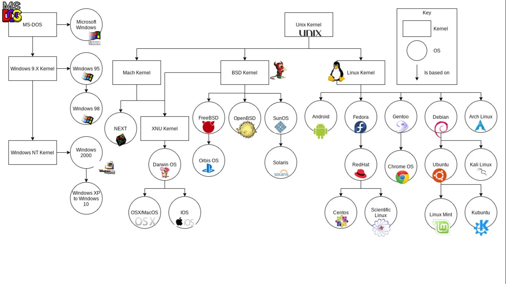

<!--
filename: 03182026.md
date: 18, March of 2026
tag: notes
last-update: 23, April of 2026
-->

# Licencias

## Licencia privativa

- Esta licencia no permite acceder al código fuente. Aquí solo adquirimos el
  derecho de ejecutarlo, pero no a conocer como se hizo su implementación. Es
  aquello que si no tenes el dinero o los medios para adquirirlo estas privado
  al acceso.

## Licencias permisivas

- es un grupo de licencias donde se modela el software libre. Cada una de ellas
  agrupa derechos y obligaciones que la diferencian entre si.

## Copy Left

- Es un tipo de licencia (GPL 2) pero si no se cumplen una de las siguientes de
  las 4 normas, deja de serlo.
  - Libertad 0: es que pueda usarlo como quiera, en el trabajo, en lo educativo
    o entorno personal.

## Weak Copy Left

- Te restringe a que puedas competir con el que desarrollo el programa original,
  por ejemplo agarramos un software y lo modificamos, lo podemos utilizar pero
  no venderlo, puede ser de uso personal o educativo

# Ejercicio en clase

## Preguntas

1. Que tipo de licencia de software te permite cambiar el tipo de licencia?
2. Que diferencia tiene la licencia BSD de la MIT?
3. Según el video las licencias CopyLeft en que se diferencias de las otras?
4. Puedo vender el código de Linux?

---

1. La MIT y el APACHE
2. Ambas son similares pero en la BSD no se puede poner los nombres de los
   autores para promocionar tus productos
3. El código fuente tiene que estar disponible siempre que se cumplan los 4
   puntos debajo

- Uso irrestricto
- Disponibilidad de código
- Cualquiera lo puede distribuir
- Las publicaciones tienen derecho a ser publicadas

4. Si porque es GPL-3

> [!NOTE] [!PREGUNTA_DE_ESCRITO ]
>
> _"Linux es un sistema operativo que esta construido en base a su kernel,
> cuando hablamos de kernel hacemos referencia al centro del sistema operativo,
> allí están los principales módulos y ellos se encuentran cargados de forma
> permanente en la memoria principal (RAM) de la computadora. Cumple tareas de
> gestión de memoria, gestión de procesos, controlador de dispositivos y
> seguridad"_
>
> _"La existencia de diferentes distribuciones, está dada por las necesidades
> especificas que se desean cubrir, ejemplo: usabilidad, rendimiento,
> compatibilidad con hardware"_
>
> _"Las principales distribuciones se organizan en "familias" que se han
> desarrollado a lo largo de los años en el sistema operativo. Llamaremos
> "familia" al conjunto de distribuciones que se relacionan entre si
> compartiendo o basándose en diferentes componentes tales como el gestor de
> paquetes de software."_

> [!NOTE]
>
> Slackware fue la primer distribution de Linux, 5 meses después vino Debian

Lleva : porque es el derivado, como decir Ubuntu extends Debian... Debian :
Ubuntu : Mint RedHat : Fedora : CentOS Slackware : Suse Arch Linux : Manjaro :
Elementary Puppy Linux : Fatdog64

> [!NOTE]
>
> distrowatch.com
>
> Te da una lista del ranking de las distros mas usadas de Linux

# Ejercicio esquemas

1. Que sistemas operativos están basados en BSD Kernel y como se relacionan con
   el Unix Kernel según el diagrama?
2. Que sistemas operativos están basados de Linux Kernel y como se relacionan
   entre si según el diagrama?
3. Cual es la rama mas lejana de todas las familias, ofrecer una posible
   respuesta?

---

1. Los sistemas operativos basados en BSD Kernel son FreeBSD, OpenBSD y SunOS,
   despumes podemos hablar de Next que es una mezcla del Kernel de Mach Kernel y
   BSD Kernel. La relación es que Unix Kernel es la base de BSD Kernel.
2. Android, Fedora, Gentoo, Debian, Arch Linux

> [!NOTE]
>
> BSD => Berkeley Software Distribution

> [!NOTE]
>
> Esto debajo es MUY IMPORTANTE

3. El mas lejano es MS-DOS porque no se adhirió al standard POSIX

  

# Instalación y configuración inicial

Las computadoras personales realizan una serie de procesos a la hora de
encenderse todo esto es conocido como BOOT, el primer componente en actuar BIOS
o UEFI, es quien busca un dispositivo de arranque con un sistema operativo.
Luego el siguiente en actuar es el gestor de arranque, es quien se encarga de
cargar el Kernel de Linux. Después inicia el primer proceso del usuario y desde
él se crearán los demás procesos. Se ejecutan diferentes scripts para crear el
resto de los procesos e iniciar el entorno gráfico.

Para instalar un sistema operativo Linux, es un proceso diferente a una carga
normal en disco de un sistema ya instalado. Se carga un instalador desde algún
medio externo. Ese instalador será el encargado de configurar el disco local con
el sistema operativo de manera que en un posterior booteo el sistema ya se
encuentre disponible

> [!NOTE]
>
> Proceso: Un programa con recursos asignados en tiempo real. _"El programa es
> como la receta, el proceso es la ejecución"_

# Ejercicio instalación de Debian 12

1. Identifica los pasos en el video
2. Dar una pequeña guía que los detalle
3. Compartir con otro grupo y sugerir mejoras

---

1.

- Vamos al sitio
- Descargamos la imagen de Debian 12.1.8, version DVD y elegimos la
  arquitectura, el archivo ISO en especifico
- Montamos la imagen ISO en DVD o CD
- Booteamos la unidad de instalación
- Seleccionamos Start
- Seleccionamos el idioma del sistema
- Seleccionamos la configuración del teclado
- El instalador empieza a descargar componentes y utilidades del sistema
- Luego aparece un input para asignar el nombre a la maquina y el dominio
- Luego aparece la sección del Root donde nos pide colocar contraseña
- Luego aparece la sección para crear el primer usuario del sistema
  (considerando que el root no es considerado un usuario corriente)

https://www.youtube.com/watch?v=tESsVlvso4o&t=124s

> [!NOTE]
>
> ISO - Estado condensado de un programa que no se puede ejecutar sino si están
> en un estado preciso y también son mono bloque (unidad)
>
> Standard generado por la IEE
